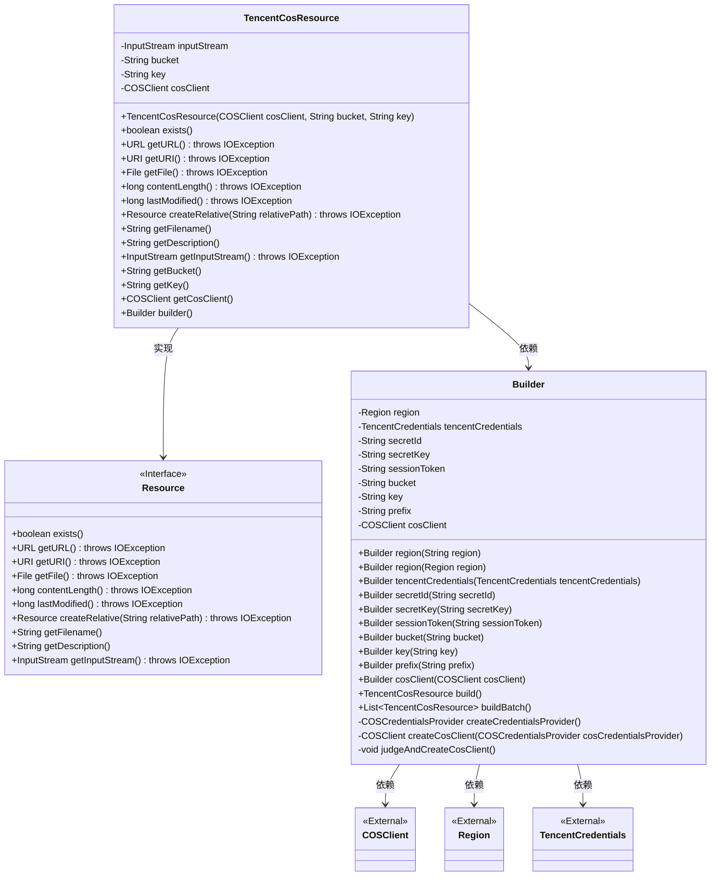

# 基础信息

|      |      |
|------|------|
| 名称 | TencentCosResource |
| 编码语言 | .java |
| 代码路径 | spring-ai-alibaba/community/document-readers/spring-ai-alibaba-starter-document-reader-encent-cos/src/main/java/com/alibaba/cloud/ai/reader/tencent/cos/TencentCosResource.java |
| 包名 | com.alibaba.cloud.ai.reader.tencent.cos |
| 依赖项 | ['com.qcloud.cos.COSClient', 'com.qcloud.cos.ClientConfig', 'com.qcloud.cos.auth.COSCredentialsProvider', 'com.qcloud.cos.model.COSObject', 'com.qcloud.cos.model.COSObjectSummary', 'com.qcloud.cos.model.GetObjectRequest', 'com.qcloud.cos.model.ListObjectsRequest', 'com.qcloud.cos.model.ObjectListing', 'com.qcloud.cos.region.Region', 'org.springframework.core.io.Resource', 'org.springframework.util.Assert', 'java.io.File', 'java.io.IOException', 'java.io.InputStream', 'java.net.URI', 'java.net.URL', 'java.util.ArrayList', 'java.util.List', 'java.util.Objects'] |
| 概述说明 | TencentCosResource类实现Resource接口，管理腾讯云COS资源。 |

# 说明

TencentCosResource类实现了Resource接口，专门用于管理腾讯云COS资源。该类的主要功能是通过实现Resource接口，提供对腾讯云对象存储服务（COS）资源的统一管理和操作。通过这个类，用户可以方便地进行资源的创建、读取、更新和删除等操作，确保对COS资源的高效管理。该类的设计旨在简化与腾讯云COS服务的交互，提升资源管理的便捷性和可维护性。

# 类列表 Class Summary

| 名称   | 类型  | 说明 |
|-------|------|-------------|
| TencentCosResource | class | TencentCosResource类实现Resource接口，用于管理腾讯云COS资源。 |

## 类 TencentCosResource

|      |      |
|------|------|
| 访问范围 | public |
| 类型 | class |
| 名称 | TencentCosResource |
| 说明 | TencentCosResource类实现Resource接口，用于管理腾讯云COS资源。 |

### UML类图

这段代码定义了一个`TencentCosResource`类，它实现了`Resource`接口，用于处理腾讯云COS（对象存储）的资源。`TencentCosResource`类通过`COSClient`与腾讯云COS进行交互，获取输入流等资源信息。`Builder`类用于构建`TencentCosResource`对象，支持批量构建和单例构建，并通过`COSClient`、`Region`和`TencentCredentials`等外部类进行配置和认证。

### 内部方法调用关系图

```mermaid
graph TD
    A["类TencentCosResource"]
    B["属性: InputStream inputStream"]
    C["属性: String bucket"]
    D["属性: String key"]
    E["属性: COSClient cosClient"]
    F["构造方法: TencentCosResource(COSClient cosClient, String bucket, String key)"]
    G["方法: boolean exists()"]
    H["方法: URL getURL()"]
    I["方法: URI getURI()"]
    J["方法: File getFile()"]
    K["方法: long contentLength()"]
    L["方法: long lastModified()"]
    M["方法: Resource createRelative(String relativePath)"]
    N["方法: String getFilename()"]
    O["方法: String getDescription()"]
    P["方法: InputStream getInputStream()"]
    Q["方法: String getBucket()"]
    R["方法: String getKey()"]
    S["方法: COSClient getCosClient()"]
    T["静态方法: Builder builder()"]
    U["内部类: Builder"]
    V["属性: Region region"]
    W["属性: TencentCredentials tencentCredentials"]
    X["属性: String secretId"]
    Y["属性: String secretKey"]
    Z["属性: String sessionToken"]
    AA["属性: String bucket"]
    AB["属性: String key"]
    AC["属性: String prefix"]
    AD["属性: COSClient cosClient"]
    AE["方法: Builder region(String region)"]
    AF["方法: Builder region(Region region)"]
    AG["方法: Builder tencentCredentials(TencentCredentials tencentCredentials)"]
    AH["方法: Builder secretId(String secretId)"]
    AI["方法: Builder secretKey(String secretKey)"]
    AJ["方法: Builder sessionToken(String sessionToken)"]
    AK["方法: Builder bucket(String bucket)"]
    AL["方法: Builder key(String key)"]
    AM["方法: Builder prefix(String prefix)"]
    AN["方法: Builder cosClient(COSClient cosClient)"]
    AO["方法: TencentCosResource build()"]
    AP["方法: List<TencentCosResource> buildBatch()"]
    AQ["方法: COSCredentialsProvider createCredentialsProvider()"]
    AR["方法: COSClient createCosClient(COSCredentialsProvider cosCredentialsProvider)"]
    AS["方法: void judgeAndCreateCosClient()"]

    A --> B
    A --> C
    A --> D
    A --> E
    A --> F
    A --> G
    A --> H
    A --> I
    A --> J
    A --> K
    A --> L
    A --> M
    A --> N
    A --> O
    A --> P
    A --> Q
    A --> R
    A --> S
    A -.-> T
    T --> U
    U --> V
    U --> W
    U --> X
    U --> Y
    U --> Z
    U --> AA
    U --> AB
    U --> AC
    U --> AD
    U --> AE
    U --> AF
    U --> AG
    U --> AH
    U --> AI
    U --> AJ
    U --> AK
    U --> AL
    U --> AM
    U --> AN
    U --> AO
    U --> AP
    U --> AQ
    U --> AR
    U --> AS
```

这段代码定义了一个名为`TencentCosResource`的类，用于处理腾讯云COS（对象存储）资源。该类包含多个属性和方法，用于获取和处理COS中的对象。内部类`Builder`提供了构建`TencentCosResource`实例的灵活方式，支持设置区域、凭证、密钥等参数，并提供了批量构建资源的方法。流程图展示了类的结构及其内部方法之间的调用关系。

### 字段列表 Field List

| 名称  | 类型  | 说明 |
|-------|-------|------|
| key | String | 私有不可变的字符串变量key。 |
| cosClient | COSClient | 私有且不可变的COSClient对象。 |
| SOURCE = "source" | String | 定义了一个静态不可变字符串常量"SOURCE"。 |
| inputStream | InputStream | 私有不可变的输入流对象。 |
| bucket | String | 私有字符串变量bucket的声明。 |

### 方法列表 Method List

| 名称  | 类型  | 说明 |
|-------|-------|------|
| getDescription | String | 重写getDescription方法，返回空字符串。 |
| lastModified | long | 重写lastModified方法，始终返回0。 |
| getCosClient | COSClient | 获取COSClient实例的方法。 |
| getBucket | String | 该方法返回bucket变量的值。 |
| builder | Builder | 创建并返回Builder类的新实例。 |
| exists | boolean | 重写exists方法，始终返回false。 |
| getInputStream | InputStream | 重写getInputStream方法，返回inputStream对象。 |
| getURL | URL | 重写getURL方法，返回null并可能抛出IOException异常。 |
| getURI | URI | 重写getURI方法，返回null并可能抛出IOException异常。 |
| getKey | String | 获取key值的字符串方法。 |
| contentLength | long | 重写contentLength方法，返回0，可能抛出IOException。 |
| getFilename | String | 重写getFilename方法，返回空字符串。 |
| createRelative | Resource | 重写createRelative方法，返回null，可能抛出IOException。 |
| getFile | File | 重写getFile方法，返回null，可能抛出IOException。 |

