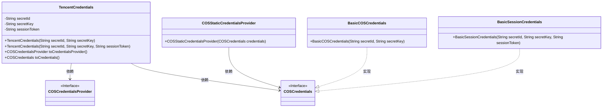
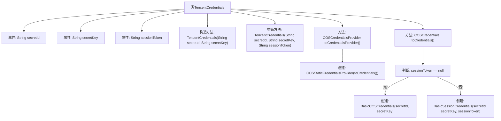

# 基础信息

|      |      |
|------|------|
| 名称 | TencentCredentials |
| 编码语言 | .java |
| 代码路径 | spring-ai-alibaba/community/document-readers/spring-ai-alibaba-starter-document-reader-encent-cos/src/main/java/com/alibaba/cloud/ai/reader/tencent/cos/TencentCredentials.java |
| 包名 | com.alibaba.cloud.ai.reader.tencent.cos |
| 依赖项 | ['com.qcloud.cos.auth.BasicCOSCredentials', 'com.qcloud.cos.auth.BasicSessionCredentials', 'com.qcloud.cos.auth.COSCredentials', 'com.qcloud.cos.auth.COSCredentialsProvider', 'com.qcloud.cos.auth.COSStaticCredentialsProvider', 'org.springframework.util.Assert'] |
| 概述说明 | 腾讯云凭证含密钥ID、密钥和会话令牌，可转为COS凭证提供者。 |

# 说明

腾讯云凭证类包含密钥ID、密钥和会话令牌三个核心元素，这些凭证用于身份验证和授权。该类支持将凭证转换为COS凭证提供者，以便在腾讯云对象存储服务中使用。通过这种方式，用户可以在不同服务之间无缝切换和管理凭证，确保安全性和便捷性。

# 类列表 Class Summary

| 名称   | 类型  | 说明 |
|-------|------|-------------|
| TencentCredentials | class | 腾讯云凭证类，包含密钥ID、密钥和会话令牌，支持转换为COS凭证提供者。 |

## 类 TencentCredentials

|      |      |
|------|------|
| 访问范围 | public |
| 类型 | class |
| 名称 | TencentCredentials |
| 说明 | 腾讯云凭证类，包含密钥ID、密钥和会话令牌，支持转换为COS凭证提供者。 |

### UML类图

### 描述
`TencentCredentials` 类用于管理腾讯云的认证信息，包括 `secretId`、`secretKey` 和可选的 `sessionToken`。它提供了两个构造函数，分别用于处理有无 `sessionToken` 的情况。类中的 `toCredentials()` 方法根据是否存在 `sessionToken` 返回不同的 `COSCredentials` 实现类（`BasicCOSCredentials` 或 `BasicSessionCredentials`）。`toCredentialsProvider()` 方法则返回一个 `COSStaticCredentialsProvider` 实例，该实例依赖于 `COSCredentials` 接口。整个类图展示了 `TencentCredentials` 如何与腾讯云认证相关的接口和实现类交互。

### 内部方法调用关系图

这段代码定义了一个名为 `TencentCredentials` 的类，用于管理腾讯云服务的凭证信息。类中包含两个构造方法，分别用于初始化 `secretId` 和 `secretKey`，以及可选的 `sessionToken`。类还提供了两个方法：`toCredentialsProvider` 用于返回一个 `COSCredentialsProvider` 对象，`toCredentials` 用于根据 `sessionToken` 是否存在返回不同类型的 `COSCredentials` 对象。流程图展示了类的结构、构造方法和方法之间的调用关系。

### 字段列表 Field List

| 名称  | 类型  | 说明 |
|-------|-------|------|
| secretId | String | 私有字符串变量secretId。 |
| sessionToken | String | 声明一个私有的不可变字符串变量sessionToken。 |
| secretKey | String | 定义了一个不可变的私有字符串变量secretKey。 |

### 方法列表 Method List

| 名称  | 类型  | 说明 |
|-------|-------|------|
| toCredentialsProvider | COSCredentialsProvider | 将COSCredentialsProvider转换为静态凭据提供者。 |
| toCredentials | COSCredentials | 根据sessionToken是否存在，返回BasicCOSCredentials或BasicSessionCredentials。 |

