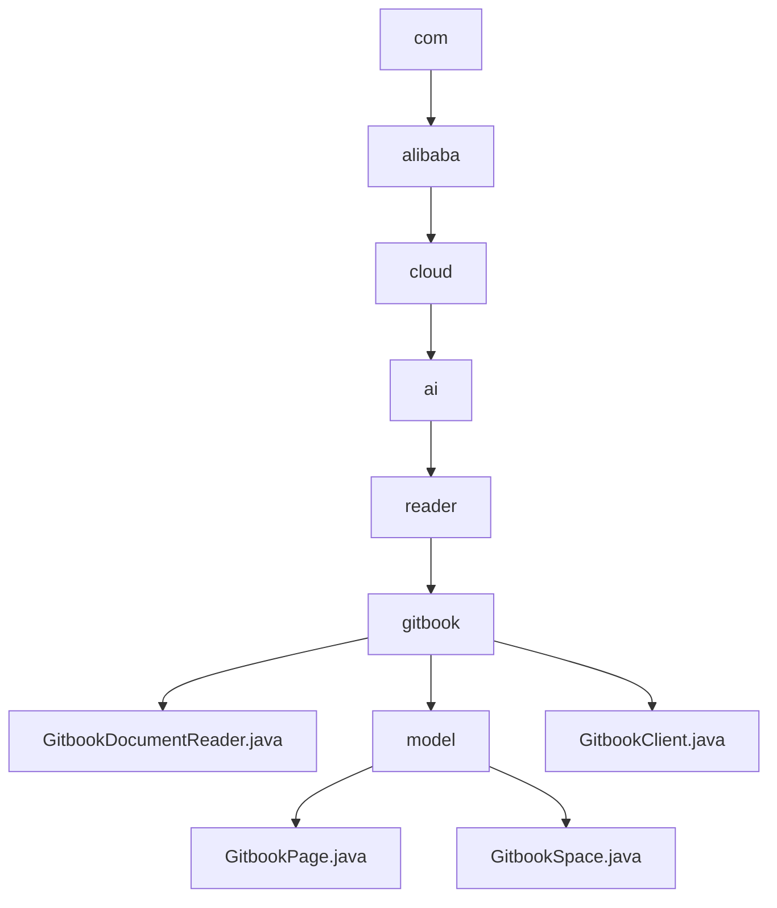

# 基础信息

|      |      |
|------|------|
| 名称 | com |
| 编码语言 | .java |
| 代码路径 | spring-ai-alibaba/community/document-readers/spring-ai-alibaba-starter-document-reader-gitbook/src/main/java/com |
| 包名 | spring-ai-alibaba.community.document-readers.spring-ai-alibaba-starter-document-reader-gitbook.src.main.java.com |
| 概述说明 | Gitbook文档读取器通过API令牌和空间ID读取页面内容，支持自定义API URL和元数据配置。 |

# 说明

## 概述

Gitbook文档读取器是一款专为与Gitbook平台集成设计的工具，旨在通过API令牌和空间ID高效读取和管理Gitbook页面内容。该工具支持用户自定义API URL，并允许灵活配置元数据字段，以便精准获取所需信息。该模块包含多个核心类，分别用于管理页面、空间信息以及与Gitbook平台的交互。通过这些类，用户可以方便地创建、读取、更新和删除Gitbook页面和空间信息，同时支持对页面层级结构的维护和数据封装。

## 主要业务场景

1. **页面管理**：
   - 通过`GitbookPage`类，用户可以管理单个页面的详细信息，包括页面ID、标题、路径、类型、描述、父页面ID及子页面列表等属性。该类提供了相关操作方法，支持页面层级结构的维护，如父页面和子页面的关系。

2. **空间管理**：
   - 通过`GitbookSpace`类，用户可以管理Gitbook空间的基本信息，包括空间的唯一标识、标题以及该空间下的所有页面列表。该类提供了相应的getter和setter方法，确保数据的封装性和可访问性。

3. **数据封装与操作**：
   - `GitbookPage`和`GitbookSpace`类均提供了getter和setter方法，确保数据的封装性和可访问性，同时支持对页面和空间信息的灵活操作。

4. **与Gitbook平台的交互**：
   - 通过`GitbookClient`类，用户可以简化与Gitbook平台的交互。该类支持API请求、获取空间信息、列出页面以及获取Markdown内容。用户可以通过API请求实现数据获取，查询空间信息，列出指定空间内的页面，并获取页面的Markdown格式内容，便于进一步处理和使用。

该模块适用于需要与Gitbook进行集成的应用场景，特别是在需要对页面和空间信息进行管理和操作的系统中。

### 包内部结构视图

该流程图展示了`spring-ai-alibaba`项目中`GitbookDocumentReader`相关的文件结构。从`com`目录开始，逐级深入到`alibaba`、`cloud`、`ai`、`reader`，最终到达`gitbook`目录。`gitbook`目录下包含`GitbookDocumentReader.java`、`GitbookClient.java`以及`model`子目录，`model`子目录下包含`GitbookPage.java`和`GitbookSpace.java`文件。

# 文件列表 File List

| 名称   | 类型  | 说明 |
|-------|------|-------------|
| [alibaba](alibaba/_module.md) | package | Gitbook文档读取器通过API令牌和空间ID读取页面内容，支持自定义API URL和元数据配置。 |

