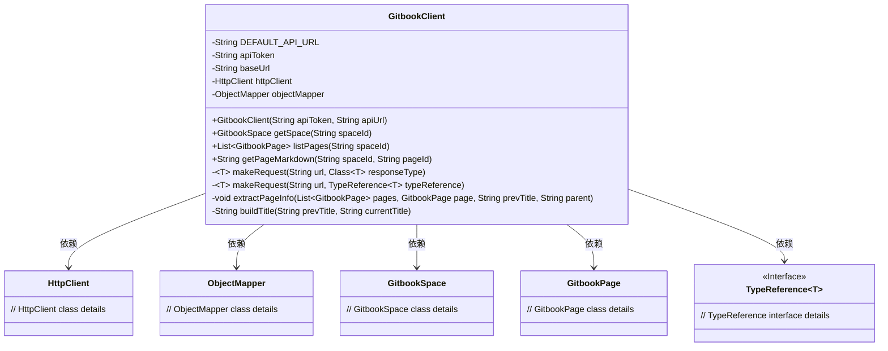
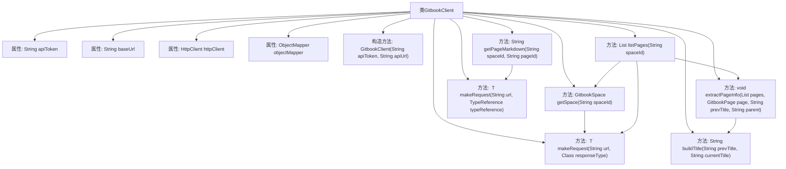

# 基础信息

|      |      |
|------|------|
| 名称 | GitbookClient |
| 编码语言 | .java |
| 代码路径 | spring-ai-alibaba/community/document-readers/spring-ai-alibaba-starter-document-reader-gitbook/src/main/java/com/alibaba/cloud/ai/reader/gitbook/GitbookClient.java |
| 包名 | com.alibaba.cloud.ai.reader.gitbook |
| 依赖项 | ['com.alibaba.cloud.ai.reader.gitbook.model.GitbookPage', 'com.alibaba.cloud.ai.reader.gitbook.model.GitbookSpace', 'com.fasterxml.jackson.core.type.TypeReference', 'com.fasterxml.jackson.databind.ObjectMapper', 'java.net.URI', 'java.net.http.HttpClient', 'java.net.http.HttpRequest', 'java.net.http.HttpResponse', 'java.util.ArrayList', 'java.util.List', 'java.util.Map'] |
| 概述说明 | Gitbook客户端类，支持API请求、获取空间信息、列出页面及获取Markdown内容。 |

# 说明

Gitbook客户端类提供了一系列功能，包括支持API请求、获取空间信息、列出页面以及获取Markdown内容。该类旨在简化与Gitbook平台的交互，通过API请求实现数据获取，支持用户查询空间信息，列出指定空间内的页面，并能够获取页面的Markdown格式内容，便于进一步处理和使用。

# 类列表 Class Summary

| 名称   | 类型  | 说明 |
|-------|------|-------------|
| GitbookClient | class | Gitbook客户端类，支持API请求、获取空间信息、列出页面及获取Markdown内容。 |

## 类 GitbookClient

|      |      |
|------|------|
| 访问范围 | public |
| 类型 | class |
| 名称 | GitbookClient |
| 说明 | Gitbook客户端类，支持API请求、获取空间信息、列出页面及获取Markdown内容。 |

### UML类图

**描述：**  
`GitbookClient` 类是一个用于与 Gitbook API 进行交互的客户端。它包含用于获取空间信息、列出页面、获取页面 Markdown 内容的方法。该类依赖于 `HttpClient` 进行 HTTP 请求，依赖于 `ObjectMapper` 进行 JSON 解析，并使用了泛型 `TypeReference` 来处理复杂类型的响应。`GitbookSpace` 和 `GitbookPage` 类分别表示 Gitbook 的空间和页面信息。

### 内部方法调用关系图

这段代码定义了一个 `GitbookClient` 类，用于与 Gitbook API 进行交互。类中包含多个方法，如 `getSpace`、`listPages`、`getPageMarkdown` 等，用于获取 Gitbook 空间、页面列表和页面内容。核心方法 `makeRequest` 负责发送 HTTP 请求并解析响应。`extractPageInfo` 方法递归地提取页面信息并构建页面层次结构。`buildTitle` 方法用于构建标题路径。整个类的设计旨在简化与 Gitbook API 的交互，并提供灵活的数据处理能力。

### 字段列表 Field List

| 名称  | 类型  | 说明 |
|-------|-------|------|
| DEFAULT_API_URL = "https://api.gitbook.com/v1" | String | 定义默认API地址为"https://api.gitbook.com/v1"。 |
| httpClient | HttpClient | 定义了一个私有的HttpClient对象。 |
| baseUrl | String | 私有常量字符串存储基础URL。 |
| objectMapper | ObjectMapper | 私有对象映射器实例。 |
| apiToken | String | 声明了一个私有的不可变字符串变量apiToken。 |

### 方法列表 Method List

| 名称  | 类型  | 说明 |
|-------|-------|------|
| listPages | List<GitbookPage> | 通过空间ID获取Gitbook页面列表，提取页面信息并返回。 |
| extractPageInfo | void | 递归提取Gitbook页面信息，设置父级并添加文档到列表。 |
| getSpace | GitbookSpace | 获取指定ID的Gitbook空间信息。 |
| buildTitle | String | 方法buildTitle拼接prevTitle和currentTitle，中间用">"连接。 |
| getPageMarkdown | String | 获取指定页面的Markdown内容，通过URL和请求实现。 |
| makeRequest | T | 私有方法：发送HTTP GET请求，处理响应并返回指定类型对象。 |
| makeRequest | T | 私有方法，通过URL和类型引用发起GET请求，处理响应并返回映射对象。 |

