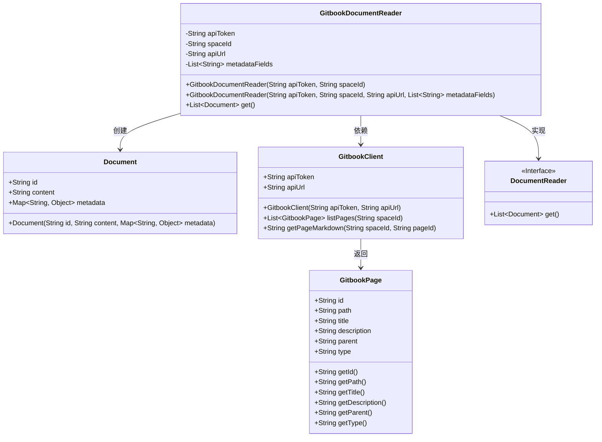
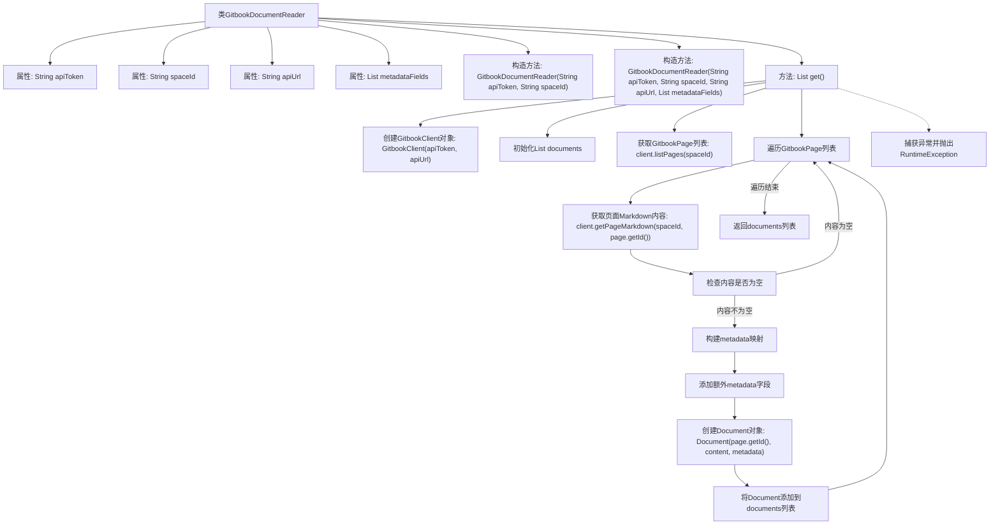

# 基础信息

|      |      |
|------|------|
| 名称 | GitbookDocumentReader |
| 编码语言 | .java |
| 代码路径 | spring-ai-alibaba/community/document-readers/spring-ai-alibaba-starter-document-reader-gitbook/src/main/java/com/alibaba/cloud/ai/reader/gitbook/GitbookDocumentReader.java |
| 包名 | com.alibaba.cloud.ai.reader.gitbook |
| 依赖项 | ['com.alibaba.cloud.ai.reader.gitbook.model.GitbookPage', 'org.springframework.ai.document.Document', 'org.springframework.ai.document.DocumentReader', 'org.springframework.util.Assert', 'java.util.ArrayList', 'java.util.HashMap', 'java.util.List', 'java.util.Map'] |
| 概述说明 | Gitbook文档读取器支持API令牌、空间ID、自定义API URL及元数据字段。 |

# 说明

Gitbook文档读取器是一款工具，能够通过API令牌和空间ID读取Gitbook页面内容。该工具支持用户自定义API URL，并且可以灵活配置元数据字段，以便更精准地获取所需信息。这一功能使得用户能够高效地管理和访问Gitbook中的文档数据。

# 类列表 Class Summary

| 名称   | 类型  | 说明 |
|-------|------|-------------|
| GitbookDocumentReader | class | Gitbook文档读取器，通过API令牌和空间ID读取Gitbook页面，支持自定义API URL和元数据字段。 |

## 类 GitbookDocumentReader

|      |      |
|------|------|
| 访问范围 | public |
| 类型 | class |
| 名称 | GitbookDocumentReader |
| 说明 | Gitbook文档读取器，通过API令牌和空间ID读取Gitbook页面，支持自定义API URL和元数据字段。 |

### UML类图

该代码展示了一个用于从Gitbook空间读取文档的类`GitbookDocumentReader`，它实现了`DocumentReader`接口。`GitbookDocumentReader`通过`GitbookClient`与Gitbook API交互，获取页面并将其转换为`Document`对象。代码中包含了两个构造函数，分别用于不同的初始化方式，并通过`get`方法获取所有文档。`Document`类用于存储文档的内容和元数据，而`GitbookPage`类表示Gitbook页面的详细信息。整个流程展示了如何从Gitbook空间获取页面并转换为文档的过程。

### 内部方法调用关系图

这段代码描述了一个`GitbookDocumentReader`类，用于从Gitbook空间中读取文档并将其转换为`Document`对象。流程图展示了类的构造方法和主要方法的执行流程，包括初始化Gitbook客户端、获取页面列表、处理页面内容、构建元数据、创建文档对象以及异常处理。整个过程确保从Gitbook空间获取的文档内容被正确转换为应用程序可用的格式。

### 字段列表 Field List

| 名称  | 类型  | 说明 |
|-------|-------|------|
| apiToken | String | 私有且不可变的API令牌字符串。 |
| spaceId | String | 私有字符串变量spaceId的声明。 |
| metadataFields | List<String> | 私有不可变字符串列表metadataFields。 |
| apiUrl | String | 私有字符串变量apiUrl用于存储API地址。 |

### 方法列表 Method List

| 名称  | 类型  | 说明 |
|-------|-------|------|
| get | List<Document> | GitbookClient获取页面并转换为Document对象，处理元数据，返回文档列表。 |

