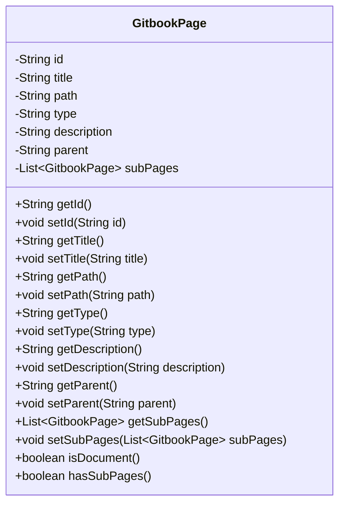

# 基础信息

|      |      |
|------|------|
| 名称 | GitbookPage |
| 编码语言 | .java |
| 代码路径 | spring-ai-alibaba/community/document-readers/spring-ai-alibaba-starter-document-reader-gitbook/src/main/java/com/alibaba/cloud/ai/reader/gitbook/model/GitbookPage.java |
| 包名 | com.alibaba.cloud.ai.reader.gitbook.model |
| 依赖项 | ['com.fasterxml.jackson.annotation.JsonIgnoreProperties', 'com.fasterxml.jackson.annotation.JsonProperty', 'java.util.List'] |
| 概述说明 | GitbookPage类包含页面信息及操作方法，如ID、标题、路径、类型等。 |

# 说明

GitbookPage类用于管理页面信息，包含页面ID、标题、路径、类型、描述、父页面ID及子页面列表等属性。该类还提供相关操作方法，用于处理和操作这些页面信息。

# 类列表 Class Summary

| 名称   | 类型  | 说明 |
|-------|------|-------------|
| GitbookPage | class | GitbookPage类包含页面ID、标题、路径、类型、描述、父页面ID及子页面列表，并提供相关操作方法。 |

## 类 GitbookPage

|      |      |
|------|------|
| 访问范围 | @JsonIgnoreProperties(ignoreUnknown = true);public |
| 类型 | class |
| 名称 | GitbookPage |
| 说明 | GitbookPage类包含页面ID、标题、路径、类型、描述、父页面ID及子页面列表，并提供相关操作方法。 |

### UML类图

### 描述
`GitbookPage`类用于表示Gitbook中的页面，包含页面的唯一标识符、标题、路径、类型、描述、父页面ID以及子页面列表。类中提供了对属性的访问和修改方法，并包含两个辅助方法：`isDocument()`用于判断页面是否为文档类型，`hasSubPages()`用于判断页面是否包含子页面。该类通过`@JsonIgnoreProperties`注解忽略未知的JSON属性，确保反序列化时的兼容性。

### 内部方法调用关系图

```mermaid
graph TD
    A["类GitbookPage"]
    B["属性: String id"]
    C["属性: String title"]
    D["属性: String path"]
    E["属性: String type"]
    F["属性: String description"]
    G["属性: String parent"]
    H["属性: List<GitbookPage> subPages"]
    I["方法: String getId()"]
    J["方法: void setId(String id)"]
    K["方法: String getTitle()"]
    L["方法: void setTitle(String title)"]
    M["方法: String getPath()"]
    N["方法: void setPath(String path)"]
    O["方法: String getType()"]
    P["方法: void setType(String type)"]
    Q["方法: String getDescription()"]
    R["方法: void setDescription(String description)"]
    S["方法: String getParent()"]
    T["方法: void setParent(String parent)"]
    U["方法: List<GitbookPage> getSubPages()"]
    V["方法: void setSubPages(List<GitbookPage> subPages)"]
    W["方法: boolean isDocument()"]
    X["方法: boolean hasSubPages()"]

    A --> B
    A --> C
    A --> D
    A --> E
    A --> F
    A --> G
    A --> H
    A --> I
    A --> J
    A --> K
    A --> L
    A --> M
    A --> N
    A --> O
    A --> P
    A --> Q
    A --> R
    A --> S
    A --> T
    A --> U
    A --> V
    A --> W
    A --> X
```

这段代码定义了一个名为`GitbookPage`的类，用于表示Gitbook中的页面。类中包含多个属性，如`id`、`title`、`path`、`type`、`description`、`parent`和`subPages`，分别表示页面的唯一标识、标题、路径、类型、描述、父页面和子页面列表。类中还提供了这些属性的getter和setter方法，以及两个辅助方法`isDocument()`和`hasSubPages()`，分别用于判断页面是否为文档类型和是否包含子页面。这段代码主要用于处理和操作Gitbook页面的数据。

### 字段列表 Field List

| 名称  | 类型  | 说明 |
|-------|-------|------|
| id | String | 定义了一个私有的字符串类型变量id。 |
| path | String | 声明了一个私有字符串变量path。 |
| description | String | 定义了一个私有字符串变量`description`。 |
| title | String | 定义一个私有的字符串类型变量title。 |
| subPages | List<GitbookPage> | GitbookPage子页面列表属性，使用JsonProperty注解。 |
| parent | String | 定义了一个私有字符串类型的变量parent。 |
| type | String | 定义了一个私有的字符串类型变量。 |

### 方法列表 Method List

| 名称  | 类型  | 说明 |
|-------|-------|------|
| getType | String | 该方法返回字符串类型的变量type。 |
| hasSubPages | boolean | 检查子页面是否存在且非空。 |
| getPath | String | 该方法返回字符串类型的路径变量值。 |
| getId | String | 方法getId返回字符串类型的id。 |
| setType | void | 设置对象类型的公共方法。 |
| isDocument | boolean | 判断类型是否为"document"。 |
| setDescription | void | 设置对象描述信息的方法。 |
| getParent | String | 方法返回父级对象。 |
| setTitle | void | 设置对象标题的方法，接受字符串参数。 |
| getSubPages | List<GitbookPage> | 获取子页面列表的方法。 |
| getDescription | String | 获取描述信息的方法。 |
| setSubPages | void | 设置子页面列表的方法。 |
| getTitle | String | 获取标题的方法，返回字符串类型。 |
| setPath | void | 设置路径方法，将传入路径赋值给当前对象。 |
| setId | void | 该方法用于设置对象的ID属性。 |
| setParent | void | 设置父级对象的字符串值。 |

