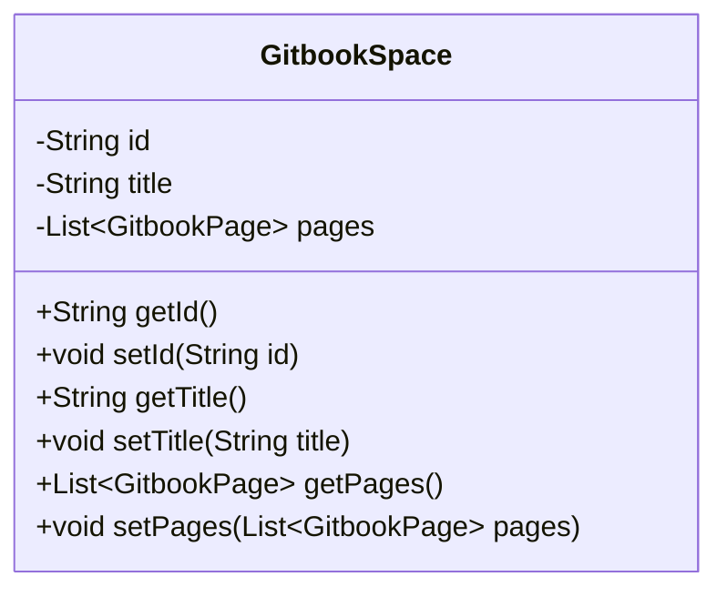
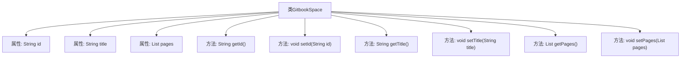

# 基础信息

|      |      |
|------|------|
| 名称 | GitbookSpace |
| 编码语言 | .java |
| 代码路径 | spring-ai-alibaba/community/document-readers/spring-ai-alibaba-starter-document-reader-gitbook/src/main/java/com/alibaba/cloud/ai/reader/gitbook/model/GitbookSpace.java |
| 包名 | com.alibaba.cloud.ai.reader.gitbook.model |
| 依赖项 | ['com.fasterxml.jackson.annotation.JsonIgnoreProperties', 'java.util.List'] |
| 概述说明 | GitbookSpace类包含ID、标题和页面列表属性，并提供getter和setter方法。 |

# 说明

GitbookSpace类是一个数据结构，包含三个主要属性：ID、标题和页面列表。ID用于唯一标识该空间，标题用于描述空间的名称或主题，页面列表则存储了该空间下的所有页面。类中提供了相应的getter和setter方法，用于获取和设置这些属性的值，确保数据的封装性和可访问性。

# 类列表 Class Summary

| 名称   | 类型  | 说明 |
|-------|------|-------------|
| GitbookSpace | class | GitbookSpace类包含ID、标题和页面列表属性，提供相应的getter和setter方法。 |

## 类 GitbookSpace

|      |      |
|------|------|
| 访问范围 | @JsonIgnoreProperties(ignoreUnknown = true);public |
| 类型 | class |
| 名称 | GitbookSpace |
| 说明 | GitbookSpace类包含ID、标题和页面列表属性，提供相应的getter和setter方法。 |

### UML类图

这段代码定义了一个名为 `GitbookSpace` 的类，用于表示 Gitbook 空间的基本信息。该类包含三个私有属性：`id`、`title` 和 `pages`，分别表示空间的唯一标识、标题和包含的页面列表。类中提供了这些属性的 getter 和 setter 方法，用于访问和修改这些属性的值。`pages` 属性是一个泛型列表，类型为 `GitbookPage`，表示该空间下的页面集合。这个类主要用于存储和操作 Gitbook 空间的相关数据。

### 内部方法调用关系图

这段代码定义了一个名为 `GitbookSpace` 的类，包含三个属性：`id`、`title` 和 `pages`，分别表示空间的唯一标识、标题和页面列表。类中提供了这些属性的 getter 和 setter 方法，用于获取和设置属性的值。代码通过 `@JsonIgnoreProperties(ignoreUnknown = true)` 注解，确保在反序列化 JSON 数据时忽略未知属性，增强了代码的健壮性。

### 字段列表 Field List

| 名称  | 类型  | 说明 |
|-------|-------|------|
| id | String | 定义了一个私有字符串类型的变量id。 |
| title | String | 定义了一个私有字符串类型的变量title。 |
| pages | List<GitbookPage> | 私有列表存储Gitbook页面对象。 |

### 方法列表 Method List

| 名称  | 类型  | 说明 |
|-------|-------|------|
| setTitle | void | 设置对象标题的方法。 |
| getTitle | String | 方法getTitle返回字符串类型的title值。 |
| setId | void | 该方法用于设置对象的ID属性。 |
| getPages | List<GitbookPage> | 该方法返回一个GitbookPage类型的列表。 |
| setPages | void | 设置GitbookPage列表到当前对象的pages属性。 |
| getId | String | 该方法返回对象的id属性值。 |

