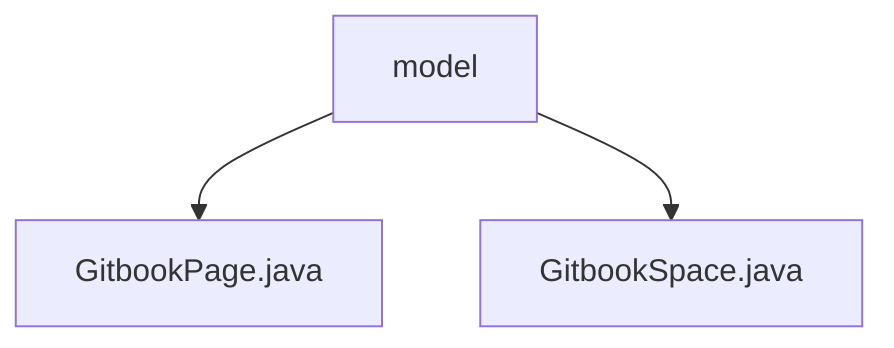

# 基础信息

|      |      |
|------|------|
| 名称 | model |
| 编码语言 | .java |
| 代码路径 | spring-ai-alibaba/community/document-readers/spring-ai-alibaba-starter-document-reader-gitbook/src/main/java/com/alibaba/cloud/ai/reader/gitbook/model |
| 包名 | spring-ai-alibaba.community.document-readers.spring-ai-alibaba-starter-document-reader-gitbook.src.main.java.com.alibaba.cloud.ai.reader.gitbook.model |
| 概述说明 | GitbookPage类管理页面信息，GitbookSpace类存储空间及其页面列表。 |

# 说明

## 概述
该代码模块主要用于管理和操作Gitbook中的页面和空间信息。模块包含两个核心类：`GitbookPage`和`GitbookSpace`。`GitbookPage`类用于管理单个页面的详细信息，包括页面ID、标题、路径、类型、描述、父页面ID及子页面列表等属性，并提供了相关操作方法。`GitbookSpace`类则用于管理Gitbook空间的信息，包含空间ID、标题和页面列表等属性，提供了相应的getter和setter方法以确保数据的封装性和可访问性。

## 主要业务场景
该模块的主要业务场景包括：
1. **页面管理**：通过`GitbookPage`类，可以创建、读取、更新和删除Gitbook页面信息，支持页面层级结构的维护（如父页面和子页面的关系）。
2. **空间管理**：通过`GitbookSpace`类，可以管理Gitbook空间的基本信息，包括空间的唯一标识、标题以及该空间下的所有页面列表。
3. **数据封装与操作**：两个类均提供了getter和setter方法，确保数据的封装性和可访问性，同时支持对页面和空间信息的灵活操作。

该模块适用于需要与Gitbook进行集成的应用场景，特别是在需要对页面和空间信息进行管理和操作的系统中。

### 包内部结构视图

该流程图展示了`spring-ai-alibaba-starter-document-reader-gitbook`项目中`model`目录下的文件结构。`model`目录包含两个Java文件：`GitbookPage.java`和`GitbookSpace.java`，分别用于表示Gitbook的页面和空间模型。

# 文件列表 File List

| 名称   | 类型  | 说明 |
|-------|------|-------------|
| [GitbookSpace.java](GitbookSpace.md) | file | GitbookSpace类包含ID、标题和页面列表属性，并提供getter和setter方法。 |
| [GitbookPage.java](GitbookPage.md) | file | GitbookPage类包含页面信息及操作方法，如ID、标题、路径、类型等。 |

