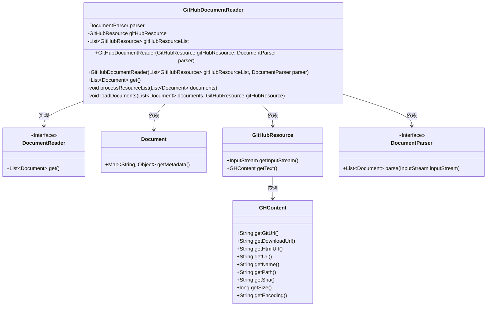
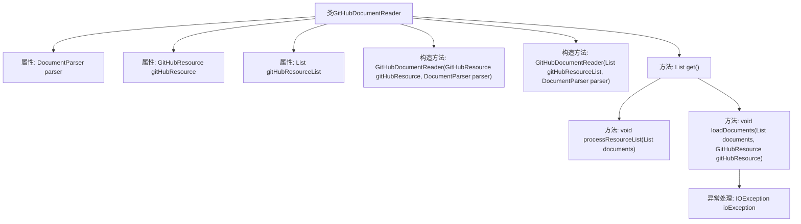

# 基础信息

|      |      |
|------|------|
| 名称 | GitHubDocumentReader |
| 编码语言 | .java |
| 代码路径 | spring-ai-alibaba/community/document-readers/spring-ai-alibaba-starter-document-reader-github/src/main/java/com/alibaba/cloud/ai/reader/github/GitHubDocumentReader.java |
| 包名 | com.alibaba.cloud.ai.reader.github |
| 依赖项 | ['org.kohsuke.github.GHContent', 'org.springframework.ai.document.Document', 'org.springframework.ai.document.DocumentReader', 'java.io.IOException', 'java.util.ArrayList', 'java.util.List', 'java.util.Map', 'java.util.Objects', 'com.alibaba.cloud.ai.document.DocumentParser'] |
| 概述说明 | GitHub文档读取器，支持解析单/多资源，提取附加元数据。 |

# 说明

GitHub文档读取器是一款工具，能够解析单个或多个资源文件，从中提取关键信息并附加元数据。该工具旨在帮助用户高效管理和处理GitHub上的文档内容，通过自动提取和附加元数据，提升文档的可读性和可搜索性。

# 类列表 Class Summary

| 名称   | 类型  | 说明 |
|-------|------|-------------|
| GitHubDocumentReader | class | GitHub文档读取器，支持单个或多个资源解析，提取并附加元数据。 |

## 类 GitHubDocumentReader

|      |      |
|------|------|
| 访问范围 | public |
| 类型 | class |
| 名称 | GitHubDocumentReader |
| 说明 | GitHub文档读取器，支持单个或多个资源解析，提取并附加元数据。 |

### UML类图

这段代码定义了一个`GitHubDocumentReader`类，该类实现了`DocumentReader`接口，用于从GitHub资源中读取文档。`GitHubDocumentReader`通过`DocumentParser`解析GitHub资源，并将解析后的文档存储在`Document`对象中。`GitHubResource`类提供了GitHub资源的输入流和文本内容，`GHContent`类则包含了GitHub资源的具体元数据。`GitHubDocumentReader`根据传入的单个或多个`GitHubResource`对象，分别处理并加载文档，最终返回一个包含所有文档的列表。

### 内部方法调用关系图

**描述**：`GitHubDocumentReader`类用于从GitHub资源中读取文档，并将其解析为`Document`对象。类包含两个构造方法，分别用于初始化单个`GitHubResource`和`GitHubResource`列表。`get()`方法根据资源类型调用`processResourceList()`或`loadDocuments()`方法来处理资源并生成文档列表。`loadDocuments()`方法通过`DocumentParser`解析资源，并将GitHub相关元数据添加到文档中。如果解析过程中发生`IOException`，则抛出运行时异常。

### 字段列表 Field List

| 名称  | 类型  | 说明 |
|-------|-------|------|
| gitHubResourceList | List<GitHubResource> | 私有GitHub资源列表变量声明。 |
| gitHubResource | GitHubResource | 定义私有GitHub资源变量gitHubResource。 |
| parser | DocumentParser | 私有不可变的DocumentParser实例变量。 |

### 方法列表 Method List

| 名称  | 类型  | 说明 |
|-------|-------|------|
| processResourceList | void | 遍历GitHub资源列表，为每个资源加载文档。 |
| get | List<Document> | 方法get()返回文档列表，根据资源列表或单个资源处理并加载文档。 |
| loadDocuments | void | 方法从GitHub加载文档并添加元数据，包括URL、文件名等。 |

