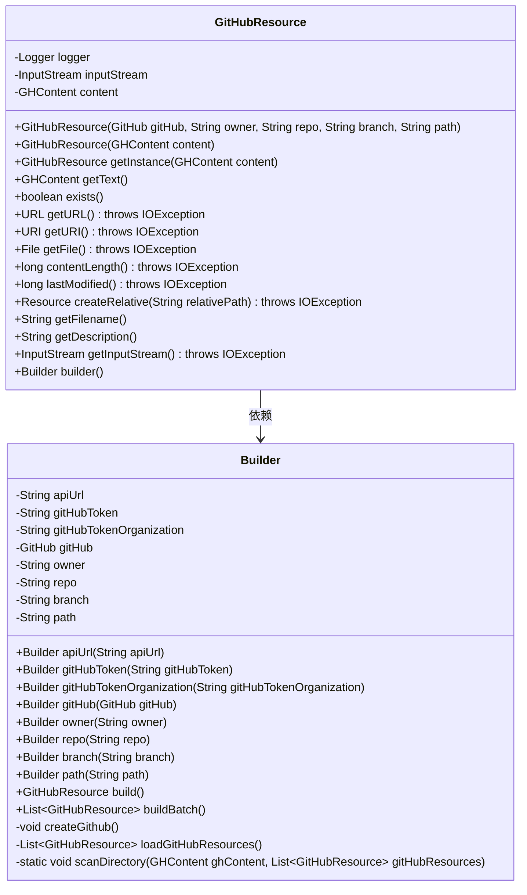

# 基础信息

|      |      |
|------|------|
| 名称 | GitHubResource |
| 编码语言 | .java |
| 代码路径 | spring-ai-alibaba/community/document-readers/spring-ai-alibaba-starter-document-reader-github/src/main/java/com/alibaba/cloud/ai/reader/github/GitHubResource.java |
| 包名 | com.alibaba.cloud.ai.reader.github |
| 依赖项 | ['org.kohsuke.github.GHContent', 'org.kohsuke.github.GitHub', 'org.kohsuke.github.GitHubBuilder', 'org.slf4j.Logger', 'org.slf4j.LoggerFactory', 'org.springframework.core.io.Resource', 'org.springframework.util.Assert', 'java.io.File', 'java.io.IOException', 'java.io.InputStream', 'java.net.URI', 'java.net.URL', 'java.util.ArrayList', 'java.util.List', 'java.util.Objects'] |
| 概述说明 | GitHubResource类支持从GitHub获取文件内容，包括单文件、多文件及流式读取。 |

# 说明

GitHubResource类是一个用于从GitHub获取文件内容的工具，支持单文件和多文件的加载操作。该类还提供了流式读取功能，允许用户以流的形式逐步读取文件内容，从而在处理大文件时提高效率。通过该工具，用户可以方便地从GitHub获取所需文件，并进行灵活的处理和操作。

# 类列表 Class Summary

| 名称   | 类型  | 说明 |
|-------|------|-------------|
| GitHubResource | class | GitHubResource类用于从GitHub获取文件内容，支持单文件和多文件加载，提供流式读取功能。 |

## 类 GitHubResource

|      |      |
|------|------|
| 访问范围 | public |
| 类型 | class |
| 名称 | GitHubResource |
| 说明 | GitHubResource类用于从GitHub获取文件内容，支持单文件和多文件加载，提供流式读取功能。 |

### UML类图

这段代码定义了一个 `GitHubResource` 类，用于从 GitHub 获取文件内容，并提供了相应的操作方法。`GitHubResource` 类通过 `Builder` 模式来构建对象，`Builder` 类负责初始化 `GitHub` 客户端并加载资源。`GitHubResource` 类提供了多个方法用于获取文件内容、URL、URI 等，并支持批量加载资源。`Builder` 类通过链式调用设置参数，并最终构建 `GitHubResource` 对象或批量加载资源。

### 内部方法调用关系图

```mermaid
graph TD
    A["类GitHubResource"]
    B["属性: Logger logger"]
    C["属性: InputStream inputStream"]
    D["属性: GHContent content"]
    E["构造方法: GitHubResource(GitHub gitHub, String owner, String repo, String branch, String path)"]
    F["构造方法: GitHubResource(GHContent content)"]
    G["静态方法: getInstance(GHContent content)"]
    H["方法: getText()"]
    I["重写方法: exists()"]
    J["重写方法: getURL()"]
    K["重写方法: getURI()"]
    L["重写方法: getFile()"]
    M["重写方法: contentLength()"]
    N["重写方法: lastModified()"]
    O["重写方法: createRelative(String relativePath)"]
    P["重写方法: getFilename()"]
    Q["重写方法: getDescription()"]
    R["重写方法: getInputStream()"]
    S["静态方法: builder()"]
    T["内部类Builder"]
    U["属性: String apiUrl"]
    V["属性: String gitHubToken"]
    W["属性: String gitHubTokenOrganization"]
    X["属性: GitHub gitHub"]
    Y["属性: String owner"]
    Z["属性: String repo"]
    AA["属性: String branch"]
    AB["属性: String path"]
    AC["方法: apiUrl(String apiUrl)"]
    AD["方法: gitHubToken(String gitHubToken)"]
    AE["方法: gitHubTokenOrganization(String gitHubTokenOrganization)"]
    AF["方法: gitHub(GitHub gitHub)"]
    AG["方法: owner(String owner)"]
    AH["方法: repo(String repo)"]
    AI["方法: branch(String branch)"]
    AJ["方法: path(String path)"]
    AK["方法: build()"]
    AL["方法: buildBatch()"]
    AM["方法: createGithub()"]
    AN["方法: loadGitHubResources()"]
    AO["静态方法: scanDirectory(GHContent ghContent, List<GitHubResource> gitHubResources)"]

    A --> B
    A --> C
    A --> D
    A --> E
    A --> F
    A --> G
    A --> H
    A --> I
    A --> J
    A --> K
    A --> L
    A --> M
    A --> N
    A --> O
    A --> P
    A --> Q
    A --> R
    A --> S
    A -.-> T
    T --> U
    T --> V
    T --> W
    T --> X
    T --> Y
    T --> Z
    T --> AA
    T --> AB
    T --> AC
    T --> AD
    T --> AE
    T --> AF
    T --> AG
    T --> AH
    T --> AI
    T --> AJ
    T --> AK
    T --> AL
    T --> AM
    T --> AN
    T --> AO
```

这段代码定义了一个名为 `GitHubResource` 的类，用于从GitHub获取资源。类中包含两个构造函数，分别通过GitHub API或直接通过 `GHContent` 对象初始化资源。类还提供了多个重写方法，用于处理资源的存在性、URL、URI、文件路径等操作。内部类 `Builder` 用于构建 `GitHubResource` 对象，提供了链式调用的API，支持批量构建资源。流程图展示了类的主要结构和内部方法调用关系。

### 字段列表 Field List

| 名称  | 类型  | 说明 |
|-------|-------|------|
| inputStream | InputStream | 私有不可变的输入流对象。 |
| content | GHContent | 私有不可变的GHContent对象实例。 |
| logger = LoggerFactory.getLogger(GitHubResource.class) | Logger | GitHubResource类中定义了一个私有静态日志记录器。 |

### 方法列表 Method List

| 名称  | 类型  | 说明 |
|-------|-------|------|
| getText | GHContent | 获取并返回内容的方法。 |
| getFilename | String | 重写getFilename方法，返回空字符串。 |
| getInputStream | InputStream | 重写getInputStream方法，返回inputStream对象。 |
| lastModified | long | 重写lastModified方法，返回固定值0。 |
| createRelative | Resource | 重写方法createRelative，返回null，可能抛出IOException。 |
| getInstance | GitHubResource | 静态方法getInstance返回GitHubResource实例。 |
| exists | boolean | 重写exists方法，始终返回false。 |
| getFile | File | 重写getFile方法，返回null，可能抛出IOException异常。 |
| builder | Builder | 静态方法`builder()`返回`Builder`类的新实例。 |
| getDescription | String | 重写getDescription方法，返回空字符串。 |
| getURL | URL | 重写getURL方法，返回null，可能抛出IOException异常。 |
| getURI | URI | 重写getURI方法，返回null并抛出IOException异常。 |
| contentLength | long | 重写方法contentLength，返回0，可能抛出IOException。 |

