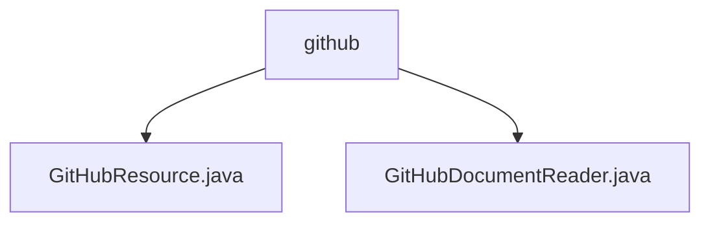

# 基础信息

|      |      |
|------|------|
| 名称 | github |
| 编码语言 | .java |
| 代码路径 | spring-ai-alibaba/community/document-readers/spring-ai-alibaba-starter-document-reader-github/src/main/java/com/alibaba/cloud/ai/reader/github |
| 包名 | spring-ai-alibaba.community.document-readers.spring-ai-alibaba-starter-document-reader-github.src.main.java.com.alibaba.cloud.ai.reader.github |
| 概述说明 | GitHubResource类支持文件加载和流式读取，GitHubDocumentReader提取文件信息并附加元数据。 |

# 说明

## 概述
该代码模块主要提供了一套用于从GitHub获取和解析文档内容的工具。核心功能包括从GitHub加载单文件或多文件内容，并支持流式读取以高效处理大文件。此外，模块还包含一个文档读取器，能够解析这些文件并提取关键信息，同时附加元数据，以提升文档的可读性和可搜索性。

## 主要业务场景
1. **GitHub文件内容获取**：通过`GitHubResource`类，用户可以从GitHub加载单个或多个文件，支持流式读取，适用于处理大文件或需要逐步处理文件内容的场景。
2. **文档解析与元数据附加**：使用`GitHubDocumentReader`工具，用户可以解析从GitHub获取的文档，提取关键信息并附加元数据，帮助用户更高效地管理和搜索文档内容。
3. **自动化文档处理**：该模块适用于需要从GitHub获取文档并自动化处理、解析、附加元数据的场景，例如文档管理系统、知识库构建等。

### 包内部结构视图

该流程图展示了`github`文件夹下的两个Java文件：`GitHubResource.java`和`GitHubDocumentReader.java`。`github`作为父节点，包含这两个子节点，清晰地表示了它们之间的层级关系。

# 文件列表 File List

| 名称   | 类型  | 说明 |
|-------|------|-------------|
| [GitHubDocumentReader.java](GitHubDocumentReader.md) | file | GitHub文档读取器，支持解析单/多资源，提取附加元数据。 |
| [GitHubResource.java](GitHubResource.md) | file | GitHubResource类支持从GitHub获取文件内容，包括单文件、多文件及流式读取。 |

