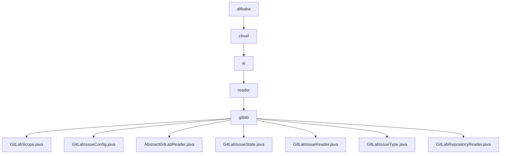

# 基础信息

|      |      |
|------|------|
| 名称 | alibaba |
| 编码语言 | .java |
| 代码路径 | spring-ai-alibaba/community/document-readers/spring-ai-alibaba-starter-document-reader-gitlab/src/main/java/com/alibaba |
| 包名 | spring-ai-alibaba.community.document-readers.spring-ai-alibaba-starter-document-reader-gitlab.src.main.java.com.alibaba |
| 概述说明 | GitLab相关类提供问题筛选、文档读取、仓库文件管理功能，提升GitLab数据处理效率。 |

# 说明

## 概述

该代码模块名为 `spring-ai-alibaba-starter-document-reader-gitlab`，主要功能是与 GitLab 平台进行集成，提供文档和问题的读取、过滤及管理功能。模块通过抽象类和具体实现类的方式，封装了与 GitLab API 的交互逻辑，支持对 GitLab 仓库文件和问题的灵活读取与处理。开发者可以通过配置筛选条件，高效地获取所需的文档或问题数据，从而提升开发团队的工作效率。

## 主要业务场景

1. **GitLab 文档读取**：
   - 通过 `AbstractGitLabReader` 抽象类，开发者可以实现与 GitLab 的通信，读取和管理 GitLab 上的文档资源。该类集成了 API 客户端，支持项目和 URL 管理功能，便于组织和访问 GitLab 中的文档。
   - `GitLabRepositoryReader` 类进一步扩展了文档读取功能，支持指定分支、路径过滤、模式匹配以及递归读取，满足不同场景下的文件读取需求。

2. **GitLab 问题管理**：
   - `GitLabIssueConfig` 类提供了对 GitLab 问题的筛选功能，支持根据创建者、问题类型、标签等条件进行精确过滤，帮助用户快速定位和处理相关任务。
   - `GitLabIssueReader` 类实现了问题的读取和转换功能，能够将筛选后的问题数据转换为文档格式，便于进一步处理和分析。
   - `GitLabIssueState` 和 `GitLabIssueType` 类为问题管理和筛选提供了状态和类型的枚举支持，增强了问题处理的灵活性。

该模块的核心目标是为开发者提供一套高效、灵活的工具，用于与 GitLab 平台进行深度集成，简化文档和问题的读取与管理流程。

### 包内部结构视图

该流程图展示了从`alibaba`到`gitlab`的层级关系，以及`gitlab`目录下的多个文件。路径从`alibaba`开始，逐步深入到`cloud`、`ai`、`reader`，最终到达`gitlab`，并在`gitlab`目录下包含多个与GitLab相关的Java文件。

# 文件列表 File List

| 名称   | 类型  | 说明 |
|-------|------|-------------|
| [cloud](cloud/_module.md) | package | GitLab相关类提供问题筛选、文档读取、仓库文件管理功能，提升GitLab数据处理效率。 |

