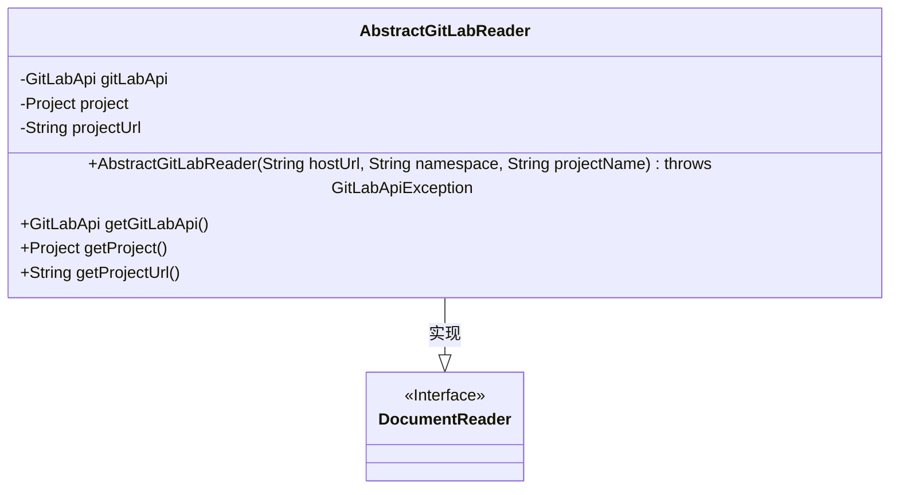
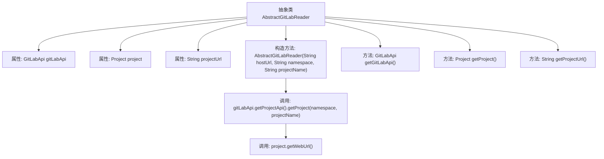

# 基础信息

|      |      |
|------|------|
| 名称 | AbstractGitLabReader |
| 编码语言 | .java |
| 代码路径 | spring-ai-alibaba/community/document-readers/spring-ai-alibaba-starter-document-reader-gitlab/src/main/java/com/alibaba/cloud/ai/reader/gitlab/AbstractGitLabReader.java |
| 包名 | com.alibaba.cloud.ai.reader.gitlab |
| 依赖项 | ['org.gitlab4j.api.GitLabApi', 'org.gitlab4j.api.GitLabApiException', 'org.gitlab4j.api.models.Project', 'org.springframework.ai.document.DocumentReader', 'org.springframework.util.Assert'] |
| 概述说明 | 抽象类实现GitLab文档读取，管理API客户端、项目和URL。 |

# 说明

该内容描述了一个抽象类，用于实现GitLab文档的读取功能。该抽象类集成了API客户端，用于与GitLab进行通信，并包含项目和URL管理功能，以便有效地组织和访问GitLab中的文档资源。通过这种方式，开发者可以方便地读取和管理GitLab上的文档内容。

# 类列表 Class Summary

| 名称   | 类型  | 说明 |
|-------|------|-------------|
| AbstractGitLabReader | class | 抽象类实现GitLab文档读取，包含API客户端、项目和URL管理。 |

## 类 AbstractGitLabReader

|      |      |
|------|------|
| 访问范围 | public abstract |
| 类型 | class |
| 名称 | AbstractGitLabReader |
| 说明 | 抽象类实现GitLab文档读取，包含API客户端、项目和URL管理。 |

### UML类图

类图描述：
`AbstractGitLabReader` 是一个抽象类，实现了 `DocumentReader` 接口。它包含了 `GitLabApi`、`Project` 和 `projectUrl` 三个私有属性，分别用于与 GitLab 服务器交互、存储项目信息和项目的 Web URL。类中提供了一个构造函数，用于初始化这些属性，并提供了三个受保护的方法来获取这些属性的值。该类主要用于从 GitLab 公共仓库读取文档。

### 内部方法调用关系图

这段代码描述了一个抽象类 `AbstractGitLabReader`，它用于与 GitLab API 进行交互。类中包含三个主要属性：`gitLabApi`、`project` 和 `projectUrl`，分别表示 GitLab API 客户端、GitLab 项目对象和项目 URL。构造方法 `AbstractGitLabReader` 用于初始化这些属性，并通过 GitLab API 获取项目信息和 URL。类中还提供了三个 getter 方法，用于获取这些属性的值。流程图展示了类的结构及其方法之间的调用关系。

### 字段列表 Field List

| 名称  | 类型  | 说明 |
|-------|-------|------|
| project | Project | 受保护的最终项目实例。 |
| gitLabApi | GitLabApi | 受保护的GitLabApi实例变量。 |
| projectUrl | String | 项目URL为受保护的最终字符串。 |

### 方法列表 Method List

| 名称  | 类型  | 说明 |
|-------|-------|------|
| getProject | Project | 该方法返回项目实例。 |
| getGitLabApi | GitLabApi | 该方法返回GitLabApi实例。 |
| getProjectUrl | String | 该方法返回项目URL的字符串值。 |

