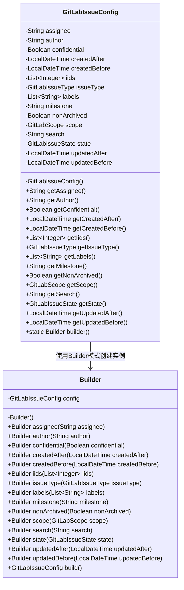

# 基础信息

|      |      |
|------|------|
| 名称 | GitLabIssueConfig |
| 编码语言 | .java |
| 代码路径 | spring-ai-alibaba/community/document-readers/spring-ai-alibaba-starter-document-reader-gitlab/src/main/java/com/alibaba/cloud/ai/reader/gitlab/GitLabIssueConfig.java |
| 包名 | com.alibaba.cloud.ai.reader.gitlab |
| 依赖项 | ['java.time.LocalDateTime', 'java.util.List'] |
| 概述说明 | GitLabIssueConfig类用于按创建者、类型和标签过滤GitLab问题。 |

# 说明

GitLabIssueConfig类专门用于过滤GitLab问题，提供多种筛选条件，包括问题的创建者、问题类型以及标签等。通过配置这些条件，用户可以精确地筛选出符合特定要求的问题，从而更高效地进行问题管理和分析。该类为处理GitLab问题提供了灵活且强大的过滤功能，帮助用户快速定位和处理相关任务。

# 类列表 Class Summary

| 名称   | 类型  | 说明 |
|-------|------|-------------|
| GitLabIssueConfig | class | GitLabIssueConfig类用于过滤GitLab问题，包含创建者、类型、标签等条件。 |

## 类 GitLabIssueConfig

|      |      |
|------|------|
| 访问范围 | public |
| 类型 | class |
| 名称 | GitLabIssueConfig |
| 说明 | GitLabIssueConfig类用于过滤GitLab问题，包含创建者、类型、标签等条件。 |

### UML类图

**描述**：`GitLabIssueConfig`类用于配置GitLab问题的过滤条件，包含多个私有属性如`assignee`、`author`、`confidential`等。该类通过`Builder`内部类实现构建者模式，允许链式调用设置属性并最终构建`GitLabIssueConfig`实例。这种方式使得配置对象的创建更加灵活和易读。

### 内部方法调用关系图

```mermaid
graph TD
    A["类GitLabIssueConfig"]
    B["属性: String assignee"]
    C["属性: String author"]
    D["属性: Boolean confidential"]
    E["属性: LocalDateTime createdAfter"]
    F["属性: LocalDateTime createdBefore"]
    G["属性: List<Integer> iids"]
    H["属性: GitLabIssueType issueType"]
    I["属性: List<String> labels"]
    J["属性: String milestone"]
    K["属性: Boolean nonArchived"]
    L["属性: GitLabScope scope"]
    M["属性: String search"]
    N["属性: GitLabIssueState state"]
    O["属性: LocalDateTime updatedAfter"]
    P["属性: LocalDateTime updatedBefore"]
    Q["构造方法: GitLabIssueConfig()"]
    R["方法: String getAssignee()"]
    S["方法: String getAuthor()"]
    T["方法: Boolean getConfidential()"]
    U["方法: LocalDateTime getCreatedAfter()"]
    V["方法: LocalDateTime getCreatedBefore()"]
    W["方法: List<Integer> getIids()"]
    X["方法: GitLabIssueType getIssueType()"]
    Y["方法: List<String> getLabels()"]
    Z["方法: String getMilestone()"]
    AA["方法: Boolean getNonArchived()"]
    AB["方法: GitLabScope getScope()"]
    AC["方法: String getSearch()"]
    AD["方法: GitLabIssueState getState()"]
    AE["方法: LocalDateTime getUpdatedAfter()"]
    AF["方法: LocalDateTime getUpdatedBefore()"]
    AG["静态方法: Builder builder()"]
    AH["内部类Builder"]
    AI["属性: GitLabIssueConfig config"]
    AJ["构造方法: Builder()"]
    AK["方法: Builder assignee(String assignee)"]
    AL["方法: Builder author(String author)"]
    AM["方法: Builder confidential(Boolean confidential)"]
    AN["方法: Builder createdAfter(LocalDateTime createdAfter)"]
    AO["方法: Builder createdBefore(LocalDateTime createdBefore)"]
    AP["方法: Builder iids(List<Integer> iids)"]
    AQ["方法: Builder issueType(GitLabIssueType issueType)"]
    AR["方法: Builder labels(List<String> labels)"]
    AS["方法: Builder milestone(String milestone)"]
    AT["方法: Builder nonArchived(Boolean nonArchived)"]
    AU["方法: Builder scope(GitLabScope scope)"]
    AV["方法: Builder search(String search)"]
    AW["方法: Builder state(GitLabIssueState state)"]
    AX["方法: Builder updatedAfter(LocalDateTime updatedAfter)"]
    AY["方法: Builder updatedBefore(LocalDateTime updatedBefore)"]
    AZ["方法: GitLabIssueConfig build()"]

    A --> B
    A --> C
    A --> D
    A --> E
    A --> F
    A --> G
    A --> H
    A --> I
    A --> J
    A --> K
    A --> L
    A --> M
    A --> N
    A --> O
    A --> P
    A --> Q
    A --> R
    A --> S
    A --> T
    A --> U
    A --> V
    A --> W
    A --> X
    A --> Y
    A --> Z
    A --> AA
    A --> AB
    A --> AC
    A --> AD
    A --> AE
    A --> AF
    A --> AG
    A --> AH
    AH --> AI
    AH --> AJ
    AH --> AK
    AH --> AL
    AH --> AM
    AH --> AN
    AH --> AO
    AH --> AP
    AH --> AQ
    AH --> AR
    AH --> AS
    AH --> AT
    AH --> AU
    AH --> AV
    AH --> AW
    AH --> AX
    AH --> AY
    AH --> AZ
```

这段代码定义了一个`GitLabIssueConfig`类，用于配置和过滤GitLab中的问题。该类包含多个属性，如`assignee`、`author`、`confidential`等，用于设置过滤条件。通过内部类`Builder`，可以使用构建者模式来创建`GitLabIssueConfig`的实例。`Builder`类提供了多个方法，用于设置各个属性，并最终通过`build()`方法返回配置好的`GitLabIssueConfig`对象。这种设计使得配置过程更加灵活和可读。

### 字段列表 Field List

| 名称  | 类型  | 说明 |
|-------|-------|------|
| assignee | String | 定义一个私有字符串变量assignee。 |
| updatedAfter | LocalDateTime | 更新时间为LocalDateTime类型。 |
| milestone | String | 定义私有字符串变量milestone。 |
| createdBefore | LocalDateTime | 定义私有LocalDateTime类型变量createdBefore。 |
| author | String | 定义了一个私有字符串类型的作者变量。 |
| iids | List<Integer> | 声明一个私有整数列表变量iids。 |
| confidential | Boolean | 私有布尔类型变量confidential用于标识信息是否保密。 |
| search | String | 定义了一个私有字符串变量search。 |
| labels | List<String> | 私有字符串列表变量labels。 |
| nonArchived | Boolean | 定义了一个布尔类型的私有变量nonArchived。 |
| issueType | GitLabIssueType | 私有变量issueType，类型为GitLabIssueType。 |
| state | GitLabIssueState | 私有GitLab问题状态变量。 |
| updatedBefore | LocalDateTime | 定义了一个私有的LocalDateTime类型变量updatedBefore。 |
| createdAfter | LocalDateTime | 创建时间筛选条件，指定为某个时间点之后。 |
| scope | GitLabScope | 定义了一个私有GitLabScope类型的变量scope。 |

### 方法列表 Method List

| 名称  | 类型  | 说明 |
|-------|-------|------|
| getCreatedBefore | LocalDateTime | 获取创建时间前的LocalDateTime对象。 |
| getAssignee | String | 该方法返回`assignee`变量的值。 |
| getState | GitLabIssueState | 获取GitLabIssue的当前状态。 |
| getNonArchived | Boolean | 返回非归档状态布尔值。 |
| getLabels | List<String> | 方法返回字符串列表labels。 |
| getIssueType | GitLabIssueType | 获取GitLab问题类型的方法。 |
| getScope | GitLabScope | 获取GitLabScope对象的方法。 |
| getConfidential | Boolean | 该方法返回布尔值表示机密状态。 |
| getCreatedAfter | LocalDateTime | 获取创建时间之后的日期时间对象。 |
| getUpdatedAfter | LocalDateTime | 获取更新时间的方法。 |
| getSearch | String | 获取搜索字符串的方法。 |
| getMilestone | String | 获取里程碑信息的公共方法。 |
| getUpdatedBefore | LocalDateTime | 获取更新前的本地日期时间。 |
| getAuthor | String | 该方法返回作者名字。 |
| builder | Builder | 静态方法返回新Builder实例。 |
| getIids | List<Integer> | 该方法返回一个整数列表iids。 |

