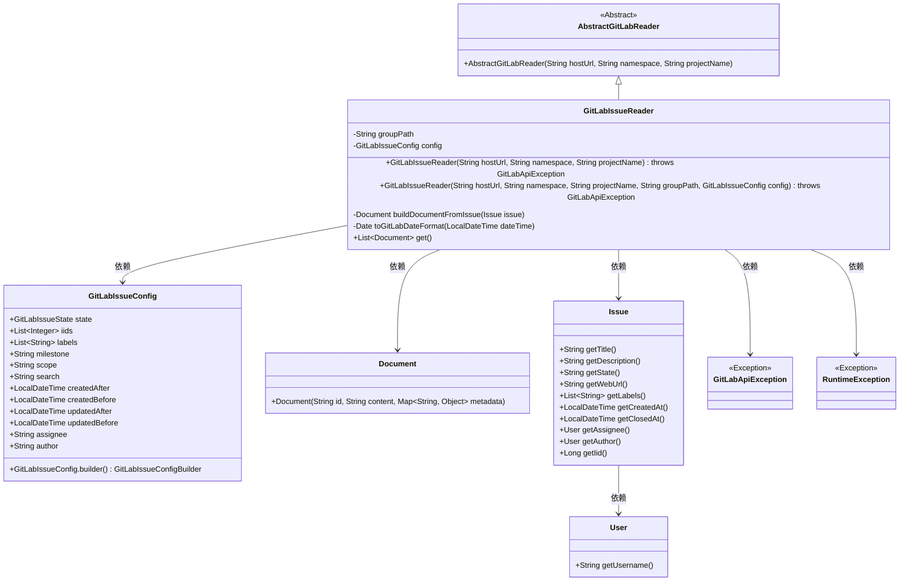

# 基础信息

|      |      |
|------|------|
| 名称 | GitLabIssueReader |
| 编码语言 | .java |
| 代码路径 | spring-ai-alibaba/community/document-readers/spring-ai-alibaba-starter-document-reader-gitlab/src/main/java/com/alibaba/cloud/ai/reader/gitlab/GitLabIssueReader.java |
| 包名 | com.alibaba.cloud.ai.reader.gitlab |
| 依赖项 | ['org.gitlab4j.api.GitLabApi', 'org.gitlab4j.api.GitLabApiException', 'org.gitlab4j.api.IssuesApi', 'org.gitlab4j.api.models.Issue', 'org.gitlab4j.api.models.IssueFilter', 'org.gitlab4j.models.Constants', 'org.springframework.ai.document.Document', 'java.time.LocalDateTime', 'java.time.ZoneId', 'java.util'] |
| 概述说明 | GitLabIssueReader类读取GitLab问题，支持过滤和文档格式转换。 |

# 说明

GitLabIssueReader类是一个专门用于读取GitLab问题的工具，具备过滤和转换功能。它能够根据特定条件筛选问题，并将结果转换为文档格式，便于进一步处理和分析。该类的主要用途是高效地管理和处理GitLab平台上的问题数据，提升开发团队的工作效率。

# 类列表 Class Summary

| 名称   | 类型  | 说明 |
|-------|------|-------------|
| GitLabIssueReader | class | GitLabIssueReader类用于读取GitLab问题，支持过滤和转换为文档格式。 |

## 类 GitLabIssueReader

|      |      |
|------|------|
| 访问范围 | public |
| 类型 | class |
| 名称 | GitLabIssueReader |
| 说明 | GitLabIssueReader类用于读取GitLab问题，支持过滤和转换为文档格式。 |

### UML类图

### 描述
`GitLabIssueReader` 类继承自 `AbstractGitLabReader`，用于从 GitLab 读取问题（Issues）并将其转换为 `Document` 对象。它包含两个构造函数，分别用于默认配置和自定义配置。`get()` 方法通过 `IssuesApi` 获取问题列表，并使用 `buildDocumentFromIssue` 方法将每个问题转换为 `Document`。`GitLabIssueConfig` 类用于配置问题过滤参数，`Issue` 类表示 GitLab 中的问题，`User` 类表示问题的分配者和作者。

### 内部方法调用关系图

```mermaid
graph TD
    A["类GitLabIssueReader"]
    B["属性: String groupPath"]
    C["属性: GitLabIssueConfig config"]
    D["构造方法: GitLabIssueReader(String hostUrl, String namespace, String projectName)"]
    E["构造方法: GitLabIssueReader(String hostUrl, String namespace, String projectName, String groupPath, GitLabIssueConfig config)"]
    F["方法: Document buildDocumentFromIssue(Issue issue)"]
    G["方法: Date toGitLabDateFormat(LocalDateTime dateTime)"]
    H["方法: List<Document> get()"]
    I["调用: super(hostUrl, namespace, projectName)"]
    J["调用: GitLabIssueConfig.builder().state(GitLabIssueState.OPEN).build()"]
    K["调用: gitLabApi.getIssuesApi()"]
    L["调用: config.getIids()"]
    M["调用: toGitLabDateFormat(config.getCreatedAfter())"]
    N["调用: Long.parseLong(assignee)"]
    O["调用: issuesApi.getGroupIssues(groupPath, filter)"]
    P["调用: issuesApi.getIssues(project.getId(), filter)"]
    Q["调用: buildDocumentFromIssue(issue)"]
    R["异常处理: GitLabApiException"]

    A --> B
    A --> C
    A --> D
    A --> E
    A --> F
    A --> G
    A --> H
    E --> I
    E --> J
    H --> K
    H --> L
    H --> M
    H --> N
    H --> O
    H --> P
    H --> Q
    H --> R
```

这段代码描述了一个`GitLabIssueReader`类，该类用于从GitLab读取问题（Issues）并将其转换为文档（Document）格式。类中包含两个构造方法，分别用于初始化GitLab主机URL、项目命名空间、项目名称、组路径和配置对象。`get()`方法通过调用GitLab API获取问题列表，并将其转换为文档格式返回。代码中还包含对异常的处理，确保在API调用失败时抛出运行时异常。

### 字段列表 Field List

| 名称  | 类型  | 说明 |
|-------|-------|------|
| groupPath | String | 私有字符串变量groupPath。 |
| config | GitLabIssueConfig | 私有GitLabIssueConfig配置对象。 |

### 方法列表 Method List

| 名称  | 类型  | 说明 |
|-------|-------|------|
| toGitLabDateFormat | Date | 将LocalDateTime转换为GitLab日期格式的私有方法。 |
| get | List<Document> | 方法通过GitLab API获取问题列表，根据配置过滤并转换为文档格式。 |
| buildDocumentFromIssue | Document | 从Issue构建Document，包含标题、描述和元数据。 |

