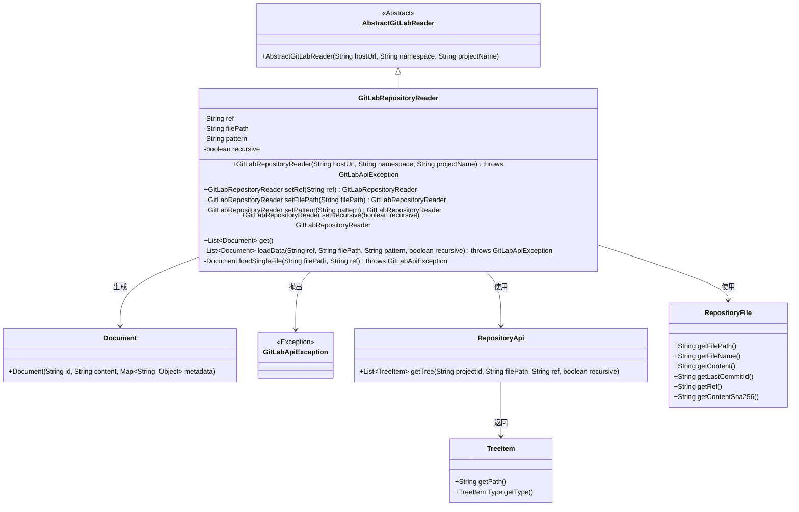
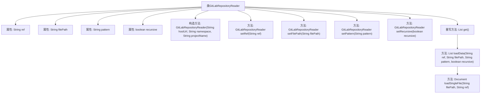

# 基础信息

|      |      |
|------|------|
| 名称 | GitLabRepositoryReader |
| 编码语言 | .java |
| 代码路径 | spring-ai-alibaba/community/document-readers/spring-ai-alibaba-starter-document-reader-gitlab/src/main/java/com/alibaba/cloud/ai/reader/gitlab/GitLabRepositoryReader.java |
| 包名 | com.alibaba.cloud.ai.reader.gitlab |
| 依赖项 | ['org.gitlab4j.api.GitLabApiException', 'org.gitlab4j.api.RepositoryApi', 'org.gitlab4j.api.models.RepositoryFile', 'org.gitlab4j.api.models.TreeItem', 'org.springframework.ai.document.Document', 'org.springframework.util.StringUtils', 'java.nio.charset.StandardCharsets', 'java.util'] |
| 概述说明 | GitLabRepositoryReader类用于读取GitLab仓库文件，支持分支、路径、模式过滤和递归读取。 |

# 说明

GitLabRepositoryReader类是一个用于读取GitLab仓库文件的工具，具备多种功能。它支持指定分支进行读取，允许用户通过路径和模式过滤文件，还提供递归读取功能，能够深入目录结构获取所需文件。该类的设计旨在灵活高效地处理GitLab仓库中的文件读取需求，满足不同场景下的使用要求。

# 类列表 Class Summary

| 名称   | 类型  | 说明 |
|-------|------|-------------|
| GitLabRepositoryReader | class | GitLabRepositoryReader类用于读取GitLab仓库文件，支持分支、路径、模式过滤和递归读取。 |

## 类 GitLabRepositoryReader

|      |      |
|------|------|
| 访问范围 | public |
| 类型 | class |
| 名称 | GitLabRepositoryReader |
| 说明 | GitLabRepositoryReader类用于读取GitLab仓库文件，支持分支、路径、模式过滤和递归读取。 |

### UML类图

### 描述
`GitLabRepositoryReader` 是一个用于从 GitLab 仓库读取文件的类，继承自 `AbstractGitLabReader`。它通过设置分支、文件路径、文件模式和递归读取等参数来加载文件，并将文件内容转换为 `Document` 对象。类中包含了处理 GitLab API 调用的方法，并捕获可能的 `GitLabApiException` 异常。通过 `RepositoryApi` 和 `RepositoryFile` 类与 GitLab 进行交互，最终生成包含文件内容和元数据的 `Document` 对象。

### 内部方法调用关系图

这段代码定义了一个 `GitLabRepositoryReader` 类，用于从 GitLab 仓库中读取文件。类中包含多个属性用于存储 Git 引用、文件路径、文件模式和递归读取标志。类提供了多个设置方法来配置这些属性，并重写了 `get()` 方法来加载数据。`loadData()` 方法根据配置的路径和模式从 GitLab 仓库中读取文件，并将其转换为文档对象。`loadSingleFile()` 方法则负责加载单个文件，并生成包含文件元数据的文档对象。整个流程从构造对象开始，通过设置属性，最终加载并返回文档列表。

### 字段列表 Field List

| 名称  | 类型  | 说明 |
|-------|-------|------|
| ref | String | 定义了一个私有的字符串类型变量ref。 |
| filePath | String | 定义私有字符串变量filePath。 |
| recursive | boolean | 该代码定义了一个私有布尔变量recursive。 |
| pattern | String | 定义了一个私有的字符串变量pattern。 |

### 方法列表 Method List

| 名称  | 类型  | 说明 |
|-------|-------|------|
| get | List<Document> | 方法get()尝试从GitLab加载数据，失败时抛出运行时异常。 |
| setFilePath | GitLabRepositoryReader | GitLab仓库读取器通过setFilePath方法设置文件路径并返回自身实例。 |
| setRef | GitLabRepositoryReader | GitLabRepositoryReader的setRef方法设置ref并返回当前对象。 |
| loadSingleFile | Document | 从GitLab加载单个文件并生成包含元数据的文档对象。 |
| setRecursive | GitLabRepositoryReader | GitLabRepositoryReader类中setRecursive方法设置递归属性并返回当前实例。 |
| loadData | List<Document> | 方法根据路径和模式从GitLab加载文件，支持递归和模式过滤。 |
| setPattern | GitLabRepositoryReader | GitLabRepositoryReader类中的setPattern方法用于设置模式并返回当前对象。 |

