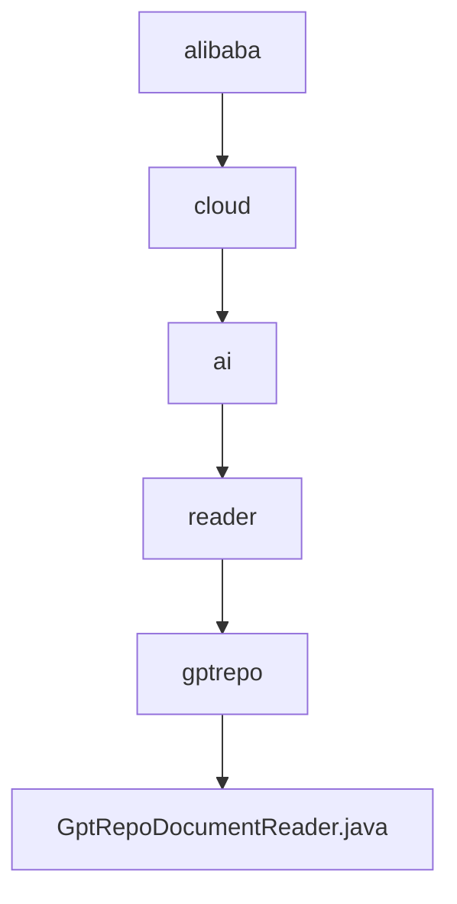

# 基础信息

|      |      |
|------|------|
| 名称 | alibaba |
| 编码语言 | .java |
| 代码路径 | spring-ai-alibaba/community/document-readers/spring-ai-alibaba-starter-document-reader-gpt-repo/src/main/java/com/alibaba |
| 包名 | spring-ai-alibaba.community.document-readers.spring-ai-alibaba-starter-document-reader-gpt-repo.src.main.java.com.alibaba |
| 概述说明 | GptRepoDocumentReader读取Git文件，支持合并、过滤和自定义编码，生成格式化文档。 |

# 说明

GptRepoDocumentReader类是一个用于读取Git仓库文件的工具，支持文件合并、扩展名过滤和自定义编码功能，最终生成格式化文档。该工具能够高效处理Git仓库中的文件内容，通过合并多个文件、根据扩展名筛选特定类型文件以及使用自定义编码方式，确保文档的准确性和可读性。生成的格式化文档便于后续处理和分析，适用于各种需要从Git仓库提取和处理文件的场景。

### 包内部结构视图

该流程图展示了从`alibaba`到`GptRepoDocumentReader.java`的层级关系。路径从`alibaba`开始，逐级深入到`cloud`、`ai`、`reader`和`gptrepo`，最终指向`GptRepoDocumentReader.java`文件。每个节点代表路径中的一个文件夹或文件，清晰地展示了文件在项目中的位置和层级结构。

# 文件列表 File List

| 名称   | 类型  | 说明 |
|-------|------|-------------|
| [cloud](cloud/_module.md) | package | GptRepoDocumentReader读取Git文件，支持合并、过滤和自定义编码，生成格式化文档。 |

