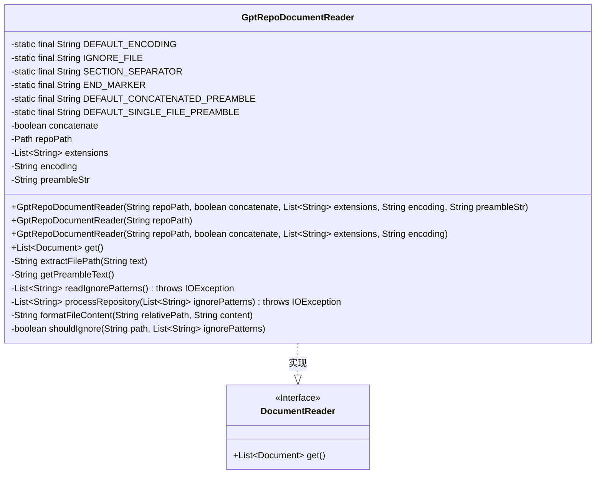

# 基础信息

|      |      |
|------|------|
| 名称 | GptRepoDocumentReader |
| 编码语言 | .java |
| 代码路径 | spring-ai-alibaba/community/document-readers/spring-ai-alibaba-starter-document-reader-gpt-repo/src/main/java/com/alibaba/cloud/ai/reader/gptrepo/GptRepoDocumentReader.java |
| 包名 | com.alibaba.cloud.ai.reader.gptrepo |
| 依赖项 | ['org.jetbrains.annotations.NotNull', 'org.springframework.ai.document.Document', 'org.springframework.ai.document.DocumentReader', 'org.springframework.util.StringUtils', 'java.io', 'java.nio.charset.Charset', 'java.nio.charset.StandardCharsets', 'java.nio.file', 'java.nio.file.attribute.BasicFileAttributes', 'java.util', 'java.util.stream.Collectors'] |
| 概述说明 | GptRepoDocumentReader读取Git文件，支持合并、过滤和自定义编码，生成格式化文档。 |

# 说明

GptRepoDocumentReader类是一个用于读取Git仓库文件的工具，支持文件合并、扩展名过滤和自定义编码功能，最终生成格式化文档。该工具能够高效处理Git仓库中的文件内容，通过合并多个文件、根据扩展名筛选特定类型文件以及使用自定义编码方式，确保文档的准确性和可读性。生成的格式化文档便于后续处理和分析，适用于各种需要从Git仓库提取和处理文件的场景。

# 类列表 Class Summary

| 名称   | 类型  | 说明 |
|-------|------|-------------|
| GptRepoDocumentReader | class | GptRepoDocumentReader类读取Git仓库文件，支持文件合并、扩展名过滤和自定义编码，生成格式化文档。 |

## 类 GptRepoDocumentReader

|      |      |
|------|------|
| 访问范围 | public |
| 类型 | class |
| 名称 | GptRepoDocumentReader |
| 说明 | GptRepoDocumentReader类读取Git仓库文件，支持文件合并、扩展名过滤和自定义编码，生成格式化文档。 |

### UML类图

### 描述
`GptRepoDocumentReader` 类实现了 `DocumentReader` 接口，用于读取并处理 Git 仓库中的文件内容。它支持根据文件扩展名过滤、忽略特定文件、合并文件内容等功能。类中包含多个构造函数，允许灵活配置编码、文件扩展名、是否合并文件内容等参数。`get()` 方法返回处理后的文档列表，每个文档包含文件内容及其元数据。类内部通过私有方法处理文件路径提取、忽略规则检查、文件内容格式化等逻辑。

### 内部方法调用关系图

```mermaid
graph TD
    A["类GptRepoDocumentReader"]
    B["属性: String DEFAULT_ENCODING"]
    C["属性: String IGNORE_FILE"]
    D["属性: String SECTION_SEPARATOR"]
    E["属性: String END_MARKER"]
    F["属性: String DEFAULT_CONCATENATED_PREAMBLE"]
    G["属性: String DEFAULT_SINGLE_FILE_PREAMBLE"]
    H["属性: boolean concatenate"]
    I["属性: Path repoPath"]
    J["属性: List<String> extensions"]
    K["属性: String encoding"]
    L["属性: String preambleStr"]
    M["构造方法: GptRepoDocumentReader(String repoPath, boolean concatenate, List<String> extensions, String encoding, String preambleStr)"]
    N["构造方法: GptRepoDocumentReader(String repoPath)"]
    O["构造方法: GptRepoDocumentReader(String repoPath, boolean concatenate, List<String> extensions, String encoding)"]
    P["方法: List<Document> get()"]
    Q["方法: String extractFilePath(String text)"]
    R["方法: String getPreambleText()"]
    S["方法: List<String> readIgnorePatterns()"]
    T["方法: List<String> processRepository(List<String> ignorePatterns)"]
    U["方法: String formatFileContent(String relativePath, String content)"]
    V["方法: boolean shouldIgnore(String path, List<String> ignorePatterns)"]

    A --> B
    A --> C
    A --> D
    A --> E
    A --> F
    A --> G
    A --> H
    A --> I
    A --> J
    A --> K
    A --> L
    A --> M
    A --> N
    A --> O
    A --> P
    A --> Q
    A --> R
    A --> S
    A --> T
    A --> U
    A --> V
```

该流程图展示了`GptRepoDocumentReader`类的结构和内部方法调用关系。类包含多个常量和属性，用于配置文档读取行为。构造函数支持不同的参数组合，核心方法`get()`负责读取和处理仓库文件，生成文档列表。其他辅助方法如`extractFilePath`、`getPreambleText`、`readIgnorePatterns`、`processRepository`、`formatFileContent`和`shouldIgnore`分别用于提取文件路径、获取前导文本、读取忽略模式、处理仓库文件、格式化文件内容以及检查文件是否应被忽略。

### 字段列表 Field List

| 名称  | 类型  | 说明 |
|-------|-------|------|
| encoding | String | 私有字符串变量 encoding 被声明为不可修改。 |
| concatenate | boolean | 私有布尔变量，用于控制是否连接操作。 |
| extensions | List<String> | 私有且不可变的字符串列表变量extensions。 |
| DEFAULT_ENCODING = "UTF-8" | String | 定义常量DEFAULT_ENCODING为UTF-8编码。 |
| IGNORE_FILE = ".gptignore" | String | 定义常量IGNORE_FILE，值为".gptignore"。 |
| repoPath | Path | 私有常量repoPath为Path类型。 |
| END_MARKER = "--END--" | String | 定义私有静态常量字符串END_MARKER，值为"--END--"。 |
| preambleStr | String | 该代码定义了一个私有且不可变的字符串变量preambleStr。 |
| SECTION_SEPARATOR = "----" | String | 定义常量SECTION_SEPARATOR，值为"----"。 |
| DEFAULT_CONCATENATED_PREAMBLE = "The following text is a Git repository with code. "			+ "The structure of the text are sections that begin with ----, "			+ "followed by a single line containing the file path and file "			+ "name, followed by a variable amount of lines containing the "			+ "file contents. The text representing the Git repository ends "			+ "when the symbols --END-- are encountered. Any further text beyond "			+ "--END-- are meant to be interpreted as instructions using the "			+ "aforementioned Git repository as context.\n" | String | Git仓库文本结构以----开始，包含文件路径、内容，以--END--结束，后续为指令。 |
| DEFAULT_SINGLE_FILE_PREAMBLE = "The following text is a file in a Git repository. "			+ "The structure of the text are sections that begin with ----, "			+ "followed by a single line containing the file path and file "			+ "name, followed by a variable amount of lines containing the "			+ "file contents. The text representing the file ends "			+ "when the symbols --END-- are encountered. Any further text beyond "			+ "--END-- are meant to be interpreted as instructions using the " + "aforementioned file as context.\n" | String | Git仓库文件结构：以----开始，包含路径、文件名及内容，以--END--结束，后续为指令。 |

### 方法列表 Method List

| 名称  | 类型  | 说明 |
|-------|-------|------|
| shouldIgnore | boolean | 方法检查路径是否匹配忽略模式列表中的任一模式。 |
| get | List<Document> | 读取忽略文件，处理仓库文本，转换为文档列表并添加元数据。 |
| getPreambleText | String | 方法返回preambleStr，若为空则根据concatenate返回默认值。 |
| readIgnorePatterns | List<String> | 读取并返回忽略文件内容列表，若文件不存在则返回空列表。 |
| extractFilePath | String | 提取文件路径方法：分割文本，检查首行分隔符，返回第二行路径。 |
| formatFileContent | String | 格式化文件内容，返回包含分隔符、路径和内容的字符串。 |
| processRepository | List<String> | 遍历文件树，过滤忽略文件，读取并格式化内容，返回结果列表。 |

