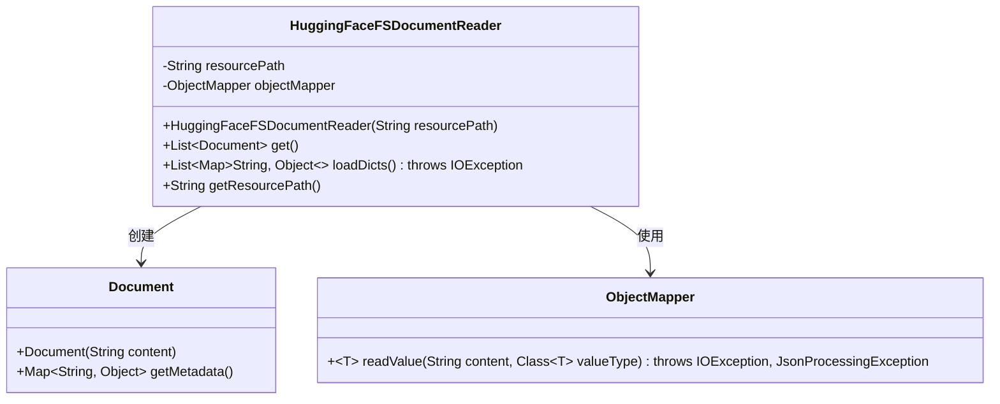

# 基础信息

|      |      |
|------|------|
| 名称 | HuggingFaceFSDocumentReader |
| 编码语言 | .java |
| 代码路径 | spring-ai-alibaba/community/document-readers/spring-ai-alibaba-starter-document-reader-huggingface-fs/src/main/java/com/alibaba/cloud/ai/reader/huggingface/fs/HuggingFaceFSDocumentReader.java |
| 包名 | com.alibaba.cloud.ai.reader.huggingface.fs |
| 依赖项 | ['com.fasterxml.jackson.databind.ObjectMapper', 'org.springframework.ai.document.Document', 'org.springframework.ai.document.DocumentReader', 'org.springframework.util.Assert', 'java.io', 'java.nio.file.Files', 'java.nio.file.Path', 'java.nio.file.Paths', 'java.util.ArrayList', 'java.util.List', 'java.util.Map', 'java.util.zip.GZIPInputStream'] |
| 概述说明 | HuggingFaceFSDocumentReader类读取并解析路径中的文件，支持gzip压缩。 |

# 说明

HuggingFaceFSDocumentReader类是一个用于从指定路径读取文件并将其解析为文档列表的工具。它支持处理gzip压缩文件，能够高效地解压并读取文件内容，适用于需要处理压缩文档的场景。该类的功能设计简洁，便于集成到需要文件读取和解析的应用程序中，提升文件处理效率。

# 类列表 Class Summary

| 名称   | 类型  | 说明 |
|-------|------|-------------|
| HuggingFaceFSDocumentReader | class | HuggingFaceFSDocumentReader类从指定路径读取文件并解析为文档列表，支持gzip压缩文件。 |

## 类 HuggingFaceFSDocumentReader

|      |      |
|------|------|
| 访问范围 | public |
| 类型 | class |
| 名称 | HuggingFaceFSDocumentReader |
| 说明 | HuggingFaceFSDocumentReader类从指定路径读取文件并解析为文档列表，支持gzip压缩文件。 |

### UML类图

这段代码定义了一个名为 `HuggingFaceFSDocumentReader` 的类，用于从指定路径读取文件并将其解析为 `Document` 对象的列表。该类依赖于 `ObjectMapper` 来解析 JSON 数据，并处理可能的 GZIP 压缩文件。`HuggingFaceFSDocumentReader` 的主要功能包括加载文件内容、解析 JSON 数据，并将解析后的数据封装为 `Document` 对象。该类还提供了获取资源路径的方法。

### 内部方法调用关系图

```mermaid
graph TD
    A["类HuggingFaceFSDocumentReader"]
    B["常量: String SOURCE"]
    C["属性: String resourcePath"]
    D["属性: ObjectMapper objectMapper"]
    E["构造方法: HuggingFaceFSDocumentReader(String resourcePath)"]
    F["方法: List<Document> get()"]
    G["方法: List<Map<String, Object>> loadDicts()"]
    H["方法: String getResourcePath()"]
    I["步骤: Assert.notNull(resourcePath, 'Resource path must not be null')"]
    J["步骤: List<Map<String, Object>> jsonDicts = loadDicts()"]
    K["步骤: List<Document> documents = new ArrayList<>()"]
    L["步骤: for (Map<String, Object> dict : jsonDicts)"]
    M["步骤: Document document = new Document(dict.toString())"]
    N["步骤: document.getMetadata().put(SOURCE, resourcePath)"]
    O["步骤: documents.add(document)"]
    P["步骤: return documents"]
    Q["步骤: throw new RuntimeException('Failed to load documents from HuggingFace: ' + e.getMessage(), e)"]
    R["步骤: Path path = Paths.get(resourcePath)"]
    S["步骤: byte[] content = Files.readAllBytes(path)"]
    T["步骤: String data"]
    U["步骤: if (resourcePath.endsWith('.gz'))"]
    V["步骤: InputStream inputStream = new ByteArrayInputStream(content)"]
    W["步骤: GZIPInputStream gzipInputStream = new GZIPInputStream(inputStream)"]
    X["步骤: data = new String(gzipInputStream.readAllBytes())"]
    Y["步骤: data = new String(content)"]
    Z["步骤: List<Map<String, Object>> jsonDicts = new ArrayList<>()"]
    AA["步骤: String[] lines = data.split('\\n')"]
    AB["步骤: for (String line : lines)"]
    AC["步骤: if (!line.trim().isEmpty())"]
    AD["步骤: Map<String, Object> jsonDict = objectMapper.readValue(line, Map.class)"]
    AE["步骤: jsonDicts.add(jsonDict)"]
    AF["步骤: continue"]
    AG["步骤: return jsonDicts"]
    AH["步骤: return this.resourcePath"]

    A --> B
    A --> C
    A --> D
    A --> E
    A --> F
    A --> G
    A --> H
    E --> I
    F --> J
    F --> K
    F --> L
    L --> M
    L --> N
    L --> O
    F --> P
    F --> Q
    G --> R
    G --> S
    G --> T
    G --> U
    U --> V
    U --> W
    U --> X
    U --> Y
    G --> Z
    G --> AA
    G --> AB
    AB --> AC
    AC --> AD
    AC --> AE
    AB --> AF
    G --> AG
    H --> AH
```

这段代码定义了一个`HuggingFaceFSDocumentReader`类，用于从指定路径读取文件并将其解析为文档列表。类中包含构造方法、获取文档的方法、加载字典的方法以及获取资源路径的方法。流程图展示了类的内部结构以及各个方法之间的调用关系，详细描述了从文件读取到文档生成的全过程。

### 字段列表 Field List

| 名称  | 类型  | 说明 |
|-------|-------|------|
| SOURCE = "source" | String | 定义静态常量字符串SOURCE，值为"source"。 |
| objectMapper | ObjectMapper | 私有且不可变的ObjectMapper实例。 |
| resourcePath | String | 私有字符串变量resourcePath的声明。 |

### 方法列表 Method List

| 名称  | 类型  | 说明 |
|-------|-------|------|
| getResourcePath | String | 获取资源路径的Java方法。 |
| loadDicts | List<Map<String, Object>> | 方法加载并解析字典文件，支持GZIP压缩，返回JSON格式列表。 |
| get | List<Document> | 方法`get`加载字典数据并转换为文档列表，失败时抛出异常。 |

