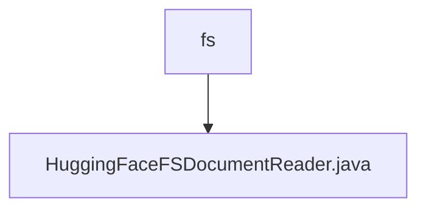

# 基础信息

|      |      |
|------|------|
| 名称 | fs |
| 编码语言 | .java |
| 代码路径 | spring-ai-alibaba/community/document-readers/spring-ai-alibaba-starter-document-reader-huggingface-fs/src/main/java/com/alibaba/cloud/ai/reader/huggingface/fs |
| 包名 | spring-ai-alibaba.community.document-readers.spring-ai-alibaba-starter-document-reader-huggingface-fs.src.main.java.com.alibaba.cloud.ai.reader.huggingface.fs |
| 概述说明 | HuggingFaceFSDocumentReader类读取并解析路径中的文件，支持gzip压缩。 |

# 说明

HuggingFaceFSDocumentReader类是一个用于从指定路径读取文件并将其解析为文档列表的工具。它支持处理gzip压缩文件，能够高效地解压并读取文件内容，适用于需要处理压缩文档的场景。该类的功能设计简洁，便于集成到需要文件读取和解析的应用程序中，提升文件处理效率。

### 包内部结构视图

该流程图展示了路径的层级关系，`fs`文件夹下包含一个文件`HuggingFaceFSDocumentReader.java`。路径结构清晰，层级关系明确，符合给定的路径信息。

# 文件列表 File List

| 名称   | 类型  | 说明 |
|-------|------|-------------|
| [HuggingFaceFSDocumentReader.java](HuggingFaceFSDocumentReader.md) | file | HuggingFaceFSDocumentReader类读取并解析路径中的文件，支持gzip压缩。 |

