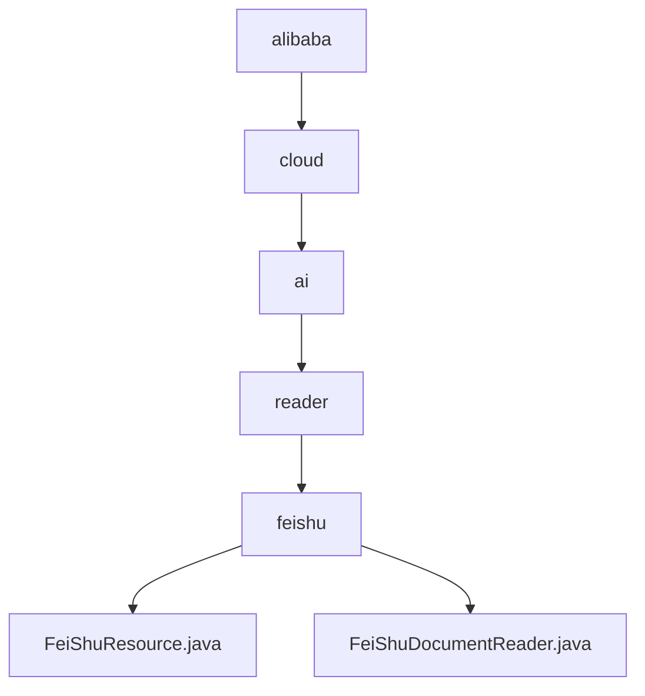

# 基础信息

|      |      |
|------|------|
| 名称 | alibaba |
| 编码语言 | .java |
| 代码路径 | spring-ai-alibaba/community/document-readers/spring-ai-alibaba-starter-document-reader-larksuite/src/main/java/com/alibaba |
| 包名 | spring-ai-alibaba.community.document-readers.spring-ai-alibaba-starter-document-reader-larksuite.src.main.java.com.alibaba |
| 概述说明 | FeiShuResource类管理飞书资源，FeiShuDocumentReader类实现文档读取功能。 |

# 说明

## 概述
该代码模块主要围绕飞书应用资源的管理和文档读取功能展开，包含两个核心类：`FeiShuResource` 和 `FeiShuDocumentReader`。`FeiShuResource` 类负责管理飞书应用的基本资源（如 `appId` 和 `appSecret`），并提供构建器和默认客户端构建方法，以确保资源的高效管理和使用。`FeiShuDocumentReader` 类则专注于实现文档读取功能，支持通过用户令牌和租户令牌获取文档内容及其列表，为用户提供了便捷的接口来访问和管理文档资源。

## 主要业务场景
1. **飞书应用资源管理**：通过 `FeiShuResource` 类，开发者可以方便地管理飞书应用的 `appId` 和 `appSecret`，并通过构建器和默认客户端构建方法确保资源的正确配置和高效使用。
2. **文档读取与管理**：`FeiShuDocumentReader` 类提供了文档读取功能，支持通过用户令牌和租户令牌获取文档内容及其列表。这一功能适用于需要从飞书平台获取文档内容的场景，如文档自动化处理、内容分析等。
3. **高效资源访问**：通过这两个类的协作，开发者可以高效地访问和管理飞书应用资源及其文档内容，适用于需要与飞书平台进行深度集成的应用场景。

### 包内部结构视图

该流程图展示了从`alibaba`到`feishu`文件夹的层级关系，最终指向两个Java文件：`FeiShuResource.java`和`FeiShuDocumentReader.java`。每个节点代表路径中的最后一级文件夹或文件，清晰地呈现了项目中的文件结构。

# 文件列表 File List

| 名称   | 类型  | 说明 |
|-------|------|-------------|
| [cloud](cloud/_module.md) | package | FeiShuResource类管理飞书资源，FeiShuDocumentReader类实现文档读取功能。 |

