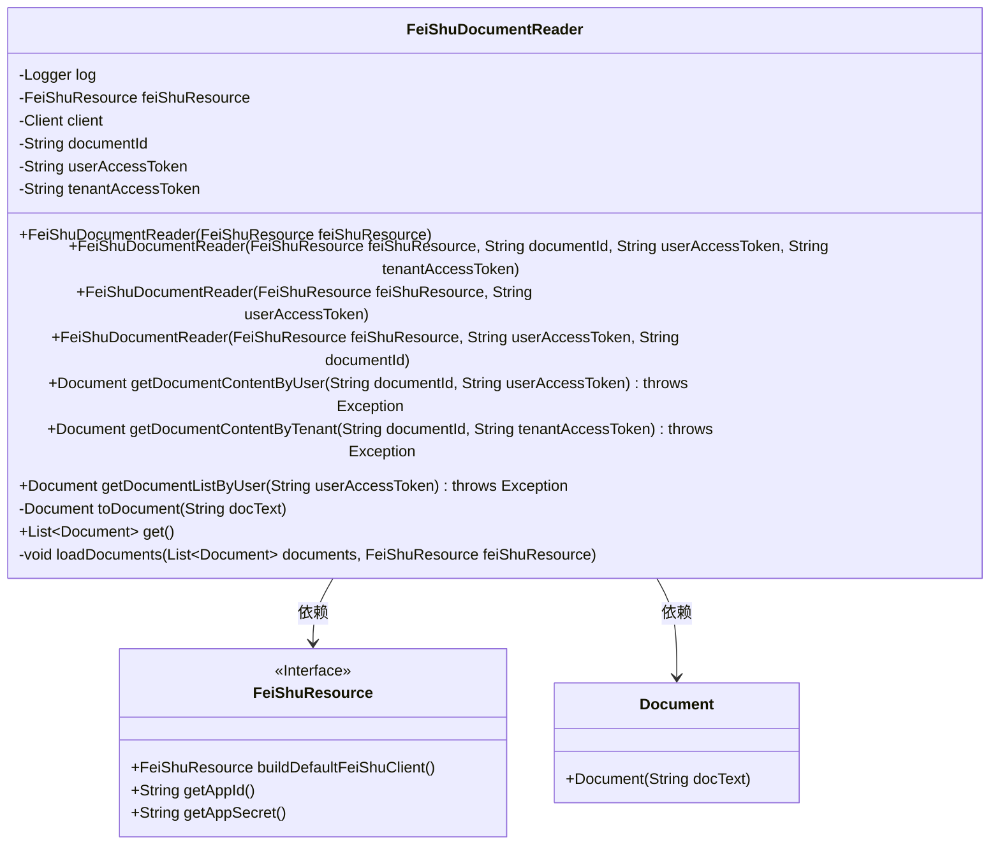
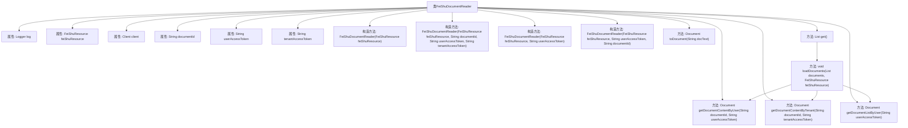

# 基础信息

|      |      |
|------|------|
| 名称 | FeiShuDocumentReader |
| 编码语言 | .java |
| 代码路径 | spring-ai-alibaba/community/document-readers/spring-ai-alibaba-starter-document-reader-larksuite/src/main/java/com/alibaba/cloud/ai/reader/feishu/FeiShuDocumentReader.java |
| 包名 | com.alibaba.cloud.ai.reader.feishu |
| 依赖项 | ['com.google.gson.JsonParser', 'com.lark.oapi.Client', 'com.lark.oapi.core.request.RequestOptions', 'com.lark.oapi.core.utils.Jsons', 'com.lark.oapi.service.docx.v1.model', 'com.lark.oapi.service.drive.v1.model.ListFileReq', 'com.lark.oapi.service.drive.v1.model.ListFileResp', 'org.slf4j.Logger', 'org.slf4j.LoggerFactory', 'org.springframework.ai.document.Document', 'org.springframework.ai.document.DocumentReader', 'java.nio.charset.StandardCharsets', 'java.util.ArrayList', 'java.util.List', 'java.lang.String.format'] |
| 概述说明 | FeiShuDocumentReader类支持用户和租户令牌获取文档内容及列表。 |

# 说明

FeiShuDocumentReader类用于实现文档读取功能，支持通过用户令牌和租户令牌获取文档内容及其列表。该类提供了便捷的接口，帮助用户高效地访问和管理文档资源。

# 类列表 Class Summary

| 名称   | 类型  | 说明 |
|-------|------|-------------|
| FeiShuDocumentReader | class | FeiShuDocumentReader类实现文档读取，支持用户和租户令牌获取文档内容及列表。 |

## 类 FeiShuDocumentReader

|      |      |
|------|------|
| 访问范围 | public |
| 类型 | class |
| 名称 | FeiShuDocumentReader |
| 说明 | FeiShuDocumentReader类实现文档读取，支持用户和租户令牌获取文档内容及列表。 |

### UML类图

这段代码定义了一个 `FeiShuDocumentReader` 类，用于从飞书（FeiShu）平台读取文档内容。该类依赖于 `FeiShuResource` 接口来获取必要的资源和客户端，并通过多个构造函数初始化不同的访问令牌和文档ID。类中提供了多种方法来获取文档内容或文档列表，并根据不同的访问令牌（用户或租户）进行区分。`loadDocuments` 方法用于加载文档并将其添加到列表中，处理了多种可能的异常情况。整体设计灵活，能够根据不同的配置和条件获取文档内容。

### 内部方法调用关系图

这段代码描述了一个名为 `FeiShuDocumentReader` 的类，用于从飞书资源中读取文档内容。类中包含多个构造方法，用于初始化不同的资源访问方式。类中定义了多个方法，如 `getDocumentContentByUser` 和 `getDocumentContentByTenant`，用于通过用户或租户的访问令牌获取文档内容。此外，`getDocumentListByUser` 方法用于获取文档列表。`loadDocuments` 方法用于加载文档并将其添加到文档列表中。整个流程涉及多个步骤，包括构建请求、发送请求、处理响应以及将响应转换为文档对象。

### 字段列表 Field List

| 名称  | 类型  | 说明 |
|-------|-------|------|
| tenantAccessToken | String | 定义私有字符串变量tenantAccessToken。 |
| log = LoggerFactory.getLogger(FeiShuDocumentReader.class) | Logger | FeiShuDocumentReader类中定义了一个静态日志记录器。 |
| client | Client | 私有且不可变的客户端实例。 |
| documentId | String | 定义了一个私有字符串变量documentId。 |
| feiShuResource | FeiShuResource | 私有飞书资源实例。 |
| userAccessToken | String | 定义私有字符串变量userAccessToken。 |

### 方法列表 Method List

| 名称  | 类型  | 说明 |
|-------|-------|------|
| toDocument | Document | 将字符串转换为文档对象的私有方法。 |
| loadDocuments | void | 加载文档，检查访问令牌和文档ID，处理异常。 |
| getDocumentListByUser | Document | 通过用户访问令牌获取按编辑时间倒序排列的文档列表。 |
| getDocumentContentByUser | Document | 通过用户访问令牌获取指定文档内容，失败时输出错误信息并抛出异常。 |
| getDocumentContentByTenant | Document | 通过租户访问令牌获取文档内容，失败时输出错误信息并抛出异常。 |
| get | List<Document> | 重写get方法，返回加载的文档列表。 |

