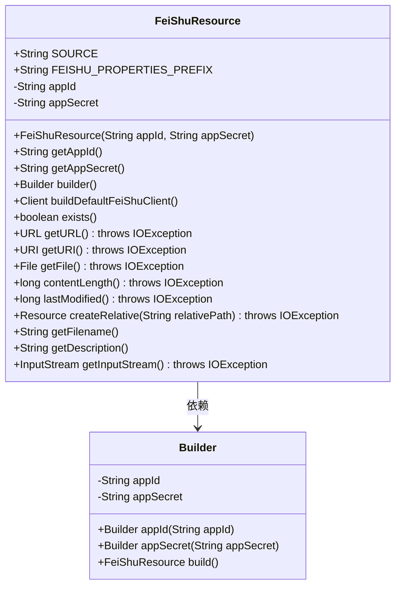

# 基础信息

|      |      |
|------|------|
| 名称 | FeiShuResource |
| 编码语言 | .java |
| 代码路径 | spring-ai-alibaba/community/document-readers/spring-ai-alibaba-starter-document-reader-larksuite/src/main/java/com/alibaba/cloud/ai/reader/feishu/FeiShuResource.java |
| 包名 | com.alibaba.cloud.ai.reader.feishu |
| 依赖项 | ['com.lark.oapi.Client', 'com.lark.oapi.core.enums.BaseUrlEnum', 'org.springframework.core.io.Resource', 'org.springframework.util.Assert', 'java.io.File', 'java.io.IOException', 'java.io.InputStream', 'java.net.URI', 'java.net.URL'] |
| 概述说明 | FeiShuResource类管理飞书资源，含appId和appSecret，提供构建器和默认客户端方法。 |

# 说明

FeiShuResource类用于管理飞书应用资源，包含appId和appSecret两个属性，提供构建器和默认客户端构建方法，确保资源的高效管理和使用。

# 类列表 Class Summary

| 名称   | 类型  | 说明 |
|-------|------|-------------|
| FeiShuResource | class | FeiShuResource类用于管理飞书应用资源，包含appId和appSecret属性，提供构建器和默认客户端构建方法。 |

## 类 FeiShuResource

|      |      |
|------|------|
| 访问范围 | public |
| 类型 | class |
| 名称 | FeiShuResource |
| 说明 | FeiShuResource类用于管理飞书应用资源，包含appId和appSecret属性，提供构建器和默认客户端构建方法。 |

### UML类图

**描述：**  
`FeiShuResource` 类实现了 `Resource` 接口，用于管理飞书资源的配置信息。它包含 `appId` 和 `appSecret` 两个私有属性，并提供了相应的获取方法。通过 `Builder` 内部类，可以使用链式调用设置 `appId` 和 `appSecret`，并最终构建 `FeiShuResource` 对象。`buildDefaultFeiShuClient` 方法用于构建默认的飞书客户端。其他方法实现了 `Resource` 接口，但大多返回默认值或空值。

### 内部方法调用关系图

```mermaid
graph TD
    A["类FeiShuResource"]
    B["常量: String SOURCE"]
    C["常量: String FEISHU_PROPERTIES_PREFIX"]
    D["属性: String appId"]
    E["属性: String appSecret"]
    F["方法: String getAppId()"]
    G["方法: String getAppSecret()"]
    H["构造方法: FeiShuResource(String appId, String appSecret)"]
    I["静态方法: Builder builder()"]
    J["内部类Builder"]
    K["属性: String appId"]
    L["属性: String appSecret"]
    M["方法: Builder appId(String appId)"]
    N["方法: Builder appSecret(String appSecret)"]
    O["方法: FeiShuResource build()"]
    P["方法: Client buildDefaultFeiShuClient()"]
    Q["方法: boolean exists()"]
    R["方法: URL getURL()"]
    S["方法: URI getURI()"]
    T["方法: File getFile()"]
    U["方法: long contentLength()"]
    V["方法: long lastModified()"]
    W["方法: Resource createRelative(String relativePath)"]
    X["方法: String getFilename()"]
    Y["方法: String getDescription()"]
    Z["方法: InputStream getInputStream()"]

    A --> B
    A --> C
    A --> D
    A --> E
    A --> F
    A --> G
    A --> H
    A --> I
    A --> J
    J --> K
    J --> L
    J --> M
    J --> N
    J --> O
    A --> P
    A --> Q
    A --> R
    A --> S
    A --> T
    A --> U
    A --> V
    A --> W
    A --> X
    A --> Y
    A --> Z
```

这段代码定义了一个名为 `FeiShuResource` 的类，该类实现了 `Resource` 接口。`FeiShuResource` 类包含两个常量、两个私有属性、多个方法以及一个内部类 `Builder`。`Builder` 类用于构建 `FeiShuResource` 对象，并确保 `appId` 和 `appSecret` 不为空。`FeiShuResource` 类还提供了一个方法 `buildDefaultFeiShuClient`，用于构建默认的飞书客户端。此外，该类还实现了 `Resource` 接口中的多个方法，但这些方法大多返回 `null` 或默认值，表示它们尚未被具体实现。

### 字段列表 Field List

| 名称  | 类型  | 说明 |
|-------|-------|------|
| FEISHU_PROPERTIES_PREFIX = "spring.ai.alibaba.plugin.feishu" | String | 飞书插件配置前缀为spring.ai.alibaba.plugin.feishu。 |
| appId | String | 私有字符串变量appId，用于存储应用程序ID。 |
| appSecret | String | 私有字符串变量appSecret声明为final。 |
| SOURCE = "source" | String | 定义了一个静态不可变字符串常量SOURCE，值为"source"。 |

### 方法列表 Method List

| 名称  | 类型  | 说明 |
|-------|-------|------|
| getAppSecret | String | 获取应用密钥的方法。 |
| getAppId | String | 该方法返回appId的值。 |
| exists | boolean | 重写exists方法，始终返回false。 |
| builder | Builder | 静态方法返回Builder实例。 |
| lastModified | long | 重写lastModified方法，始终返回0。 |
| getFilename | String | 重写getFilename方法，返回null。 |
| getURI | URI | 重写getURI方法，返回null并可能抛出IOException异常。 |
| getFile | File | 重写getFile方法，返回null，可能抛出IOException。 |
| createRelative | Resource | 重写方法，创建相对路径资源，返回空值。 |
| contentLength | long | 重写contentLength方法，返回0。 |
| getURL | URL | 该方法重写getURL，返回null，可能抛出IOException。 |
| getDescription | String | 重写getDescription方法，返回值为空。 |
| getInputStream | InputStream | 重写getInputStream方法，返回null并可能抛出IOException。 |
| buildDefaultFeiShuClient | Client | 构建默认飞书客户端，需非空AppId和AppSecret，设置基础URL并启用调试日志。 |

