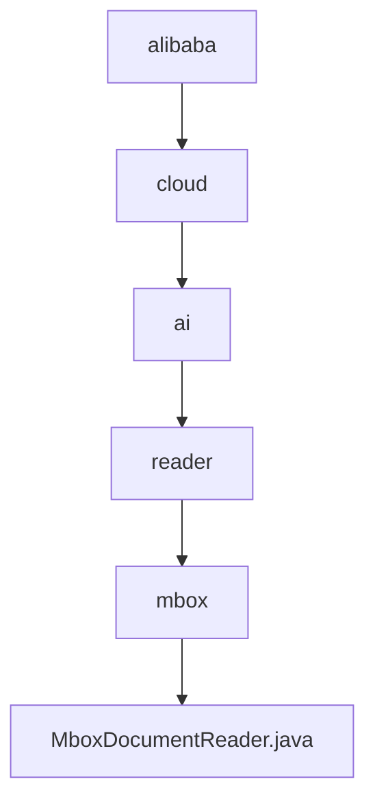

# 基础信息

|      |      |
|------|------|
| 名称 | alibaba |
| 编码语言 | .java |
| 代码路径 | spring-ai-alibaba/community/document-readers/spring-ai-alibaba-starter-document-reader-mbox/src/main/java/com/alibaba |
| 包名 | spring-ai-alibaba.community.document-readers.spring-ai-alibaba-starter-document-reader-mbox.src.main.java.com.alibaba |
| 概述说明 | MboxDocumentReader类读取Mbox文件，解析邮件并生成文档，支持自定义格式和多部分邮件处理。 |

# 说明

MboxDocumentReader类是一个用于读取Mbox文件的工具，能够解析邮件内容并生成相应的文档。该工具支持自定义格式，可以灵活处理不同格式的邮件内容。此外，它还能够处理多部分邮件，确保复杂邮件的各个部分都能被正确解析和生成文档。通过这一功能，用户可以高效地管理和处理大量邮件数据，满足多样化的需求。

### 包内部结构视图

该流程图展示了从 `alibaba` 到 `MboxDocumentReader.java` 的层级关系。每个节点代表路径中的一个文件夹或文件，逐步深入到最终的 `MboxDocumentReader.java` 文件。通过这种方式，清晰地展示了文件在项目结构中的位置和层级关系。

# 文件列表 File List

| 名称   | 类型  | 说明 |
|-------|------|-------------|
| [cloud](cloud/_module.md) | package | MboxDocumentReader类读取Mbox文件，解析邮件并生成文档，支持自定义格式和多部分邮件处理。 |

