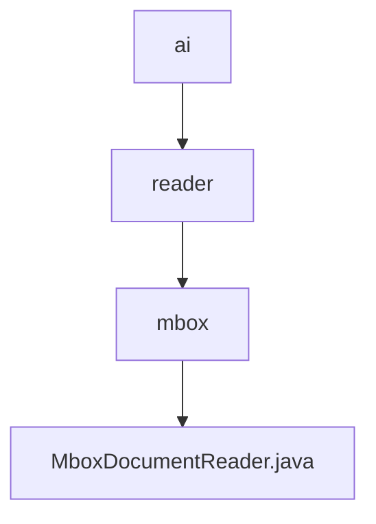

# 基础信息

|      |      |
|------|------|
| 名称 | ai |
| 编码语言 | .java |
| 代码路径 | spring-ai-alibaba/community/document-readers/spring-ai-alibaba-starter-document-reader-mbox/src/main/java/com/alibaba/cloud/ai |
| 包名 | spring-ai-alibaba.community.document-readers.spring-ai-alibaba-starter-document-reader-mbox.src.main.java.com.alibaba.cloud.ai |
| 概述说明 | MboxDocumentReader类读取Mbox文件，解析邮件并生成文档，支持自定义格式和多部分邮件处理。 |

# 说明

MboxDocumentReader类是一个用于读取Mbox文件的工具，能够解析邮件内容并生成相应的文档。该工具支持自定义格式，可以灵活处理不同格式的邮件内容。此外，它还能够处理多部分邮件，确保复杂邮件的各个部分都能被正确解析和生成文档。通过这一功能，用户可以高效地管理和处理大量邮件数据，满足多样化的需求。

### 包内部结构视图

该流程图展示了路径的层级关系，从`ai`文件夹开始，逐步深入到`reader`和`mbox`子文件夹，最终指向`MboxDocumentReader.java`文件。这种结构清晰地反映了项目中的文件组织方式，便于开发者理解和导航代码库。

# 文件列表 File List

| 名称   | 类型  | 说明 |
|-------|------|-------------|
| [reader](reader/_module.md) | package | MboxDocumentReader类读取Mbox文件，解析邮件并生成文档，支持自定义格式和多部分邮件处理。 |

