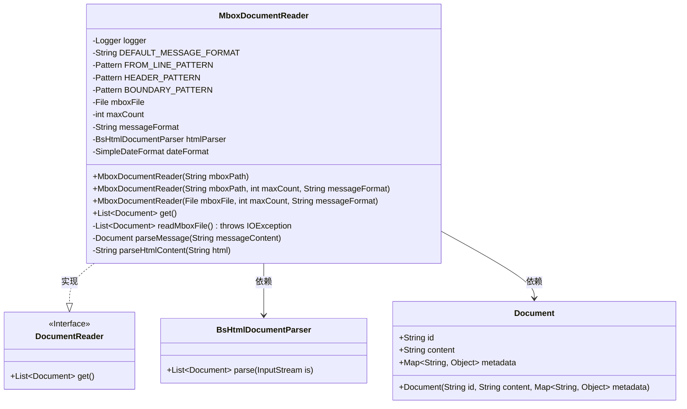
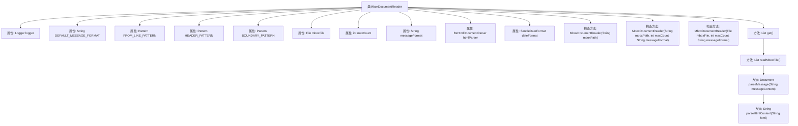

# 基础信息

|      |      |
|------|------|
| 名称 | MboxDocumentReader |
| 编码语言 | .java |
| 代码路径 | spring-ai-alibaba/community/document-readers/spring-ai-alibaba-starter-document-reader-mbox/src/main/java/com/alibaba/cloud/ai/reader/mbox/MboxDocumentReader.java |
| 包名 | com.alibaba.cloud.ai.reader.mbox |
| 依赖项 | ['com.alibaba.cloud.ai.parser.bshtml.BsHtmlDocumentParser', 'org.apache.commons.io.FileUtils', 'org.apache.commons.io.LineIterator', 'org.springframework.ai.document.Document', 'org.springframework.ai.document.DocumentReader', 'org.springframework.util.Assert', 'org.slf4j.Logger', 'org.slf4j.LoggerFactory', 'java.io.ByteArrayInputStream', 'java.io.File', 'java.io.IOException', 'java.io.InputStream', 'java.nio.charset.StandardCharsets', 'java.text.ParseException', 'java.text.SimpleDateFormat', 'java.util', 'java.util.regex.Matcher', 'java.util.regex.Pattern'] |
| 概述说明 | MboxDocumentReader类读取Mbox文件，解析邮件并生成文档，支持自定义格式和多部分邮件处理。 |

# 说明

MboxDocumentReader类是一个用于读取Mbox文件的工具，能够解析邮件内容并生成相应的文档。该工具支持自定义格式，可以灵活处理不同格式的邮件内容。此外，它还能够处理多部分邮件，确保复杂邮件的各个部分都能被正确解析和生成文档。通过这一功能，用户可以高效地管理和处理大量邮件数据，满足多样化的需求。

# 类列表 Class Summary

| 名称   | 类型  | 说明 |
|-------|------|-------------|
| MboxDocumentReader | class | MboxDocumentReader类用于读取Mbox文件，解析邮件内容并生成文档。支持自定义格式和多部分邮件处理。 |

## 类 MboxDocumentReader

|      |      |
|------|------|
| 访问范围 | public |
| 类型 | class |
| 名称 | MboxDocumentReader |
| 说明 | MboxDocumentReader类用于读取Mbox文件，解析邮件内容并生成文档。支持自定义格式和多部分邮件处理。 |

### UML类图

**描述：**
`MboxDocumentReader` 是一个实现了 `DocumentReader` 接口的类，用于从 `.mbox` 文件中读取邮件内容并解析为 `Document` 对象。它通过正则表达式匹配邮件头信息，并使用 `BsHtmlDocumentParser` 解析 HTML 内容。类中包含多个私有方法用于处理文件读取、消息解析和 HTML 内容解析。`MboxDocumentReader` 提供了多种构造函数，允许用户自定义文件路径、最大读取消息数和消息格式。最终，`get()` 方法返回解析后的 `Document` 列表。

### 内部方法调用关系图

**描述：**
`MboxDocumentReader` 类用于读取和解析 Mbox 格式的邮件文件。它包含多个构造方法，允许通过文件路径或文件对象初始化，并支持自定义消息格式和最大读取数量。主要方法 `get()` 调用 `readMboxFile()` 读取文件内容，`readMboxFile()` 逐行解析邮件内容并调用 `parseMessage()` 处理每条消息。`parseMessage()` 负责解析邮件头、正文和元数据，并调用 `parseHtmlContent()` 处理 HTML 内容。最终返回一个包含所有解析结果的文档列表。

### 字段列表 Field List

| 名称  | 类型  | 说明 |
|-------|-------|------|
| maxCount | int | 私有整型常量maxCount |
| mboxFile | File | 私有文件对象mboxFile。 |
| BOUNDARY_PATTERN = Pattern.compile("boundary=\"?([^\"]+)\"?") | Pattern | 定义正则表达式匹配边界字符串。 |
| FROM_LINE_PATTERN = Pattern.compile("^From .*\\d{4}$") | Pattern | 定义静态正则表达式，匹配以"From"开头且结尾为四位数字的行。 |
| logger = LoggerFactory.getLogger(MboxDocumentReader.class) | Logger | MboxDocumentReader类中定义了一个私有的静态Logger对象。 |
| messageFormat | String | 私有常量字符串messageFormat。 |
| DEFAULT_MESSAGE_FORMAT = "Date: %s\nFrom: %s\nTo: %s\nSubject: %s\nContent: %s" | String | 默认消息格式包含日期、发件人、收件人、主题和内容。 |
| htmlParser | BsHtmlDocumentParser | 私有常量htmlParser用于解析HTML文档。 |
| dateFormat | SimpleDateFormat | 私有常量SimpleDateFormat对象。 |
| HEADER_PATTERN = Pattern.compile("^([^:]+):\\s*(.*)$") | Pattern | 定义静态常量HEADER_PATTERN，用于匹配冒号分隔的键值对。 |

### 方法列表 Method List

| 名称  | 类型  | 说明 |
|-------|-------|------|
| readMboxFile | List<Document> | 读取mbox文件并解析为文档列表，处理每条消息并限制最大数量。 |
| get | List<Document> | 重写get方法，调用readMboxFile，异常时抛出包含文件路径的运行时异常。 |
| parseHtmlContent | String | 解析HTML内容，检查空值，处理异常，去除多余空格并返回纯文本。 |
| parseMessage | Document | 解析消息内容，提取元数据，处理多部分和HTML内容，生成格式化文档。 |

