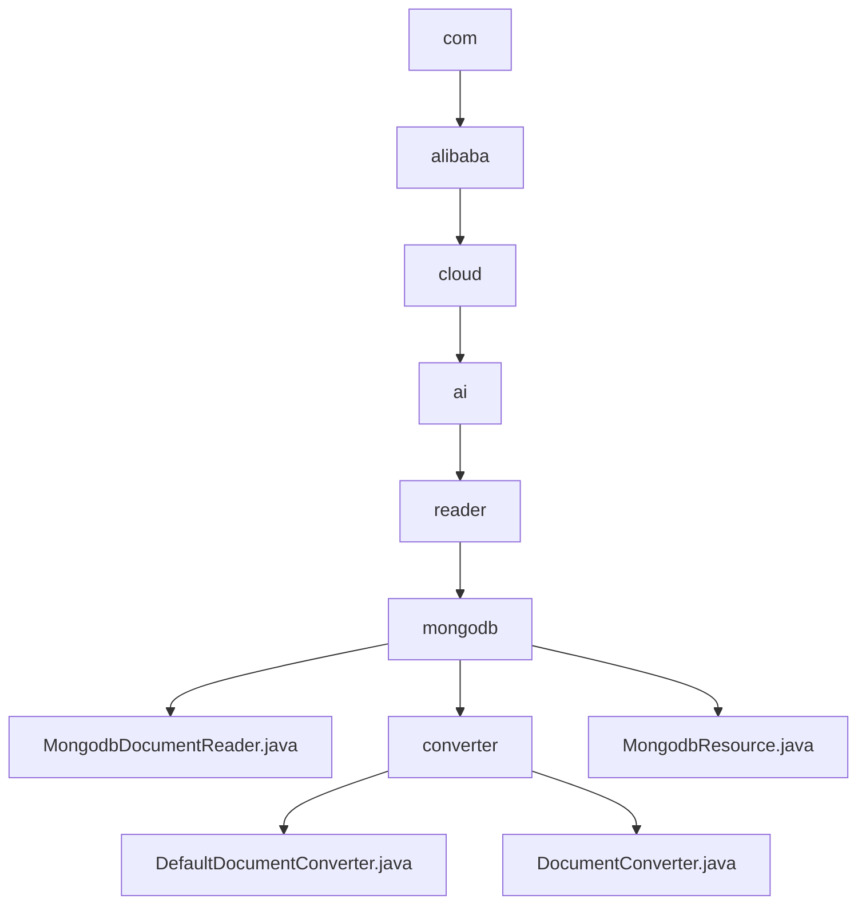

# 基础信息

|      |      |
|------|------|
| 名称 | com |
| 编码语言 | .java |
| 代码路径 | spring-ai-alibaba/community/document-readers/spring-ai-alibaba-starter-document-reader-mongodb/src/main/java/com |
| 包名 | spring-ai-alibaba.community.document-readers.spring-ai-alibaba-starter-document-reader-mongodb.src.main.java.com |
| 概述说明 | MongodbDocumentReader实现文档读取与关闭，支持查询、分页、并行查询。DefaultDocumentConverter负责文档转换，保留元数据与内容。MongodbResource管理MongoDB连接与数据处理。 |

# 说明

## 概述
该代码模块主要涉及与MongoDB数据库的交互，包括文档的读取、转换、管理以及资源的高效配置。核心功能由`MongodbDocumentReader`、`DefaultDocumentConverter`和`MongodbResource`三个类实现，分别负责文档的读取与关闭、文档的转换（包括向量化处理）以及MongoDB资源的配置与管理。该模块通过`MongoTemplate`和`MongoClient`与MongoDB进行交互，确保高效的数据读取、转换和管理，适用于需要处理大规模MongoDB文档的场景。

## 主要业务场景
1. **文档读取与关闭**：通过`MongodbDocumentReader`类实现MongoDB文档的读取与关闭，支持查询、分页和并行查询等操作，确保高效的数据读取。
2. **数据转换**：通过`DefaultDocumentConverter`类将MongoDB中的文档转换为包含元数据和内容的`Document`对象，便于后续处理或分析，支持向量化处理，适用于大规模数据处理场景。
3. **资源管理**：通过`MongodbResource`类配置MongoDB的连接、查询、数据分块以及向量化操作，提供对MongoDB数据库的全面管理，支持复杂的数据操作和优化，满足不同应用场景的需求。
4. **数据保留**：确保转换后的`Document`对象不仅包含原始文档的元数据，还保留其内容信息，适用于需要完整数据的业务场景。

### 包内部结构视图

该流程图展示了从`com`到`MongodbDocumentReader.java`和`MongodbResource.java`的层级关系，以及`converter`文件夹下的`DefaultDocumentConverter.java`和`DocumentConverter.java`文件。整个结构清晰地反映了路径的嵌套关系，帮助理解项目的文件组织结构。

# 文件列表 File List

| 名称   | 类型  | 说明 |
|-------|------|-------------|
| [alibaba](alibaba/_module.md) | package | MongodbDocumentReader实现文档读取与关闭，支持查询、分页、并行查询。DefaultDocumentConverter负责文档转换，保留元数据与内容。MongodbResource管理MongoDB连接与数据处理。 |

