# 基础信息

|      |      |
|------|------|
| 名称 | MongodbDocumentReader |
| 编码语言 | .java |
| 代码路径 | spring-ai-alibaba/community/document-readers/spring-ai-alibaba-starter-document-reader-mongodb/src/main/java/com/alibaba/cloud/ai/reader/mongodb/MongodbDocumentReader.java |
| 包名 | com.alibaba.cloud.ai.reader.mongodb |
| 依赖项 | ['com.alibaba.cloud.ai.reader.mongodb.converter.DefaultDocumentConverter', 'com.alibaba.cloud.ai.reader.mongodb.converter.DocumentConverter', 'com.mongodb.ConnectionString', 'com.mongodb.MongoClientSettings', 'com.mongodb.MongoException', 'com.mongodb.client.MongoClient', 'com.mongodb.client.MongoClients', 'org.bson.Document', 'org.slf4j.Logger', 'org.slf4j.LoggerFactory', 'org.springframework.ai.document.DocumentReader', 'org.springframework.data.mongodb.core.MongoTemplate', 'org.springframework.data.mongodb.core.query.BasicQuery', 'org.springframework.data.mongodb.core.query.CriteriaDefinition', 'org.springframework.data.mongodb.core.query.Query', 'org.springframework.util.Assert', 'org.springframework.util.StringUtils', 'java.io.Closeable', 'java.util.Collections', 'java.util.List', 'java.util.Objects', 'java.util.concurrent.TimeUnit', 'java.util.function.Supplier', 'java.util.regex.Pattern', 'java.util.stream.Collectors', 'java.util.stream.StreamSupport'] |
| 概述说明 | MongodbDocumentReader实现文档读取与关闭，支持查询、分页、并行操作，使用MongoTemplate和MongoClient交互。 |

# 说明

MongodbDocumentReader实现了文档读取与关闭功能，支持多种操作包括查询、分页和并行查询。该组件通过MongoTemplate和MongoClient与MongoDB数据库进行交互，确保高效的数据读取和管理。

# 类列表 Class Summary

| 名称   | 类型  | 说明 |
|-------|------|-------------|
| MongodbDocumentReader | class | MongodbDocumentReader实现文档读取与关闭功能，支持查询、分页、并行查询等操作，使用MongoTemplate和MongoClient进行数据库交互。 |


## 类 MongodbDocumentReader

|      |      |
|------|------|
| 访问范围 | public |
| 类型 | class |
| 名称 | MongodbDocumentReader |
| 说明 | MongodbDocumentReader实现文档读取与关闭功能，支持查询、分页、并行查询等操作，使用MongoTemplate和MongoClient进行数据库交互。 |


### UML类图

```mermaid
classDiagram
    class MongodbDocumentReader {
        -Logger log
        -MongoTemplate mongoTemplate
        -MongodbResource properties
        -MongoClient mongoClient
        -boolean shouldCloseClient
        -volatile boolean closed
        -DocumentConverter documentConverter
        -Pattern MONGODB_URI_PATTERN
        +builder() Builder
        +close()
        +findByCriteriaDefinition(CriteriaDefinition criteriaDefinition) List~Document~
        +findByQuery(Query query) List~Document~
        +findWithPagination(Query query, int page, int size) List~Document~
        +get() List~Document~
        +findInDatabaseAndCollection(String database, String collection, Query query) List~Document~
        +findInDatabaseAndCollectionParallel(String database, List~String~ collections, Query query) List~Document~
        +findInDatabaseAndCollectionWithPagination(String collection, Query query, int page, int size) List~Document~
        +findInDatabaseAndCollectionWithPagination(String database, String collection, Query query, int page, int size) List~Document~
        -validateConfiguration()
        -validateMongoDbUri(String uri)
        -validatePoolSettings(MongodbResource resource)
        -executeWithMetrics(String operation, Supplier~T~ query) T
        -checkState()
        -buildQuery() Query
        -processDocuments(Query query) List~Document~
    }

    class Builder {
        -MongoTemplate mongoTemplate
        -MongodbResource resource
        -MongoClient mongoClient
        -DocumentConverter converter
        +withMongoTemplate(MongoTemplate mongoTemplate) Builder
        +withResource(MongodbResource resource) Builder
        +withMongoClient(MongoClient mongoClient) Builder
        +withDocumentConverter(DocumentConverter converter) Builder
        +build() MongodbDocumentReader
        -createMongoClient(MongodbResource resource) MongoClient
    }

    interface DocumentReader {
        <<Interface>>
        +get() List~Document~
    }

    interface Closeable {
        <<Interface>>
        +close()
    }

    class DocumentConverter {
        <<Interface>>
        +convert(Document doc, String database, String collection, MongodbResource properties) Document
    }

    class DefaultDocumentConverter {
        +convert(Document doc, String database, String collection, MongodbResource properties) Document
    }

    MongodbDocumentReader --> Builder : 构建
    MongodbDocumentReader --> DocumentReader : 实现
    MongodbDocumentReader --> Closeable : 实现
    MongodbDocumentReader --> DocumentConverter : 依赖
    DocumentConverter <|.. DefaultDocumentConverter : 实现
```

### 描述
`MongodbDocumentReader` 是一个用于从 MongoDB 读取文档的类，实现了 `DocumentReader` 和 `Closeable` 接口。它通过 `MongoTemplate` 和 `MongoClient` 与 MongoDB 进行交互，并支持查询、分页查询、并行查询等功能。`Builder` 类用于构建 `MongodbDocumentReader` 实例，提供了灵活的配置选项。`DocumentConverter` 接口用于将 MongoDB 文档转换为自定义格式，`DefaultDocumentConverter` 是其默认实现。该类还包含对 MongoDB URI 和连接池设置的验证逻辑，确保配置的正确性。


### 内部方法调用关系图

```mermaid
graph TD
    A["类MongodbDocumentReader"]
    B["属性: Logger log"]
    C["属性: MongoTemplate mongoTemplate"]
    D["属性: MongodbResource properties"]
    E["属性: MongoClient mongoClient"]
    F["属性: boolean shouldCloseClient"]
    G["属性: boolean closed"]
    H["属性: DocumentConverter documentConverter"]
    I["属性: Pattern MONGODB_URI_PATTERN"]
    J["方法: builder()"]
    K["类Builder"]
    L["属性: MongoTemplate mongoTemplate"]
    M["属性: MongodbResource resource"]
    N["属性: MongoClient mongoClient"]
    O["属性: DocumentConverter converter"]
    P["方法: withMongoTemplate(MongoTemplate mongoTemplate)"]
    Q["方法: withResource(MongodbResource resource)"]
    R["方法: withMongoClient(MongoClient mongoClient)"]
    S["方法: withDocumentConverter(DocumentConverter converter)"]
    T["方法: createMongoClient(MongodbResource resource)"]
    U["方法: build()"]
    V["方法: MongodbDocumentReader(Builder builder)"]
    W["方法: validateConfiguration()"]
    X["方法: validateMongoDbUri(String uri)"]
    Y["方法: validatePoolSettings(MongodbResource resource)"]
    Z["方法: executeWithMetrics(String operation, Supplier<T> query)"]
    AA["方法: checkState()"]
    AB["方法: close()"]
    AC["方法: findByCriteriaDefinition(CriteriaDefinition criteriaDefinition)"]
    AD["方法: findByQuery(Query query)"]
    AE["方法: findWithPagination(Query query, int page, int size)"]
    AF["方法: get()"]
    AG["方法: buildQuery()"]
    AH["方法: processDocuments(Query query)"]
    AI["方法: findInDatabaseAndCollection(String database, String collection, Query query)"]
    AJ["方法: findInDatabaseAndCollectionParallel(String database, List<String> collections, Query query)"]
    AK["方法: findInDatabaseAndCollectionWithPagination(String collection, Query query, int page, int size)"]
    AL["方法: findInDatabaseAndCollectionWithPagination(String database, String collection, Query query, int page, int size)"]

    A --> B
    A --> C
    A --> D
    A --> E
    A --> F
    A --> G
    A --> H
    A --> I
    A --> J
    J --> K
    K --> L
    K --> M
    K --> N
    K --> O
    K --> P
    K --> Q
    K --> R
    K --> S
    K --> T
    K --> U
    U --> V
    V --> W
    W --> X
    W --> Y
    A --> Z
    A --> AA
    A --> AB
    A --> AC
    A --> AD
    A --> AE
    A --> AF
    AF --> AG
    AF --> AH
    A --> AI
    A --> AJ
    A --> AK
    A --> AL
```



这段代码定义了一个`MongodbDocumentReader`类，用于从MongoDB中读取文档。它使用了Builder模式来构建对象，并提供了多种查询方法，如根据条件查询、分页查询等。代码还包含了对MongoDB URI和连接池设置的验证逻辑，确保配置的正确性。通过`executeWithMetrics`方法，代码在执行查询时记录了性能指标，并在出现异常时捕获并记录错误。`close`方法用于关闭MongoDB客户端，确保资源的正确释放。

### 字段列表 Field List

| 名称  | 类型  | 说明 |
|-------|-------|------|
| mongoTemplate | MongoTemplate | 私有MongoTemplate对象mongoTemplate。 |
| documentConverter | DocumentConverter | 私有且不可变的文档转换器实例。 |
| shouldCloseClient | boolean | 私有布尔变量，决定是否关闭客户端。 |
| mongoClient | MongoClient | 私有不可变的MongoClient实例。 |
| log = LoggerFactory.getLogger(MongodbDocumentReader.class) | Logger | MongodbDocumentReader类中声明了私有的静态日志记录器。 |
| properties | MongodbResource | 私有且不可变的MongoDB资源属性。 |
| MONGODB_URI_PATTERN = Pattern.compile("mongodb(?:\\+srv)?://[^/]+(/[^?]+)?(\\?.*)?") | Pattern | 定义MongoDB URI的正则表达式，支持普通和SRV格式。 |
| closed = false | boolean | 私有易变布尔变量closed初始值为false。 |

### 方法列表 Method List

| 名称  | 类型  | 说明 |
|-------|-------|------|
| validateMongoDbUri | void | 验证MongoDB URI非空且格式正确。 |
| findInDatabaseAndCollection | List<org.springframework.ai.document.Document> | 查询数据库集合并返回文档列表。 |
| processDocuments | List<org.springframework.ai.document.Document> | 处理查询并转换文档为列表。 |
| validatePoolSettings | void | 验证MongoDB资源池设置，确保池大小和连接超时大于0。 |
| checkState | void | 检查MongodbDocumentReader状态，若已关闭则抛出异常。 |
| get | List<org.springframework.ai.document.Document> | 重写方法，验证配置，构建查询并处理文档。 |
| findByCriteriaDefinition | List<org.springframework.ai.document.Document> | 根据条件定义查找文档，若无定义返回空列表，校验配置后处理文档。 |
| findByQuery | List<org.springframework.ai.document.Document> | 根据查询条件查找文档，若无查询则返回空列表。 |
| validateConfiguration | void | 验证MongoDB URI和连接池配置。 |
| close | void | 关闭MongodbDocumentReader，确保线程安全，处理异常并标记为已关闭。 |
| buildQuery | Query | 构建查询方法：解析查询字符串并返回查询对象，失败时抛出异常。 |
| findInDatabaseAndCollectionWithPagination | List<org.springframework.ai.document.Document> | 从数据库和集合中分页查询文档并返回结果列表。 |
| findWithPagination | List<org.springframework.ai.document.Document> | 方法实现分页查询，根据页码和大小跳过并限制结果，返回处理后的文档列表。 |
| builder | Builder | 静态方法`builder()`返回一个新的`Builder`实例。 |
| findInDatabaseAndCollectionParallel | List<org.springframework.ai.document.Document> | 并行查询数据库和集合中的文档并返回结果列表。 |
| findInDatabaseAndCollectionWithPagination | List<org.springframework.ai.document.Document> | 方法根据集合和查询条件，分页查找数据库中的文档。 |
| executeWithMetrics | T | 执行带度量的操作，记录日志并处理异常。 |


