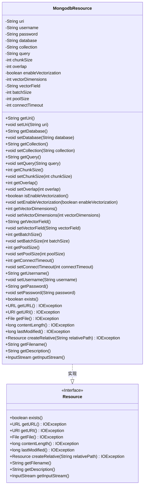

# 基础信息

|      |      |
|------|------|
| 名称 | MongodbResource |
| 编码语言 | .java |
| 代码路径 | spring-ai-alibaba/community/document-readers/spring-ai-alibaba-starter-document-reader-mongodb/src/main/java/com/alibaba/cloud/ai/reader/mongodb/MongodbResource.java |
| 包名 | com.alibaba.cloud.ai.reader.mongodb |
| 依赖项 | ['java.io.File', 'java.io.IOException', 'java.io.InputStream', 'java.net.URI', 'java.net.URL', 'org.springframework.core.io.Resource'] |
| 概述说明 | MongodbResource类实现资源接口，涵盖MongoDB连接、查询、分块、向量化配置。 |

# 说明

MongodbResource类实现了资源接口，主要功能包括配置MongoDB的连接、查询、数据分块以及向量化操作。该类旨在提供对MongoDB数据库的全面管理，确保高效的数据访问和处理。通过集成这些功能，MongodbResource类能够支持复杂的数据操作和优化，满足不同应用场景的需求。

# 类列表 Class Summary

| 名称   | 类型  | 说明 |
|-------|------|-------------|
| MongodbResource | class | MongodbResource类实现资源接口，包含MongoDB连接、查询、分块、向量化等配置。 |

## 类 MongodbResource

|      |      |
|------|------|
| 访问范围 | public |
| 类型 | class |
| 名称 | MongodbResource |
| 说明 | MongodbResource类实现资源接口，包含MongoDB连接、查询、分块、向量化等配置。 |

### UML类图

### 描述
`MongodbResource`类实现了`Resource`接口，用于管理与MongoDB数据库的连接和操作。该类包含多个私有字段，如`uri`、`username`、`password`等，用于配置MongoDB连接参数。此外，还提供了对这些字段的getter和setter方法。`MongodbResource`类还实现了`Resource`接口中的多个方法，如`exists()`、`getURL()`等，用于处理资源的存在性检查、URL获取等操作。通过实现`Resource`接口，`MongodbResource`类能够与其他资源类进行统一管理。

### 内部方法调用关系图

这段代码定义了一个名为 `MongodbResource` 的类，用于管理与 MongoDB 数据库连接和操作的资源。类中包含多个属性，如数据库连接 URI、用户名、密码、数据库名称、集合名称等，以及对这些属性的 getter 和 setter 方法。此外，类还实现了 `Resource` 接口，提供了如 `exists()`、`getURL()`、`getURI()` 等方法。该类的设计旨在提供对 MongoDB 资源的灵活配置和操作，支持批量读取、文档分块、向量化等功能。

### 字段列表 Field List

| 名称  | 类型  | 说明 |
|-------|-------|------|
| poolSize = 5 | int | 私有整型变量poolSize初始值为5。 |
| uri | String | 定义私有字符串变量uri。 |
| password | String | 定义了一个私有字符串变量password。 |
| vectorDimensions = 1536 | int | 向量维度设置为1536。 |
| connectTimeout = 3000 | int | 连接超时设置为3000毫秒。 |
| batchSize = 100 | int | 私有整型变量batchSize初始值为100。 |
| chunkSize = 1000 | int | 私有整型变量chunkSize初始值为1000。 |
| query | String | 定义一个私有字符串变量query。 |
| enableVectorization = false | boolean | 私有布尔变量enableVectorization默认值为false。 |
| vectorField = "vector" | String | 定义私有字符串变量vectorField，初始值为"vector"。 |
| overlap = 200 | int | 私有整型变量overlap初始值为200。 |
| username | String | 定义了一个私有字符串类型的用户名变量。 |
| database | String | 声明了一个私有的字符串类型变量database。 |
| collection | String | 定义私有字符串变量`collection`。 |

### 方法列表 Method List

| 名称  | 类型  | 说明 |
|-------|-------|------|
| getDatabase | String | 获取数据库名称的方法。 |
| setPoolSize | void | 设置线程池大小的公共方法。 |
| setVectorDimensions | void | 设置向量维度的方法，将参数赋值给类成员变量。 |
| createRelative | Resource | 重写createRelative方法，返回null。 |
| getPoolSize | int | 获取当前池大小的方法。 |
| getConnectTimeout | int | 获取连接超时时间的方法。 |
| contentLength | long | 重写contentLength方法，返回0。 |
| setOverlap | void | 设置重叠值的方法，用于更新重叠属性。 |
| getUsername | String | 获取用户名的Java方法。 |
| setVectorField | void | 该方法用于设置向量字段的值。 |
| getVectorField | String | 获取vectorField字段的字符串值。 |
| setCollection | void | 设置字符串类型的collection属性值。 |
| getVectorDimensions | int | 该方法返回向量维度值。 |
| setUri | void | 设置URI字符串的方法。 |
| getQuery | String | 获取查询字符串的方法。 |
| getUri | String | 该方法返回字符串类型的uri变量。 |
| setConnectTimeout | void | 设置连接超时时间的方法。 |
| setBatchSize | void | 设置批量处理大小的方法。 |
| getPassword | String | 该方法返回密码字符串。 |
| lastModified | long | 重写lastModified方法，始终返回0。 |
| setEnableVectorization | void | 设置向量化功能的启用状态。 |
| getCollection | String | 方法getCollection返回collection变量的值。 |
| getOverlap | int | 方法返回整型变量overlap的值。 |
| getChunkSize | int | 获取chunkSize的整数值。 |
| setDatabase | void | 设置数据库名称的方法，将传入参数赋值给成员变量。 |
| exists | boolean | 重写exists方法，始终返回false。 |
| setUsername | void | 设置用户名的Java方法。 |
| getBatchSize | int | 获取批处理大小的公共方法。 |
| isEnableVectorization | boolean | 方法返回布尔值，表示是否启用向量化。 |
| getDescription | String | 重写getDescription方法，返回空字符串。 |
| setPassword | void | 设置密码的方法，将输入值赋给类成员变量。 |
| getInputStream | InputStream | 重写getInputStream方法，返回空输入流。 |
| getFile | File | 重写getFile方法，返回null，可能抛出IOException。 |
| setQuery | void | 设置查询字符串的方法。 |
| getFilename | String | 重写getFilename方法，返回空字符串。 |
| getURI | URI | 重写getURI方法，返回null并抛出IOException。 |
| getURL | URL | 重写getURL方法，返回null，可能抛出IOException异常。 |
| setChunkSize | void | 设置块大小的方法。 |

