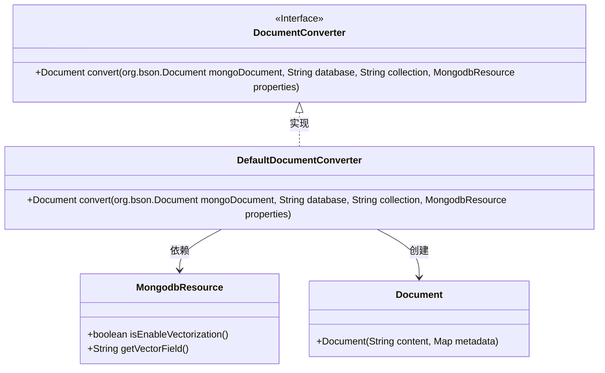
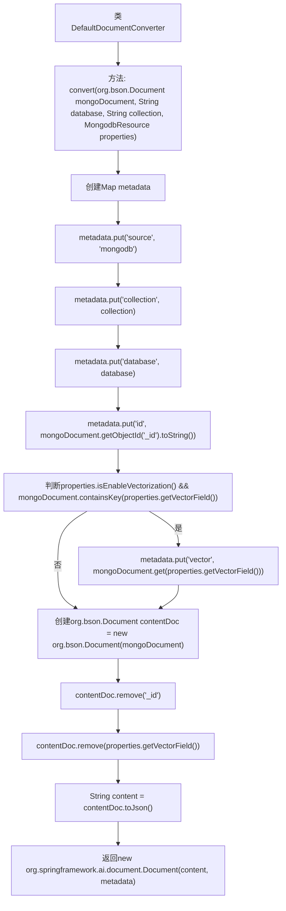

# 基础信息

|      |      |
|------|------|
| 名称 | DefaultDocumentConverter |
| 编码语言 | .java |
| 代码路径 | spring-ai-alibaba/community/document-readers/spring-ai-alibaba-starter-document-reader-mongodb/src/main/java/com/alibaba/cloud/ai/reader/mongodb/converter/DefaultDocumentConverter.java |
| 包名 | com.alibaba.cloud.ai.reader.mongodb.converter |
| 依赖项 | ['com.alibaba.cloud.ai.reader.mongodb.MongodbResource', 'org.springframework.ai.document.Document', 'java.util.HashMap', 'java.util.Map'] |
| 概述说明 | DefaultDocumentConverter类将MongoDB文档转为含元数据和内容的Document对象，支持向量化。 |

# 说明

DefaultDocumentConverter类负责将MongoDB文档转换为包含元数据和内容的Document对象。该转换过程支持向量化处理，能够高效处理大量数据，确保转换后的Document对象既包含原始文档的元数据，也保留其内容信息，适用于需要进一步处理或分析的场景。

# 类列表 Class Summary

| 名称   | 类型  | 说明 |
|-------|------|-------------|
| DefaultDocumentConverter | class | DefaultDocumentConverter类将MongoDB文档转换为包含元数据和内容的Document对象，支持向量化处理。 |

## 类 DefaultDocumentConverter

|      |      |
|------|------|
| 访问范围 | public |
| 类型 | class |
| 名称 | DefaultDocumentConverter |
| 说明 | DefaultDocumentConverter类将MongoDB文档转换为包含元数据和内容的Document对象，支持向量化处理。 |

### UML类图

**描述：**  
`DefaultDocumentConverter`类实现了`DocumentConverter`接口，用于将MongoDB的`Document`对象转换为自定义的`Document`对象。在转换过程中，它会提取元数据（如源数据库、集合、ID等），并根据`MongodbResource`的配置决定是否包含向量化数据。最终，它将转换后的内容和元数据封装到新的`Document`对象中返回。

### 内部方法调用关系图

这段代码实现了一个`DefaultDocumentConverter`类，其中的`convert`方法用于将MongoDB文档转换为包含元数据和内容的`Document`对象。首先，代码创建了一个`metadata`映射，用于存储文档的元信息，如来源、集合、数据库和ID。接着，如果启用了向量化且文档中包含向量字段，则将该字段添加到元数据中。然后，代码创建了一个新的MongoDB文档副本，移除了不需要的字段（如`_id`和向量字段），并将其转换为JSON字符串。最后，返回一个包含内容和元数据的`Document`对象。

### 字段列表 Field List

| 名称  | 类型  | 说明 |
|-------|-------|------|

### 方法列表 Method List

| 名称  | 类型  | 说明 |
|-------|-------|------|
| convert | Document | 将MongoDB文档转换为包含元数据和内容的Spring AI文档，支持向量化。 |

