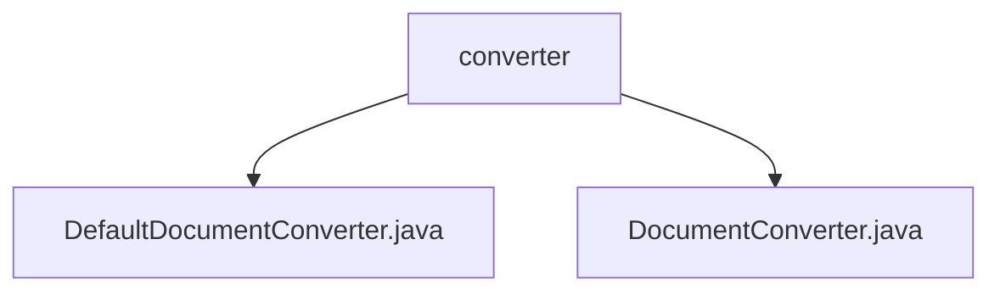

# 基础信息

|      |      |
|------|------|
| 名称 | converter |
| 编码语言 | .java |
| 代码路径 | spring-ai-alibaba/community/document-readers/spring-ai-alibaba-starter-document-reader-mongodb/src/main/java/com/alibaba/cloud/ai/reader/mongodb/converter |
| 包名 | spring-ai-alibaba.community.document-readers.spring-ai-alibaba-starter-document-reader-mongodb.src.main.java.com.alibaba.cloud.ai.reader.mongodb.converter |
| 概述说明 | DefaultDocumentConverter类将MongoDB文档转换为包含元数据和内容的Document对象，支持向量化处理。 |

# 说明

## 概述
该代码模块主要涉及将MongoDB文档转换为包含元数据和内容的`Document`对象。核心功能由`DefaultDocumentConverter`类实现，支持向量化处理，能够高效处理大量数据。该模块适用于需要进一步处理或分析MongoDB文档的场景，确保转换后的`Document`对象既包含原始文档的元数据，也保留其内容信息。

## 主要业务场景
1. **数据转换**：将MongoDB中的文档转换为包含元数据和内容的`Document`对象，便于后续处理或分析。
2. **向量化处理**：支持对大量数据进行高效转换，适用于需要处理大规模MongoDB文档的场景。
3. **数据保留**：确保转换后的`Document`对象不仅包含原始文档的元数据，还保留其内容信息，适用于需要完整数据的业务场景。

### 包内部结构视图

该流程图展示了路径2中的层级关系，`converter`文件夹包含两个文件：`DefaultDocumentConverter.java`和`DocumentConverter.java`。流程图清晰地展示了文件夹与文件之间的从属关系，帮助理解项目结构。

# 文件列表 File List

| 名称   | 类型  | 说明 |
|-------|------|-------------|
| [DocumentConverter.java](DocumentConverter.md) | file | 输入信息为空，无法生成概要描述。 |
| [DefaultDocumentConverter.java](DefaultDocumentConverter.md) | file | DefaultDocumentConverter类将MongoDB文档转为含元数据和内容的Document对象，支持向量化。 |

