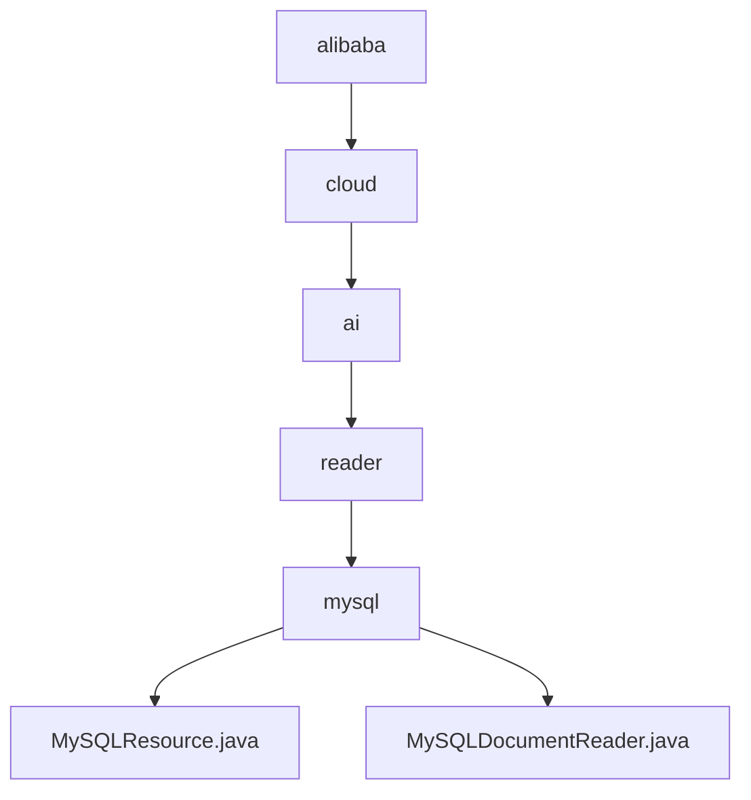

# 基础信息

|      |      |
|------|------|
| 名称 | alibaba |
| 编码语言 | .java |
| 代码路径 | spring-ai-alibaba/community/document-readers/spring-ai-alibaba-starter-document-reader-mysql/src/main/java/com/alibaba |
| 包名 | spring-ai-alibaba.community.document-readers.spring-ai-alibaba-starter-document-reader-mysql.src.main.java.com.alibaba |
| 概述说明 | MySQLResource类管理MySQL连接，支持SQL查询和结果配置。MySQLDocumentReader类从MySQL读取文档，处理查询结果并生成文档列表。 |

# 说明

## 概述
该代码模块是一个用于从MySQL数据库中读取和处理文档的工具集，主要包含两个核心类：`MySQLResource`和`MySQLDocumentReader`。`MySQLResource`类负责管理与MySQL数据库的连接，支持执行SQL查询，并允许配置查询结果的元数据列和内容。`MySQLDocumentReader`类则利用`MySQLResource`的功能，从数据库中读取文档数据，并对查询结果进行处理，最终生成一个文档列表。该模块适用于需要从MySQL数据库中提取和处理文档的业务场景。

## 主要业务场景
1. **数据库连接管理**：通过`MySQLResource`类，用户可以方便地配置和管理与MySQL数据库的连接，包括主机、端口、数据库、用户名和密码等关键属性。
2. **SQL查询执行**：`MySQLResource`类支持执行SQL查询，并允许用户配置查询结果的元数据列和内容，提供全面的数据库操作功能。
3. **文档数据读取**：`MySQLDocumentReader`类通过执行查询操作，从MySQL数据库中获取文档数据，并对查询结果进行处理，最终生成一个文档列表。
4. **数据处理与转换**：`MySQLDocumentReader`类不仅负责读取数据，还对查询结果进行处理，将数据转换为适合进一步处理的文档格式。
5. **文档提取与处理**：该模块适用于需要从MySQL数据库中提取和处理文档的场景，例如数据迁移、数据分析和文档生成等。

### 包内部结构视图

该流程图展示了从`alibaba`到`MySQLResource.java`和`MySQLDocumentReader.java`的层级关系。路径从`alibaba`开始，依次经过`cloud`、`ai`、`reader`和`mysql`，最终指向两个具体的Java文件。这种层级结构清晰地反映了项目中的模块化设计，便于开发者理解和维护代码。

# 文件列表 File List

| 名称   | 类型  | 说明 |
|-------|------|-------------|
| [cloud](cloud/_module.md) | package | MySQLResource类管理MySQL连接，支持SQL查询和结果配置。MySQLDocumentReader类从MySQL读取文档，处理查询结果并生成文档列表。 |

