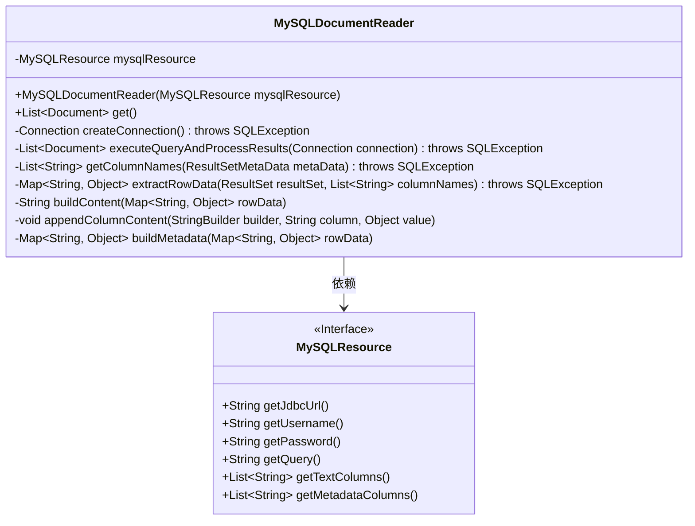
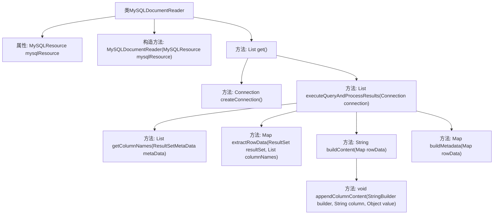

# 基础信息

|      |      |
|------|------|
| 名称 | MySQLDocumentReader |
| 编码语言 | .java |
| 代码路径 | spring-ai-alibaba/community/document-readers/spring-ai-alibaba-starter-document-reader-mysql/src/main/java/com/alibaba/cloud/ai/reader/mysql/MySQLDocumentReader.java |
| 包名 | com.alibaba.cloud.ai.reader.mysql |
| 依赖项 | ['org.springframework.ai.document.Document', 'org.springframework.ai.document.DocumentReader', 'java.sql', 'java.util.ArrayList', 'java.util.HashMap', 'java.util.List', 'java.util.Map'] |
| 概述说明 | MySQLDocumentReader类读取MySQL数据并生成文档列表。 |

# 说明

MySQLDocumentReader类是一个用于从MySQL数据库读取文档的工具。它通过执行查询操作获取数据库中的文档数据，并对查询结果进行处理，最终生成一个文档列表。该类的核心功能包括连接数据库、执行查询、处理结果集以及将数据转换为文档列表，适用于需要从MySQL数据库中提取和处理文档的场景。

# 类列表 Class Summary

| 名称   | 类型  | 说明 |
|-------|------|-------------|
| MySQLDocumentReader | class | MySQLDocumentReader类从MySQL数据库读取文档，处理查询结果并生成文档列表。 |

## 类 MySQLDocumentReader

|      |      |
|------|------|
| 访问范围 | public |
| 类型 | class |
| 名称 | MySQLDocumentReader |
| 说明 | MySQLDocumentReader类从MySQL数据库读取文档，处理查询结果并生成文档列表。 |

### UML类图

这段代码描述了一个 `MySQLDocumentReader` 类，它实现了从 MySQL 数据库中读取文档的功能。`MySQLDocumentReader` 依赖于 `MySQLResource` 接口来获取数据库连接信息和查询参数。通过 `get()` 方法，该类执行 SQL 查询并将结果转换为 `Document` 对象列表。内部方法包括创建数据库连接、执行查询、处理结果集、构建文档内容和元数据等。整个流程展示了从数据库读取数据并将其转换为结构化文档的过程。

### 内部方法调用关系图

这段代码实现了一个`MySQLDocumentReader`类，用于从MySQL数据库中读取文档数据。该类通过`get()`方法获取文档列表，内部调用`createConnection()`方法创建数据库连接，并通过`executeQueryAndProcessResults()`方法执行查询并处理结果。`executeQueryAndProcessResults()`方法进一步调用`getColumnNames()`、`extractRowData()`、`buildContent()`和`buildMetadata()`方法来处理结果集中的每一行数据，最终生成文档对象并返回。该流程涵盖了从数据库连接到数据处理和文档生成的完整过程。

### 字段列表 Field List

| 名称  | 类型  | 说明 |
|-------|-------|------|
| mysqlResource | MySQLResource | 私有且不可变的MySQL资源实例。 |

### 方法列表 Method List

| 名称  | 类型  | 说明 |
|-------|-------|------|
| get | List<Document> | 方法获取MySQL数据，处理异常并返回文档列表。 |
| createConnection | Connection | 创建数据库连接，使用JDBC URL、用户名和密码。 |
| appendColumnContent | void | 方法将列名和值追加到StringBuilder中，并换行。 |
| getColumnNames | List<String> | 从ResultSetMetaData获取列名并返回列表。 |
| extractRowData | Map<String, Object> | 从ResultSet提取列数据并存入Map。 |
| executeQueryAndProcessResults | List<Document> | 执行SQL查询并处理结果，生成文档列表返回。 |
| buildContent | String | 方法根据指定列或所有列构建内容字符串。 |
| buildMetadata | Map<String, Object> | 构建元数据方法，提取指定列数据并返回。 |

