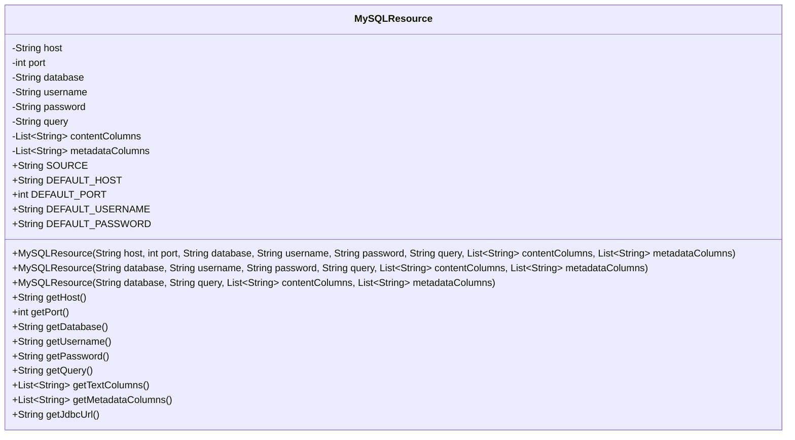

# 基础信息

|      |      |
|------|------|
| 名称 | MySQLResource |
| 编码语言 | .java |
| 代码路径 | spring-ai-alibaba/community/document-readers/spring-ai-alibaba-starter-document-reader-mysql/src/main/java/com/alibaba/cloud/ai/reader/mysql/MySQLResource.java |
| 包名 | com.alibaba.cloud.ai.reader.mysql |
| 依赖项 | ['java.util.List'] |
| 概述说明 | MySQLResource类管理MySQL连接，支持SQL查询及列配置。 |

# 说明

MySQLResource类是一个用于管理MySQL连接的工具类，包含主机、端口、数据库、用户名和密码等关键属性。该类支持执行SQL查询，并允许配置查询结果的元数据列和内容，提供全面的数据库操作功能。

# 类列表 Class Summary

| 名称   | 类型  | 说明 |
|-------|------|-------------|
| MySQLResource | class | MySQLResource类用于管理MySQL连接，包含主机、端口、数据库、用户名、密码等属性，支持SQL查询及内容、元数据列配置。 |

## 类 MySQLResource

|      |      |
|------|------|
| 访问范围 | public |
| 类型 | class |
| 名称 | MySQLResource |
| 说明 | MySQLResource类用于管理MySQL连接，包含主机、端口、数据库、用户名、密码等属性，支持SQL查询及内容、元数据列配置。 |

### UML类图

**描述：**
`MySQLResource` 类用于管理与 MySQL 数据库的连接和查询设置。它包含连接数据库所需的主机、端口、数据库名称、用户名和密码等属性，以及执行查询的 SQL 语句和结果列的相关配置。类提供了多个构造函数，允许使用默认值或自定义值初始化连接参数，并提供了获取这些参数的方法。此外，类还提供了一个生成 JDBC URL 的方法，用于建立数据库连接。

### 内部方法调用关系图

```mermaid
graph TD
    A["类MySQLResource"]
    B["属性: String host"]
    C["属性: int port"]
    D["属性: String database"]
    E["属性: String username"]
    F["属性: String password"]
    G["属性: String query"]
    H["属性: List<String> contentColumns"]
    I["属性: List<String> metadataColumns"]
    J["常量: String SOURCE = 'mysql'"]
    K["常量: String DEFAULT_HOST = '127.0.0.1'"]
    L["常量: int DEFAULT_PORT = 3306"]
    M["常量: String DEFAULT_USERNAME = 'root'"]
    N["常量: String DEFAULT_PASSWORD = 'root'"]
    O["构造方法: MySQLResource(String host, int port, String database, String username, String password, String query, List<String> contentColumns, List<String> metadataColumns)"]
    P["构造方法: MySQLResource(String database, String username, String password, String query, List<String> contentColumns, List<String> metadataColumns)"]
    Q["构造方法: MySQLResource(String database, String query, List<String> contentColumns, List<String> metadataColumns)"]
    R["方法: String getHost()"]
    S["方法: int getPort()"]
    T["方法: String getDatabase()"]
    U["方法: String getUsername()"]
    V["方法: String getPassword()"]
    W["方法: String getQuery()"]
    X["方法: List<String> getTextColumns()"]
    Y["方法: List<String> getMetadataColumns()"]
    Z["方法: String getJdbcUrl()"]

    A --> B
    A --> C
    A --> D
    A --> E
    A --> F
    A --> G
    A --> H
    A --> I
    A --> J
    A --> K
    A --> L
    A --> M
    A --> N
    A --> O
    A --> P
    A --> Q
    A --> R
    A --> S
    A --> T
    A --> U
    A --> V
    A --> W
    A --> X
    A --> Y
    A --> Z
```

这段代码定义了一个名为`MySQLResource`的类，用于管理与MySQL数据库的连接和查询操作。类中包含多个属性，如主机名、端口、数据库名、用户名、密码等，以及用于执行SQL查询的字段。类提供了多个构造方法，允许用户以不同的方式初始化对象。此外，类还提供了多个getter方法，用于获取属性值，以及一个生成JDBC URL的方法。整体设计旨在简化MySQL连接的配置和查询操作。

### 字段列表 Field List

| 名称  | 类型  | 说明 |
|-------|-------|------|
| host | String | 私有字符串变量host。 |
| database | String | 声明了一个私有的最终字符串变量database。 |
| DEFAULT_HOST = "127.0.0.1" | String | 默认主机地址为127.0.0.1。 |
| metadataColumns | List<String> | 私有且不可变的字符串列表metadataColumns。 |
| contentColumns | List<String> | 私有且不可变的字符串列表内容列。 |
| password | String | 私有不可变字符串变量password。 |
| DEFAULT_PASSWORD = "root" | String | 默认密码为“root”的静态常量字符串。 |
| query | String | 私有字符串变量query声明为final。 |
| DEFAULT_PORT = 3306 | int | 定义默认端口常量值为3306。 |
| username | String | 定义了一个私有的不可变字符串变量username。 |
| DEFAULT_USERNAME = "root" | String | 定义静态常量DEFAULT_USERNAME，值为"root"。 |
| SOURCE = "mysql" | String | 定义静态常量SOURCE，值为"mysql"。 |
| port | int | 私有整型变量port，不可修改。 |

### 方法列表 Method List

| 名称  | 类型  | 说明 |
|-------|-------|------|
| getHost | String | 获取主机地址的方法。 |
| getPort | int | 获取端口号的方法。 |
| getPassword | String | 该方法返回密码字符串。 |
| getUsername | String | 方法返回用户名。 |
| getTextColumns | List<String> | 该方法返回一个字符串列表，包含文本列内容。 |
| getDatabase | String | 获取数据库名称的方法。 |
| getMetadataColumns | List<String> | 获取元数据列的方法，返回字符串列表。 |
| getQuery | String | 方法getQuery返回字符串类型变量query的值。 |
| getJdbcUrl | String | 该方法生成MySQL数据库的JDBC连接URL，包含主机、端口和数据库名。 |

