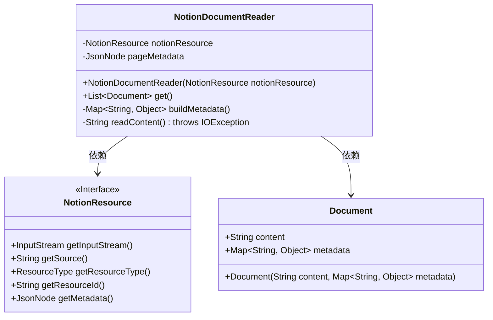
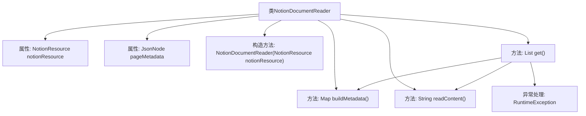

# 基础信息

|      |      |
|------|------|
| 名称 | NotionDocumentReader |
| 编码语言 | .java |
| 代码路径 | spring-ai-alibaba/community/document-readers/spring-ai-alibaba-starter-document-reader-notion/src/main/java/com/alibaba/cloud/ai/reader/notion/NotionDocumentReader.java |
| 包名 | com.alibaba.cloud.ai.reader.notion |
| 依赖项 | ['java.io.BufferedReader', 'java.io.IOException', 'java.io.InputStreamReader', 'java.time.Instant', 'java.util.Collections', 'java.util.HashMap', 'java.util.List', 'java.util.Map', 'com.fasterxml.jackson.databind.JsonNode', 'org.springframework.ai.document.Document', 'org.springframework.ai.document.DocumentReader', 'org.springframework.util.StringUtils'] |
| 概述说明 | NotionDocumentReader读取Notion资源，生成文档及元数据。 |

# 说明

NotionDocumentReader是一个工具，用于从Notion平台读取资源，并生成相应的文档及其元数据。该工具能够提取Notion中的内容，包括文本、图片、表格等，并生成包含这些信息的文档。同时，它还能生成与文档相关的元数据，如创建时间、修改时间、作者等信息，以便用户更好地管理和查找文档。通过这种方式，NotionDocumentReader帮助用户高效地从Notion中获取和整理所需内容。

# 类列表 Class Summary

| 名称   | 类型  | 说明 |
|-------|------|-------------|
| NotionDocumentReader | class | NotionDocumentReader读取Notion资源并生成文档及其元数据。 |

## 类 NotionDocumentReader

|      |      |
|------|------|
| 访问范围 | public |
| 类型 | class |
| 名称 | NotionDocumentReader |
| 说明 | NotionDocumentReader读取Notion资源并生成文档及其元数据。 |

### UML类图

这段代码定义了一个`NotionDocumentReader`类，用于从`NotionResource`中读取文档内容并构建元数据。`NotionDocumentReader`依赖于`NotionResource`接口来获取输入流和元数据，并通过`Document`类返回读取的文档内容及其元数据。`buildMetadata`方法从`NotionResource`的元数据中提取并构建详细的元信息，而`readContent`方法则从输入流中读取文档内容。整体设计简洁，职责清晰，适合处理从Notion API获取的文档数据。

### 内部方法调用关系图

这段代码定义了一个`NotionDocumentReader`类，用于从Notion资源中读取文档内容并构建元数据。类中包含两个属性：`notionResource`和`pageMetadata`，分别表示Notion资源和页面元数据。构造方法初始化这两个属性。`get()`方法负责读取内容、构建元数据并返回文档列表，若发生IO异常则抛出运行时异常。`buildMetadata()`方法从Notion API响应中提取并构建元数据，`readContent()`方法从输入流中读取内容。流程图展示了类的主要方法和它们之间的调用关系。

### 字段列表 Field List

| 名称  | 类型  | 说明 |
|-------|-------|------|
| notionResource | NotionResource | 包含私有NotionResource对象的最终变量。 |
| pageMetadata | JsonNode | 私有常量存储页面元数据的JsonNode对象。 |

### 方法列表 Method List

| 名称  | 类型  | 说明 |
|-------|-------|------|
| readContent | String | 读取输入流内容并返回字符串。 |
| get | List<Document> | 方法读取内容并构建元数据，返回包含内容和元数据的文档列表。 |
| buildMetadata | Map<String, Object> | 构建元数据方法，包含资源信息、创建编辑时间、作者、URL、父信息、图标和封面。 |

