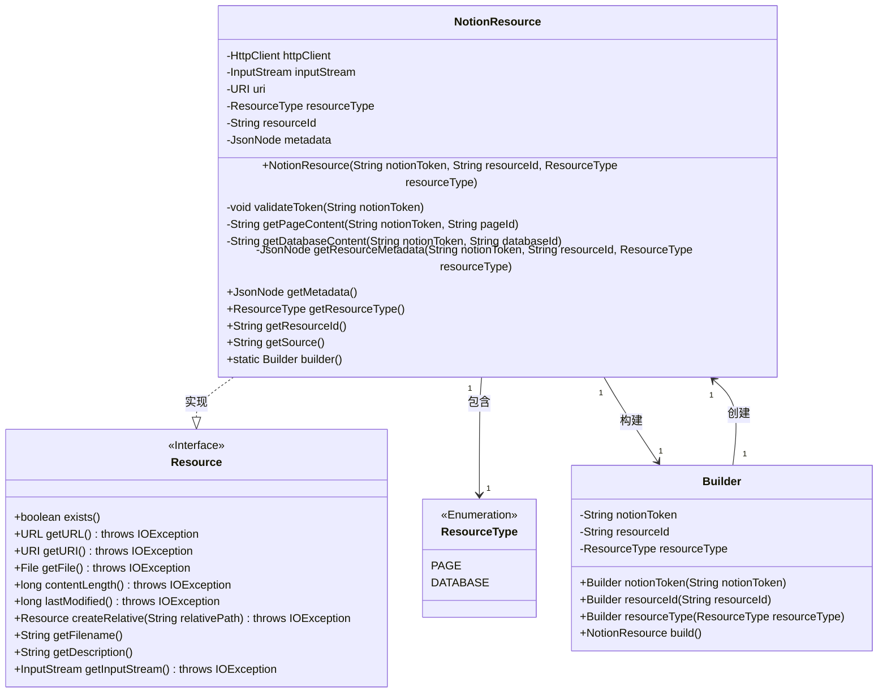

# 基础信息

|      |      |
|------|------|
| 名称 | NotionResource |
| 编码语言 | .java |
| 代码路径 | spring-ai-alibaba/community/document-readers/spring-ai-alibaba-starter-document-reader-notion/src/main/java/com/alibaba/cloud/ai/reader/notion/NotionResource.java |
| 包名 | com.alibaba.cloud.ai.reader.notion |
| 依赖项 | ['java.io.ByteArrayInputStream', 'java.io.File', 'java.io.IOException', 'java.io.InputStream', 'java.net.URI', 'java.net.URL', 'java.net.http.HttpClient', 'java.net.http.HttpRequest', 'java.net.http.HttpResponse', 'java.util.Iterator', 'com.fasterxml.jackson.databind.JsonNode', 'com.fasterxml.jackson.databind.ObjectMapper', 'org.springframework.core.io.Resource', 'org.springframework.util.Assert'] |
| 概述说明 | NotionResource类实现资源接口，获取页面和数据库内容，含元数据和输入流。 |

# 说明

NotionResource类实现了资源接口，具备获取页面和数据库内容的功能。该类不仅能够处理元数据，还支持输入流操作，确保数据的完整性和可访问性。通过这一实现，用户可以高效地管理和操作Notion中的资源，提升整体工作流程的灵活性和效率。

# 类列表 Class Summary

| 名称   | 类型  | 说明 |
|-------|------|-------------|
| NotionResource | class | NotionResource类实现资源接口，支持获取页面和数据库内容，包含元数据和输入流。 |

## 类 NotionResource

|      |      |
|------|------|
| 访问范围 | public |
| 类型 | class |
| 名称 | NotionResource |
| 说明 | NotionResource类实现资源接口，支持获取页面和数据库内容，包含元数据和输入流。 |

### UML类图

### 描述
`NotionResource`类实现了`Resource`接口，用于处理Notion API的资源操作。它包含`HttpClient`、`InputStream`、`URI`等私有成员，并通过`validateToken`方法验证API令牌。`getPageContent`和`getDatabaseContent`方法分别获取页面和数据库的内容，`getResourceMetadata`方法获取资源的元数据。`Builder`类用于构建`NotionResource`实例，`ResourceType`枚举定义了资源类型（PAGE和DATABASE）。

### 内部方法调用关系图

```mermaid
graph TD
    A["类NotionResource"]
    B["属性: String SOURCE"]
    C["属性: String BASE_URL"]
    D["属性: String API_VERSION"]
    E["枚举: ResourceType"]
    F["属性: HttpClient httpClient"]
    G["属性: InputStream inputStream"]
    H["属性: URI uri"]
    I["属性: ResourceType resourceType"]
    J["属性: String resourceId"]
    K["属性: JsonNode metadata"]
    L["构造方法: NotionResource(String notionToken, String resourceId, ResourceType resourceType)"]
    M["方法: validateToken(String notionToken)"]
    N["方法: getPageContent(String notionToken, String pageId)"]
    O["方法: getDatabaseContent(String notionToken, String databaseId)"]
    P["方法: getResourceMetadata(String notionToken, String resourceId, ResourceType resourceType)"]
    Q["方法: getMetadata()"]
    R["方法: builder()"]
    S["内部类: Builder"]
    T["方法: exists()"]
    U["方法: getURL()"]
    V["方法: getURI()"]
    W["方法: getFile()"]
    X["方法: contentLength()"]
    Y["方法: lastModified()"]
    Z["方法: createRelative(String relativePath)"]
    AA["方法: getFilename()"]
    AB["方法: getDescription()"]
    AC["方法: getInputStream()"]
    AD["方法: getResourceType()"]
    AE["方法: getResourceId()"]
    AF["方法: getSource()"]

    A --> B
    A --> C
    A --> D
    A --> E
    A --> F
    A --> G
    A --> H
    A --> I
    A --> J
    A --> K
    A --> L
    L --> M
    L --> P
    L --> N
    L --> O
    A --> Q
    A --> R
    R --> S
    A --> T
    A --> U
    A --> V
    A --> W
    A --> X
    A --> Y
    A --> Z
    A --> AA
    A --> AB
    A --> AC
    A --> AD
    A --> AE
    A --> AF
```

这段代码定义了一个`NotionResource`类，用于与Notion API进行交互，获取页面或数据库的内容。类中包含多个属性、构造方法和辅助方法，用于验证API令牌、获取资源元数据、解析页面或数据库内容，并提供了一系列的getter方法。通过`Builder`模式可以方便地创建`NotionResource`实例。流程图展示了类的主要结构和方法调用关系。

### 字段列表 Field List

| 名称  | 类型  | 说明 |
|-------|-------|------|
| resourceType | ResourceType | 私有不可变的资源类型变量。 |
| inputStream | InputStream | 私有且不可变的输入流对象。 |
| httpClient | HttpClient | 声明一个私有的HttpClient实例。 |
| SOURCE = "source" | String | 定义了一个名为SOURCE的静态常量字符串，值为"source"。 |
| API_VERSION = "2022-06-28" | String | 私有静态常量API_VERSION值为"2022-06-28"。 |
| BASE_URL = "https://api.notion.com/v1" | String | Notion API基础URL为https://api.notion.com/v1。 |
| resourceId | String | 定义一个私有且不可变的字符串变量resourceId。 |
| uri | URI | 私有不可变的URI变量。 |
| metadata | JsonNode | 定义了一个私有的JsonNode类型变量metadata。 |

### 方法列表 Method List

| 名称  | 类型  | 说明 |
|-------|-------|------|
| getMetadata | JsonNode | 该方法返回metadata的JsonNode对象。 |
| getSource | String | 方法返回URI的字符串表示。 |
| getURL | URL | 该方法重写getURL，返回null并可能抛出IOException。 |
| getInputStream | InputStream | 重写getInputStream方法，返回inputStream。 |
| lastModified | long | 重写lastModified方法，返回固定值0。 |
| getFilename | String | 重写getFilename方法，返回resourceId作为文件名。 |
| contentLength | long | 该方法重写并返回内容长度为0。 |
| validateToken | void | 验证Notion令牌，发送GET请求检查状态码是否为200。 |
| getResourceType | ResourceType | 该方法返回资源类型。 |
| getURI | URI | 重写getURI方法，返回URI对象，可能抛出IOException异常。 |
| builder | Builder | 静态方法`builder()`返回一个新的`Builder`实例。 |
| exists | boolean | 方法exists()始终返回true。 |
| getResourceMetadata | JsonNode | 获取Notion资源元数据，支持页面和数据库，使用HTTP请求和JSON解析。 |
| getResourceId | String | 获取资源ID的方法，返回字符串类型的resourceId。 |
| getDatabaseContent | String | 方法通过API查询Notion数据库内容，解析并提取属性值，最终返回格式化字符串。 |
| createRelative | Resource | 重写方法createRelative，返回null并抛出IOException。 |
| getPageContent | String | 通过Notion API获取页面内容并解析标题和文本块。 |
| getFile | File | 重写getFile方法，返回null，可能抛出IOException。 |
| getDescription | String | 重写getDescription方法，返回Notion资源类型和ID的格式化描述。 |

