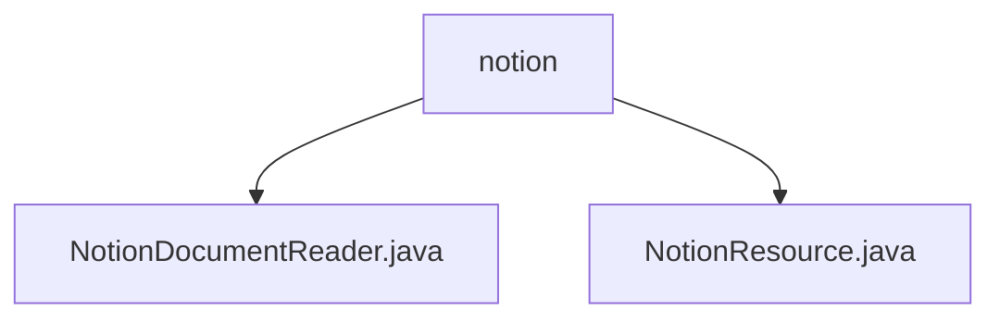

# 基础信息

|      |      |
|------|------|
| 名称 | notion |
| 编码语言 | .java |
| 代码路径 | spring-ai-alibaba/community/document-readers/spring-ai-alibaba-starter-document-reader-notion/src/main/java/com/alibaba/cloud/ai/reader/notion |
| 包名 | spring-ai-alibaba.community.document-readers.spring-ai-alibaba-starter-document-reader-notion.src.main.java.com.alibaba.cloud.ai.reader.notion |
| 概述说明 | NotionDocumentReader读取Notion资源生成文档及元数据，NotionResource处理内容提升效率。 |

# 说明

## 概述

`NotionDocumentReader` 是一个用于从 Notion 平台读取资源并生成相应文档及其元数据的工具。该工具能够提取 Notion 中的内容，包括文本、图片、表格等，并生成包含这些信息的文档。同时，它还能生成与文档相关的元数据，如创建时间、修改时间、作者等信息，以便用户更好地管理和查找文档。通过这种方式，`NotionDocumentReader` 帮助用户高效地从 Notion 中获取和整理所需内容。

## 主要业务场景

1. **文档提取与生成**：`NotionDocumentReader` 能够从 Notion 平台提取各种类型的内容（如文本、图片、表格等），并生成包含这些内容的文档。这使得用户能够轻松地将 Notion 中的信息转换为可管理的文档格式。

2. **元数据管理**：该工具不仅能提取内容，还能生成与文档相关的元数据，如创建时间、修改时间、作者等信息。这些元数据有助于用户更好地管理和查找文档，提升文档管理的效率。

3. **资源操作与管理**：`NotionResource` 类实现了资源接口，具备获取页面和数据库内容的功能。该类不仅能够处理元数据，还支持输入流操作，确保数据的完整性和可访问性。这使得用户能够高效地管理和操作 Notion 中的资源，提升整体工作流程的灵活性和效率。

通过 `NotionDocumentReader` 和 `NotionResource` 的结合，用户能够从 Notion 平台高效地提取、管理和操作资源，提升工作效率和文档管理的灵活性。

### 包内部结构视图

该流程图展示了`notion`目录下的两个文件：`NotionDocumentReader.java`和`NotionResource.java`。`notion`作为根节点，直接包含这两个文件，层级关系清晰，路径简洁明了，便于理解文件结构。

# 文件列表 File List

| 名称   | 类型  | 说明 |
|-------|------|-------------|
| [NotionResource.java](NotionResource.md) | file | NotionResource类实现资源接口，获取页面和数据库内容，含元数据和输入流。 |
| [NotionDocumentReader.java](NotionDocumentReader.md) | file | NotionDocumentReader读取Notion资源，生成文档及元数据。 |

