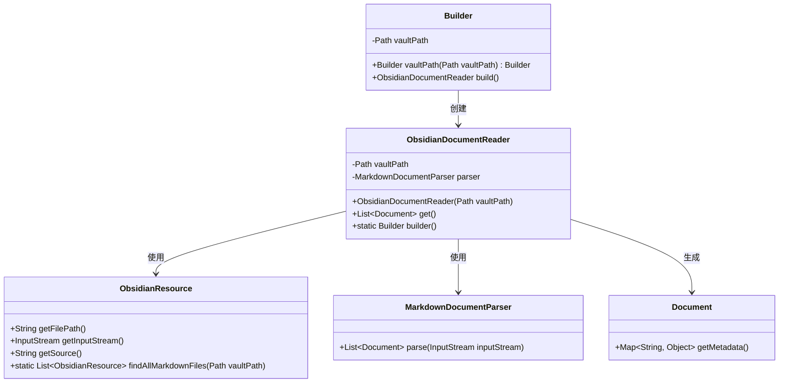
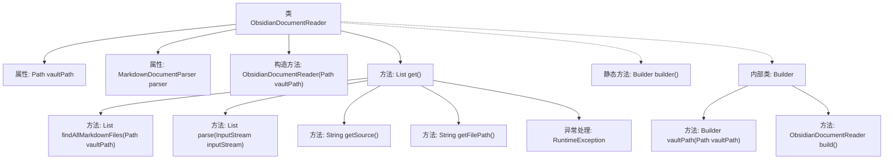

# 基础信息

|      |      |
|------|------|
| 名称 | ObsidianDocumentReader |
| 编码语言 | .java |
| 代码路径 | spring-ai-alibaba/community/document-readers/spring-ai-alibaba-starter-document-reader-obsidian/src/main/java/com/alibaba/cloud/ai/reader/obsidian/ObsidianDocumentReader.java |
| 包名 | com.alibaba.cloud.ai.reader.obsidian |
| 依赖项 | ['com.alibaba.cloud.ai.parser.markdown.MarkdownDocumentParser', 'org.springframework.ai.document.Document', 'org.springframework.ai.document.DocumentReader', 'java.io.IOException', 'java.nio.file.Path', 'java.util.ArrayList', 'java.util.List'] |
| 概述说明 | ObsidianDocumentReader解析Obsidian库中的Markdown文件。 |

# 说明

ObsidianDocumentReader是一种工具，用于读取并解析Obsidian库中的Markdown文件。它能够处理Obsidian特有的格式和链接，提取文件内容并转换为可用的数据结构。该工具支持批量处理，能够高效地管理大量Markdown文件，适用于笔记整理、知识管理等场景。通过解析文件，用户可以获取标题、标签、链接等关键信息，便于进一步分析和应用。ObsidianDocumentReader的设计旨在简化Obsidian库的访问和操作，提升用户的工作效率。

# 类列表 Class Summary

| 名称   | 类型  | 说明 |
|-------|------|-------------|
| ObsidianDocumentReader | class | ObsidianDocumentReader读取并解析Obsidian库中的Markdown文件。 |

## 类 ObsidianDocumentReader

|      |      |
|------|------|
| 访问范围 | public |
| 类型 | class |
| 名称 | ObsidianDocumentReader |
| 说明 | ObsidianDocumentReader读取并解析Obsidian库中的Markdown文件。 |

### UML类图

### 描述
`ObsidianDocumentReader` 类用于读取 Obsidian 仓库中的所有 Markdown 文件，并将其解析为 `Document` 对象。它依赖于 `ObsidianResource` 类来查找和获取文件资源，以及 `MarkdownDocumentParser` 类来解析文件内容。`Builder` 类用于构建 `ObsidianDocumentReader` 实例，允许灵活配置仓库路径。通过 `get()` 方法，可以获取所有解析后的文档，并为每个文档添加源文件路径的元数据。

### 内部方法调用关系图

这段代码定义了一个`ObsidianDocumentReader`类，用于读取Obsidian仓库中的所有Markdown文件并将其解析为文档列表。代码首先通过`findAllMarkdownFiles`方法查找所有Markdown文件，然后使用`MarkdownDocumentParser`解析每个文件，并将解析后的文档添加到列表中。每个文档都会附加源文件路径作为元数据。代码还包含一个`Builder`内部类，用于构建`ObsidianDocumentReader`实例。整个过程包括文件查找、解析、元数据添加和异常处理。

### 字段列表 Field List

| 名称  | 类型  | 说明 |
|-------|-------|------|
| parser | MarkdownDocumentParser | 私有且不可变的Markdown文档解析器实例。 |
| vaultPath | Path | 私有路径变量vaultPath。 |

### 方法列表 Method List

| 名称  | 类型  | 说明 |
|-------|-------|------|
| builder | Builder | 静态方法返回新的Builder实例。 |
| get | List<Document> | 获取并解析所有Markdown文件，添加元数据后返回文档列表。 |

