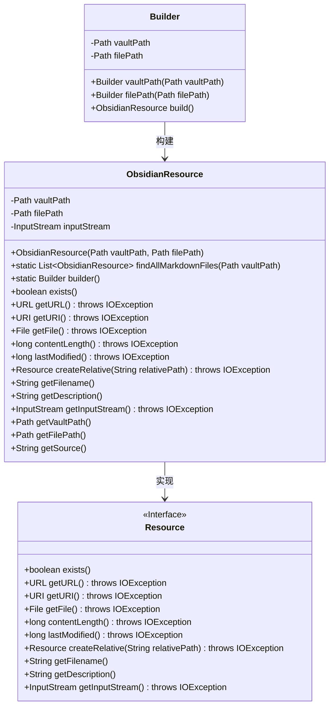

# 基础信息

|      |      |
|------|------|
| 名称 | ObsidianResource |
| 编码语言 | .java |
| 代码路径 | spring-ai-alibaba/community/document-readers/spring-ai-alibaba-starter-document-reader-obsidian/src/main/java/com/alibaba/cloud/ai/reader/obsidian/ObsidianResource.java |
| 包名 | com.alibaba.cloud.ai.reader.obsidian |
| 依赖项 | ['org.springframework.core.io.Resource', 'org.springframework.util.Assert', 'java.io.File', 'java.io.FileInputStream', 'java.io.IOException', 'java.io.InputStream', 'java.net.URI', 'java.net.URL', 'java.nio.file.Files', 'java.nio.file.Path', 'java.util.ArrayList', 'java.util.List', 'java.util.stream.Stream'] |
| 概述说明 | ObsidianResource类管理Markdown文件，支持路径验证、流操作及递归查找。 |

# 说明

ObsidianResource类是一个用于管理Obsidian库中Markdown文件的工具类，提供了文件路径验证、流操作以及递归查找等功能，帮助用户高效处理和组织Markdown文件。

# 类列表 Class Summary

| 名称   | 类型  | 说明 |
|-------|------|-------------|
| ObsidianResource | class | ObsidianResource类用于管理Obsidian库中的Markdown文件，支持文件路径验证、流操作及递归查找功能。 |

## 类 ObsidianResource

|      |      |
|------|------|
| 访问范围 | public |
| 类型 | class |
| 名称 | ObsidianResource |
| 说明 | ObsidianResource类用于管理Obsidian库中的Markdown文件，支持文件路径验证、流操作及递归查找功能。 |

### UML类图

**描述**：`ObsidianResource`类实现了`Resource`接口，用于处理Obsidian笔记库中的Markdown文件资源。它提供了文件的读取、路径管理、资源描述等功能。`Builder`类用于构建`ObsidianResource`对象，支持链式调用。`findAllMarkdownFiles`方法用于递归查找库中的所有Markdown文件，并返回对应的资源列表。

### 内部方法调用关系图

```mermaid
graph TD
    A["类ObsidianResource"]
    B["常量: String SOURCE"]
    C["常量: String MARKDOWN_EXTENSION"]
    D["属性: Path vaultPath"]
    E["属性: Path filePath"]
    F["属性: InputStream inputStream"]
    G["构造方法: ObsidianResource(Path vaultPath, Path filePath)"]
    H["静态方法: List<ObsidianResource> findAllMarkdownFiles(Path vaultPath)"]
    I["静态方法: Builder builder()"]
    J["内部类: Builder"]
    K["方法: boolean exists()"]
    L["方法: URL getURL()"]
    M["方法: URI getURI()"]
    N["方法: File getFile()"]
    O["方法: long contentLength()"]
    P["方法: long lastModified()"]
    Q["方法: Resource createRelative(String relativePath)"]
    R["方法: String getFilename()"]
    S["方法: String getDescription()"]
    T["方法: InputStream getInputStream()"]
    U["方法: Path getVaultPath()"]
    V["方法: Path getFilePath()"]
    W["方法: String getSource()"]

    A --> B
    A --> C
    A --> D
    A --> E
    A --> F
    A --> G
    A --> H
    A --> I
    A --> J
    A --> K
    A --> L
    A --> M
    A --> N
    A --> O
    A --> P
    A --> Q
    A --> R
    A --> S
    A --> T
    A --> U
    A --> V
    A --> W

    J --> X["方法: Builder vaultPath(Path vaultPath)"]
    J --> Y["方法: Builder filePath(Path filePath)"]
    J --> Z["方法: ObsidianResource build()"]
```

这段代码定义了一个名为 `ObsidianResource` 的类，用于管理与 Obsidian 文档相关的资源。类中包含多个方法和属性，用于处理文件的路径、输入流、文件元数据等。代码还提供了一个内部类 `Builder`，用于构建 `ObsidianResource` 实例。流程图展示了类的主要结构、方法调用关系以及内部类的功能。

### 字段列表 Field List

| 名称  | 类型  | 说明 |
|-------|-------|------|
| vaultPath | Path | 私有变量vaultPath，类型为Path。 |
| SOURCE = "source" | String | 定义了一个公共静态不可变的字符串常量SOURCE，值为"source"。 |
| MARKDOWN_EXTENSION = ".md" | String | 定义静态常量MARKDOWN_EXTENSION，值为“.md”。 |
| inputStream | InputStream | 私有不可变输入流实例。 |
| filePath | Path | 定义私有不可变文件路径变量。 |

### 方法列表 Method List

| 名称  | 类型  | 说明 |
|-------|-------|------|
| getVaultPath | Path | 获取保险库路径的方法。 |
| builder | Builder | 静态方法`builder()`返回`Builder`类的新实例。 |
| exists | boolean | 检查文件路径是否存在。 |
| getURI | URI | 重写getURI方法，返回filePath的URI。 |
| getURL | URL | 重写getURL方法，将文件路径转换为URL并返回。 |
| getFilename | String | 重写getFilename方法，返回文件路径中的文件名。 |
| getSource | String | 获取文件相对于库路径的相对路径字符串。 |
| getFilePath | Path | 方法返回文件路径对象。 |
| findAllMarkdownFiles | List<ObsidianResource> | 查找指定路径下的所有Markdown文件，忽略隐藏文件和目录，返回资源列表。 |
| createRelative | Resource | 重写方法，根据相对路径创建新资源并返回。 |
| getDescription | String | 重写getDescription方法，返回Obsidian资源路径和文件路径。 |
| getFile | File | 重写getFile方法，返回filePath对应的File对象。 |
| lastModified | long | 重写lastModified方法，返回文件最后修改时间的毫秒值。 |
| getInputStream | InputStream | 重写getInputStream方法，返回inputStream。 |
| contentLength | long | 该方法返回文件大小，可能抛出IO异常。 |

