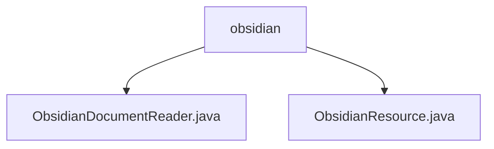

# 基础信息

|      |      |
|------|------|
| 名称 | obsidian |
| 编码语言 | .java |
| 代码路径 | spring-ai-alibaba/community/document-readers/spring-ai-alibaba-starter-document-reader-obsidian/src/main/java/com/alibaba/cloud/ai/reader/obsidian |
| 包名 | spring-ai-alibaba.community.document-readers.spring-ai-alibaba-starter-document-reader-obsidian.src.main.java.com.alibaba.cloud.ai.reader.obsidian |
| 概述说明 | ObsidianDocumentReader解析Obsidian库Markdown文件，提取内容并支持批量处理。 |

# 说明

## 概述
该代码模块是一个用于处理Obsidian库中Markdown文件的工具集，主要包含`ObsidianDocumentReader`和`ObsidianResource`两个核心类。`ObsidianDocumentReader`负责读取和解析Obsidian库中的Markdown文件，支持批量处理和提取关键信息（如标题、标签、链接等），并将其转换为可用的数据结构。`ObsidianResource`则提供了文件路径验证、流操作和递归查找等功能，帮助用户高效管理和组织Markdown文件。该模块旨在简化Obsidian库的访问和操作，提升用户在笔记整理和知识管理场景中的工作效率。

## 主要业务场景
1. **笔记整理**：通过解析和提取Markdown文件中的关键信息，帮助用户快速整理和分类笔记内容。
2. **知识管理**：支持批量处理大量Markdown文件，便于用户构建和管理知识库。
3. **数据分析**：提取文件中的结构化数据（如标题、标签、链接等），便于进一步分析和应用。
4. **文件组织**：通过`ObsidianResource`类的功能，用户能够高效地验证文件路径、进行流操作以及递归查找文件，提升文件管理的效率。

### 包内部结构视图

该流程图展示了`obsidian`文件夹下的文件层级关系。`obsidian`文件夹包含两个文件：`ObsidianDocumentReader.java`和`ObsidianResource.java`。这些文件是`spring-ai-alibaba`项目中用于文档读取的组件，分别负责文档读取和资源管理的功能。

# 文件列表 File List

| 名称   | 类型  | 说明 |
|-------|------|-------------|
| [ObsidianResource.java](ObsidianResource.md) | file | ObsidianResource类管理Markdown文件，支持路径验证、流操作及递归查找。 |
| [ObsidianDocumentReader.java](ObsidianDocumentReader.md) | file | ObsidianDocumentReader解析Obsidian库中的Markdown文件。 |

