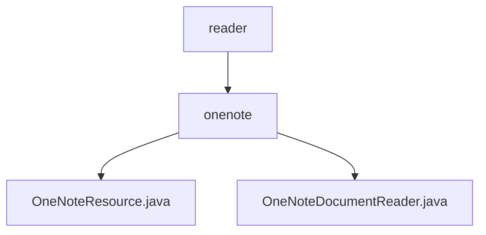

# 基础信息

|      |      |
|------|------|
| 名称 | reader |
| 编码语言 | .java |
| 代码路径 | spring-ai-alibaba/community/document-readers/spring-ai-alibaba-starter-document-reader-onenote/src/main/java/com/alibaba/cloud/api/reader |
| 包名 | spring-ai-alibaba.community.document-readers.spring-ai-alibaba-starter-document-reader-onenote.src.main.java.com.alibaba.cloud.api.reader |
| 概述说明 | OneNoteResource类实现Resource接口，提供资源管理和操作功能。OneNote文档读取器通过Microsoft Graph API获取内容并生成元数据。 |

# 说明

## 概述
该代码模块主要实现了一个与Microsoft OneNote集成的文档读取器，通过Microsoft Graph API从OneNote中获取笔记本、分区和页面的详细内容，并生成相应的元数据。模块的核心功能包括资源管理和文档读取，确保与其他资源类的兼容性和一致性，便于在系统中进行统一管理和调用。

## 主要业务场景
1. **资源管理**：`OneNoteResource`类实现了`Resource`接口，包含资源类型和ID两个关键属性。通过构建器（Builder）模式实例化对象，提供基础资源方法，用于管理和操作资源。
2. **文档读取**：`OneNoteDocumentReader`类利用Microsoft Graph API从OneNote中获取笔记本、分区和页面的详细内容，并构建元数据。该过程涉及通过API接口访问OneNote的数据结构，提取相关文档信息，并生成用于管理和组织这些内容的元数据，以便于后续的查询和使用。

该模块适用于需要从OneNote中提取文档内容并进行管理的场景，特别是在需要与其他资源类进行统一管理的系统中。

### 包内部结构视图

该流程图展示了`spring-ai-alibaba-starter-document-reader-onenote`模块中的路径层级关系。`reader`文件夹包含`onenote`子文件夹，而`onenote`文件夹中又包含两个Java文件：`OneNoteResource.java`和`OneNoteDocumentReader.java`。这种结构清晰地反映了项目的组织方式，便于开发者理解和维护代码。

# 文件列表 File List

| 名称   | 类型  | 说明 |
|-------|------|-------------|
| [onenote](onenote/_module.md) | package | OneNoteResource类实现Resource接口，提供资源管理和操作功能。OneNote文档读取器通过Microsoft Graph API获取内容并生成元数据。 |

