# 基础信息

|      |      |
|------|------|
| 名称 | OneNoteDocumentReader |
| 编码语言 | .java |
| 代码路径 | spring-ai-alibaba/community/document-readers/spring-ai-alibaba-starter-document-reader-onenote/src/main/java/com/alibaba/cloud/api/reader/onenote/OneNoteDocumentReader.java |
| 包名 | com.alibaba.cloud.api.reader.onenote |
| 依赖项 | ['com.google.gson.JsonArray', 'com.google.gson.JsonElement', 'com.google.gson.JsonObject', 'com.google.gson.JsonParser', 'org.jsoup.Jsoup', 'org.slf4j.Logger', 'org.slf4j.LoggerFactory', 'org.springframework.ai.document.Document', 'org.springframework.ai.document.DocumentReader', 'org.springframework.util.Assert', 'org.springframework.util.StringUtils', 'java.net.URI', 'java.net.http.HttpClient', 'java.net.http.HttpRequest', 'java.net.http.HttpResponse', 'java.time.Instant', 'java.util'] |
| 概述说明 | OneNote文档读取器利用Microsoft Graph API获取并构建笔记本、分区和页面内容的元数据。 |

# 说明

OneNote文档读取器利用Microsoft Graph API从OneNote中获取笔记本、分区和页面的详细内容，并在此基础上构建元数据。这一过程涉及通过API接口访问OneNote的数据结构，提取相关文档信息，并生成用于管理和组织这些内容的元数据，以便于后续的查询和使用。

# 类列表 Class Summary

| 名称   | 类型  | 说明 |
|-------|------|-------------|
| OneNoteDocumentReader | class | OneNote文档读取器通过Microsoft Graph API获取笔记本、分区和页面内容，并构建元数据。 |


## 类 OneNoteDocumentReader

|      |      |
|------|------|
| 访问范围 | public |
| 类型 | class |
| 名称 | OneNoteDocumentReader |
| 说明 | OneNote文档读取器通过Microsoft Graph API获取笔记本、分区和页面内容，并构建元数据。 |


### UML类图

```mermaid
classDiagram
    class Document {
        +String content
        +Map~String, Object~ metaData
        +Document(String content, Map~String, Object~ metaData)
    }

    class OneNoteResource {
        <<Interface>>
        +ResourceType getResourceType()
        +String getResourceId()
        enum ResourceType {
            NOTEBOOK
            SECTION
            PAGE
        }
    }

    class OneNoteDocumentReader {
        +String MICROSOFT_GRAPH_BASE_URL
        +String NOTEBOOK_ID_FILTER_PREFIX
        +String SECTION_ID_FILTER_PREFIX
        -Logger log
        -OneNoteResource oneNoteResource
        -HttpClient client
        -String accessToken
        +OneNoteDocumentReader(String accessToken, OneNoteResource oneNoteResource)
        -List~String~ getNoteBookContent(String accessToken, String notebookId)
        -List~String~ getSectionContent(String accessToken, String sectionId)
        -List~String~ getOneNotePageIdsByURI(String accessToken, String uri)
        -List~String~ parsePageIdsFromJson(String jsonResponse)
        -String getPageContent(String accessToken, String pageId)
        +List~Document~ get()
        -String parseHtmlContent(String htmlContent)
        -Map~String, Object~ buildMetadata()
    }

    OneNoteDocumentReader --> OneNoteResource : 依赖
    OneNoteDocumentReader --> Document : 生成
```

这段代码定义了一个 `OneNoteDocumentReader` 类，用于从 Microsoft Graph API 读取 OneNote 文档内容。该类通过 `OneNoteResource` 接口获取资源类型和 ID，并根据资源类型（Notebook、Section 或 Page）从 API 中获取内容。获取的内容被封装在 `Document` 对象中，包含内容和元数据。`OneNoteDocumentReader` 类还包含多个私有方法，用于处理 API 请求、解析 JSON 响应以及构建元数据。整个类图展示了 `OneNoteDocumentReader` 如何依赖 `OneNoteResource` 接口，并生成 `Document` 对象。


### 内部方法调用关系图

```mermaid
graph TD
    A["类OneNoteDocumentReader"]
    B["常量: MICROSOFT_GRAPH_BASE_URL"]
    C["常量: NOTEBOOK_ID_FILTER_PREFIX"]
    D["常量: SECTION_ID_FILTER_PREFIX"]
    E["属性: Logger log"]
    F["属性: OneNoteResource oneNoteResource"]
    G["属性: HttpClient client"]
    H["属性: String accessToken"]
    I["构造方法: OneNoteDocumentReader(String accessToken, OneNoteResource oneNoteResource)"]
    J["方法: List<String> getNoteBookContent(String accessToken, String notebookId)"]
    K["方法: List<String> getSectionContent(String accessToken, String sectionId)"]
    L["方法: List<String> getOneNotePageIdsByURI(String accessToken, String uri)"]
    M["方法: List<String> parsePageIdsFromJson(String jsonResponse)"]
    N["方法: String getPageContent(String accessToken, String pageId)"]
    O["方法: List<Document> get()"]
    P["方法: String parseHtmlContent(String htmlContent)"]
    Q["方法: Map<String, Object> buildMetadata()"]

    A --> B
    A --> C
    A --> D
    A --> E
    A --> F
    A --> G
    A --> H
    A --> I
    A --> J
    A --> K
    A --> L
    A --> M
    A --> N
    A --> O
    A --> P
    A --> Q
```



这段代码定义了一个`OneNoteDocumentReader`类，用于从Microsoft Graph API读取OneNote文档内容。类中包含多个方法，分别用于获取笔记本、分区和页面的内容，并解析JSON响应和HTML内容。流程图展示了类的结构、属性和方法之间的关系，帮助理解代码的执行流程和功能模块。

### 字段列表 Field List

| 名称  | 类型  | 说明 |
|-------|-------|------|
| NOTEBOOK_ID_FILTER_PREFIX = "/me/onenote/pages/?$expand=parentNotebook&$filter=parentNotebook/id" | String | 静态常量定义OneNote笔记本ID过滤前缀。 |
| MICROSOFT_GRAPH_BASE_URL = "https://graph.microsoft.com/v1.0" | String | 微软Graph API基础URL为graph.microsoft.com/v1.0。 |
| accessToken | String | 声明了一个私有的不可变字符串变量accessToken。 |
| log = LoggerFactory.getLogger(OneNoteDocumentReader.class) | Logger | 在OneNoteDocumentReader类中定义了一个私有的静态日志记录器。 |
| client | HttpClient | 声明一个私有的不可变的HttpClient对象。 |
| SECTION_ID_FILTER_PREFIX = "/me/onenote/pages/?$expand=parentSection&$filter=parentSection/id" | String | 静态常量定义OneNote页面过滤条件，扩展父节并筛选父节ID。 |
| oneNoteResource | OneNoteResource | 私有成员变量oneNoteResource类型为OneNoteResource。 |

### 方法列表 Method List

| 名称  | 类型  | 说明 |
|-------|-------|------|
| getPageContent | String | 通过访问令牌和页面ID获取OneNote页面内容，返回解析后的HTML。 |
| getSectionContent | List<String> | 通过API获取指定笔记本页面的内容列表。 |
| parseHtmlContent | String | 解析HTML内容，提取标题和文本，返回格式化结果。 |
| getNoteBookContent | List<String> | 通过API获取指定笔记本内容并返回页面内容列表。 |
| get | List<Document> | 获取OneNote资源内容并构建文档列表，检查参数后根据资源类型获取内容并生成元数据。 |
| buildMetadata | Map<String, Object> | 构建OneNote资源元数据，包括URI、类型、ID、创建时间、最后修改时间和内容URL。 |
| getOneNotePageIdsByURI | List<String> | 通过URI获取OneNote页面ID，使用访问令牌和JSON格式发送GET请求，解析响应提取ID。 |
| parsePageIdsFromJson | List<String> | 解析JSON响应，提取"value"数组中的"id"字段并返回字符串列表。 |


