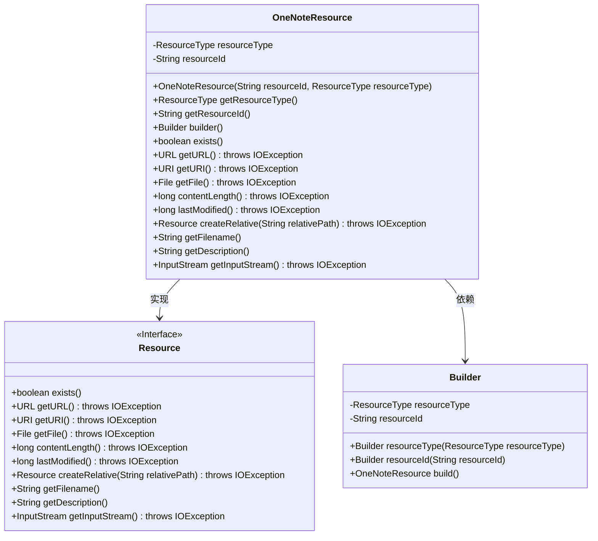

# 基础信息

|      |      |
|------|------|
| 名称 | OneNoteResource |
| 编码语言 | .java |
| 代码路径 | spring-ai-alibaba/community/document-readers/spring-ai-alibaba-starter-document-reader-onenote/src/main/java/com/alibaba/cloud/api/reader/onenote/OneNoteResource.java |
| 包名 | com.alibaba.cloud.api.reader.onenote |
| 依赖项 | ['org.springframework.core.io.Resource', 'org.springframework.util.Assert', 'java.io.File', 'java.io.IOException', 'java.io.InputStream', 'java.net.URI', 'java.net.URL'] |
| 概述说明 | OneNoteResource类实现Resource接口，包含类型和ID，提供构建器和基础方法。 |

# 说明

OneNoteResource类实现了Resource接口，包含资源类型和ID两个关键属性。该类提供了构建器（Builder）模式来实例化对象，并具备基础资源方法，用于管理和操作资源。通过实现Resource接口，OneNoteResource类能够确保与其他资源类的兼容性和一致性，便于在系统中进行统一管理和调用。

# 类列表 Class Summary

| 名称   | 类型  | 说明 |
|-------|------|-------------|
| OneNoteResource | class | OneNoteResource类实现Resource接口，包含资源类型和ID，提供构建器和基础资源方法。 |

## 类 OneNoteResource

|      |      |
|------|------|
| 访问范围 | public |
| 类型 | class |
| 名称 | OneNoteResource |
| 说明 | OneNoteResource类实现Resource接口，包含资源类型和ID，提供构建器和基础资源方法。 |

### UML类图

类图描述：
`OneNoteResource` 类实现了 `Resource` 接口，提供了对 OneNote 资源的基本操作。它包含两个私有成员 `resourceType` 和 `resourceId`，分别表示资源的类型和 ID。`OneNoteResource` 类还包含一个内部类 `Builder`，用于构建 `OneNoteResource` 实例。`Builder` 类提供了设置资源类型和 ID 的方法，并通过 `build` 方法返回一个新的 `OneNoteResource` 实例。`OneNoteResource` 类通过实现 `Resource` 接口，提供了对资源是否存在、获取 URL、URI、文件、内容长度、最后修改时间等操作的支持。

### 内部方法调用关系图

```mermaid
graph TD
    A["类OneNoteResource"]
    B["常量: String SOURCE"]
    C["枚举: ResourceType"]
    D["属性: ResourceType resourceType"]
    E["属性: String resourceId"]
    F["方法: ResourceType getResourceType()"]
    G["方法: String getResourceId()"]
    H["构造方法: OneNoteResource(String resourceId, ResourceType resourceType)"]
    I["静态方法: Builder builder()"]
    J["内部类: Builder"]
    K["属性: ResourceType resourceType"]
    L["属性: String resourceId"]
    M["方法: Builder resourceType(ResourceType resourceType)"]
    N["方法: Builder resourceId(String resourceId)"]
    O["方法: OneNoteResource build()"]
    P["重写方法: boolean exists()"]
    Q["重写方法: URL getURL()"]
    R["重写方法: URI getURI()"]
    S["重写方法: File getFile()"]
    T["重写方法: long contentLength()"]
    U["重写方法: long lastModified()"]
    V["重写方法: Resource createRelative(String relativePath)"]
    W["重写方法: String getFilename()"]
    X["重写方法: String getDescription()"]
    Y["重写方法: InputStream getInputStream()"]

    A --> B
    A --> C
    A --> D
    A --> E
    A --> F
    A --> G
    A --> H
    A --> I
    I --> J
    J --> K
    J --> L
    J --> M
    J --> N
    J --> O
    A --> P
    A --> Q
    A --> R
    A --> S
    A --> T
    A --> U
    A --> V
    A --> W
    A --> X
    A --> Y
```

这段代码定义了一个名为 `OneNoteResource` 的类，该类实现了 `Resource` 接口。类中包含一个枚举类型 `ResourceType`，用于表示资源的类型，如笔记本、部分和页面。类中还包含两个主要属性 `resourceType` 和 `resourceId`，分别表示资源的类型和ID。类提供了获取这些属性的方法，并通过一个内部类 `Builder` 实现了构建者模式，用于创建 `OneNoteResource` 对象。此外，类还重写了 `Resource` 接口中的多个方法，但这些方法目前都返回默认值或空值。

### 字段列表 Field List

| 名称  | 类型  | 说明 |
|-------|-------|------|
| resourceType | ResourceType | 私有常量资源类型字段。 |
| resourceId | String | 定义一个私有且不可变的字符串变量resourceId。 |
| SOURCE = "source" | String | 定义了一个名为SOURCE的公共静态常量字符串，值为"source"。 |

### 方法列表 Method List

| 名称  | 类型  | 说明 |
|-------|-------|------|
| getResourceId | String | 获取资源ID的方法。 |
| builder | Builder | 静态方法返回新的Builder实例。 |
| getDescription | String | 重写getDescription方法，返回null值。 |
| createRelative | Resource | 重写方法createRelative，返回null，可能抛出IOException。 |
| getFilename | String | 重写getFilename方法，返回null。 |
| getFile | File | 重写getFile方法，返回null，可能抛出IOException异常。 |
| exists | boolean | 重写exists方法，始终返回false。 |
| lastModified | long | 重写lastModified方法，始终返回0。 |
| getInputStream | InputStream | 重写getInputStream方法，返回null并抛出IOException异常。 |
| contentLength | long | 重写contentLength方法，返回固定值0。 |
| getURL | URL | 重写getURL方法，返回null并抛出IOException异常。 |
| getResourceType | ResourceType | 该方法返回资源类型。 |
| getURI | URI | 重写getURI方法，返回null，可能抛出IOException。 |

