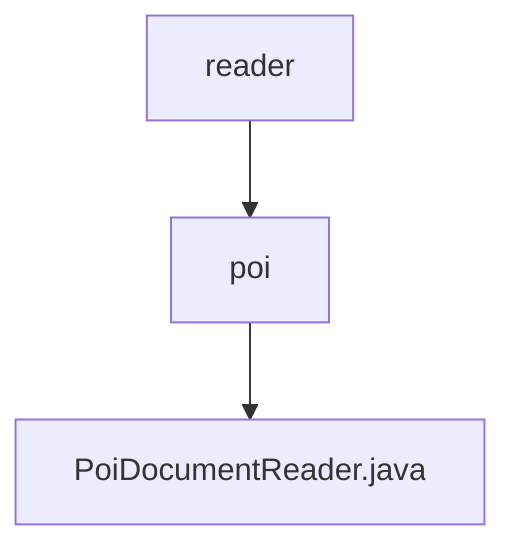

# 基础信息

|      |      |
|------|------|
| 名称 | reader |
| 编码语言 | .java |
| 代码路径 | spring-ai-alibaba/community/document-readers/spring-ai-alibaba-starter-document-reader-poi/src/main/java/com/alibaba/cloud/ai/reader |
| 包名 | spring-ai-alibaba.community.document-readers.spring-ai-alibaba-starter-document-reader-poi.src.main.java.com.alibaba.cloud.ai.reader |
| 概述说明 | PoiDocumentReader类提取文档，支持自定义格式和元数据。 |

# 说明

PoiDocumentReader类是一个用于从资源中提取文档的工具，支持用户自定义文本格式化功能，并且能够包含与文档相关的元数据源信息。该类的主要作用是高效地从指定资源中读取文档内容，同时允许用户根据需要调整文本的格式，并保留文档的元数据，以便进一步处理或分析。

### 包内部结构视图

该流程图展示了`spring-ai-alibaba-starter-document-reader-poi`模块中的文件层级关系。`reader`目录下包含`poi`子目录，而`poi`目录中则包含`PoiDocumentReader.java`文件。这种结构清晰地反映了项目中的文件组织方式，便于开发者快速定位和理解代码结构。

# 文件列表 File List

| 名称   | 类型  | 说明 |
|-------|------|-------------|
| [poi](poi/_module.md) | package | PoiDocumentReader类提取文档，支持自定义格式和元数据。 |

