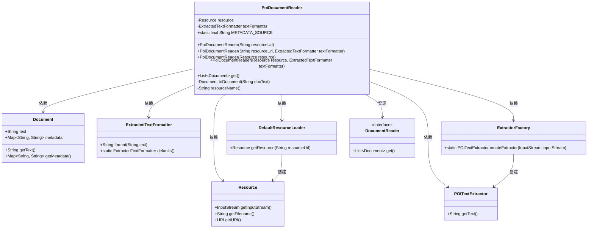
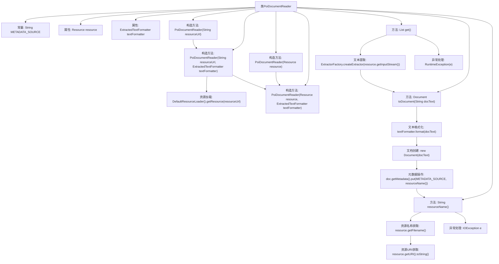

# 基础信息

|      |      |
|------|------|
| 名称 | PoiDocumentReader |
| 编码语言 | .java |
| 代码路径 | spring-ai-alibaba/community/document-readers/spring-ai-alibaba-starter-document-reader-poi/src/main/java/com/alibaba/cloud/ai/reader/poi/PoiDocumentReader.java |
| 包名 | com.alibaba.cloud.ai.reader.poi |
| 依赖项 | ['org.apache.poi.extractor.ExtractorFactory', 'org.apache.poi.extractor.POITextExtractor', 'org.springframework.ai.document.Document', 'org.springframework.ai.document.DocumentReader', 'org.springframework.ai.reader.ExtractedTextFormatter', 'org.springframework.core.io.DefaultResourceLoader', 'org.springframework.core.io.Resource', 'org.springframework.util.StringUtils', 'java.io.IOException', 'java.util.List', 'java.util.Objects'] |
| 概述说明 | PoiDocumentReader类提取文档，支持自定义格式和元数据。 |

# 说明

PoiDocumentReader类是一个用于从资源中提取文档的工具，支持用户自定义文本格式化功能，并且能够包含与文档相关的元数据源信息。该类的主要作用是高效地从指定资源中读取文档内容，同时允许用户根据需要调整文本的格式，并保留文档的元数据，以便进一步处理或分析。

# 类列表 Class Summary

| 名称   | 类型  | 说明 |
|-------|------|-------------|
| PoiDocumentReader | class | PoiDocumentReader类用于从资源中提取文档，支持自定义文本格式化，并包含元数据源信息。 |

## 类 PoiDocumentReader

|      |      |
|------|------|
| 访问范围 | public |
| 类型 | class |
| 名称 | PoiDocumentReader |
| 说明 | PoiDocumentReader类用于从资源中提取文档，支持自定义文本格式化，并包含元数据源信息。 |

### UML类图

**描述**：`PoiDocumentReader` 类实现了 `DocumentReader` 接口，用于从资源中提取文档内容。它依赖于 `Resource` 类来获取输入流，`ExtractedTextFormatter` 类来格式化提取的文本，`POITextExtractor` 类来提取文本内容，`ExtractorFactory` 类来创建提取器，`DefaultResourceLoader` 类来加载资源，最终生成 `Document` 对象。该类的核心方法 `get()` 通过提取文本并将其转换为 `Document` 对象列表，同时将资源信息存储为元数据。

### 内部方法调用关系图

这段代码定义了一个`PoiDocumentReader`类，用于从资源中提取文档内容并转换为`Document`对象。类中包含多个构造方法，用于初始化资源和文本格式化器。`get()`方法通过`ExtractorFactory`创建文本提取器，提取文本后调用`toDocument()`方法将文本格式化为`Document`对象，并在元数据中添加资源来源信息。`resourceName()`方法用于获取资源的名称或URI，处理可能的异常情况。

### 字段列表 Field List

| 名称  | 类型  | 说明 |
|-------|-------|------|
| resource | Resource | 私有不可变资源实例变量。 |
| textFormatter | ExtractedTextFormatter | 私有且不可变的文本格式化工具实例。 |
| METADATA_SOURCE = "source" | String | 定义了一个名为METADATA_SOURCE的静态常量字符串，值为"source"。 |

### 方法列表 Method List

| 名称  | 类型  | 说明 |
|-------|-------|------|
| toDocument | Document | 将文本转换为文档对象，格式化并添加元数据。 |
| get | List<Document> | 重写get方法，提取文本并转换为文档，异常时抛出运行时异常。 |
| resourceName | String | 方法resourceName获取资源文件名，若为空则返回URI，异常时返回错误信息。 |

