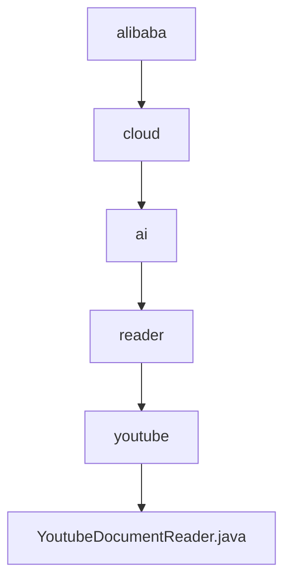

# 基础信息

|      |      |
|------|------|
| 名称 | alibaba |
| 编码语言 | .java |
| 代码路径 | spring-ai-alibaba/community/document-readers/spring-ai-alibaba-starter-document-reader-youtube/src/main/java/com/alibaba |
| 包名 | spring-ai-alibaba.community.document-readers.spring-ai-alibaba-starter-document-reader-youtube.src.main.java.com.alibaba |
| 概述说明 | YoutubeDocumentReader提取YouTube视频字幕并生成文档。 |

# 说明

YoutubeDocumentReader是一款工具，能够从指定的YouTube视频URL中提取字幕信息，并将其转换为文档格式。该工具通过解析视频的字幕数据，生成可供用户阅读和使用的文本内容，便于后续处理或存档。其核心功能包括自动识别视频字幕、提取文本信息以及生成标准化的文档，适用于需要从视频中获取文字内容的场景。

### 包内部结构视图

该流程图展示了从`alibaba`到`YoutubeDocumentReader.java`的层级关系。路径从`alibaba`开始，依次经过`cloud`、`ai`、`reader`和`youtube`，最终指向`YoutubeDocumentReader.java`。每个节点代表路径中的一个文件夹或文件，层级关系清晰，符合给定的路径信息。

# 文件列表 File List

| 名称   | 类型  | 说明 |
|-------|------|-------------|
| [cloud](cloud/_module.md) | package | YoutubeDocumentReader提取YouTube视频字幕并生成文档。 |

