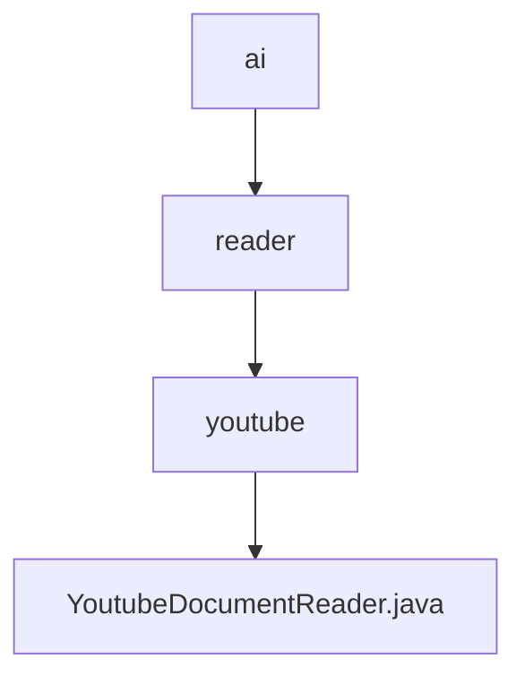

# 基础信息

|      |      |
|------|------|
| 名称 | ai |
| 编码语言 | .java |
| 代码路径 | spring-ai-alibaba/community/document-readers/spring-ai-alibaba-starter-document-reader-youtube/src/main/java/com/alibaba/cloud/ai |
| 包名 | spring-ai-alibaba.community.document-readers.spring-ai-alibaba-starter-document-reader-youtube.src.main.java.com.alibaba.cloud.ai |
| 概述说明 | YoutubeDocumentReader提取YouTube视频字幕并生成文档。 |

# 说明

YoutubeDocumentReader是一款工具，能够从指定的YouTube视频URL中提取字幕信息，并将其转换为文档格式。该工具通过解析视频的字幕数据，生成可供用户阅读和使用的文本内容，便于后续处理或存档。其核心功能包括自动识别视频字幕、提取文本信息以及生成标准化的文档，适用于需要从视频中获取文字内容的场景。

### 包内部结构视图

该流程图展示了`ai`文件夹下的层级结构，`ai`包含`reader`文件夹，`reader`文件夹下又包含`youtube`文件夹，最终在`youtube`文件夹中存在`YoutubeDocumentReader.java`文件。这种结构清晰地反映了项目的模块化设计，便于管理和维护代码。

# 文件列表 File List

| 名称   | 类型  | 说明 |
|-------|------|-------------|
| [reader](reader/_module.md) | package | YoutubeDocumentReader提取YouTube视频字幕并生成文档。 |

