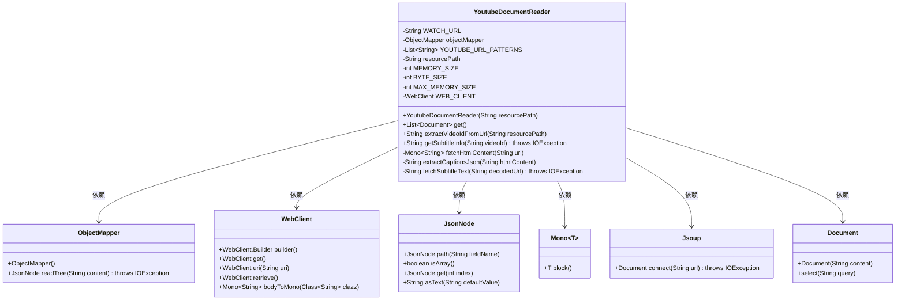

# 基础信息

|      |      |
|------|------|
| 名称 | YoutubeDocumentReader |
| 编码语言 | .java |
| 代码路径 | spring-ai-alibaba/community/document-readers/spring-ai-alibaba-starter-document-reader-youtube/src/main/java/com/alibaba/cloud/ai/reader/youtube/YoutubeDocumentReader.java |
| 包名 | com.alibaba.cloud.ai.reader.youtube |
| 依赖项 | ['com.fasterxml.jackson.databind.JsonNode', 'com.fasterxml.jackson.databind.ObjectMapper', 'org.apache.commons.lang3.StringEscapeUtils', 'org.jsoup.Jsoup', 'org.springframework.ai.document.Document', 'org.springframework.ai.document.DocumentReader', 'org.springframework.util.Assert', 'org.springframework.web.reactive.function.client.WebClient', 'reactor.core.publisher.Mono', 'java.io.IOException', 'java.net.URLDecoder', 'java.nio.charset.StandardCharsets', 'java.util.ArrayList', 'java.util.List', 'java.util.regex.Matcher', 'java.util.regex.Pattern'] |
| 概述说明 | YoutubeDocumentReader提取YouTube视频字幕并生成文档。 |

# 说明

YoutubeDocumentReader是一款工具，能够从指定的YouTube视频URL中提取字幕信息，并将其转换为文档格式。该工具通过解析视频的字幕数据，生成可供用户阅读和使用的文本内容，便于后续处理或存档。其核心功能包括自动识别视频字幕、提取文本信息以及生成标准化的文档，适用于需要从视频中获取文字内容的场景。

# 类列表 Class Summary

| 名称   | 类型  | 说明 |
|-------|------|-------------|
| YoutubeDocumentReader | class | YoutubeDocumentReader从YouTube视频URL提取字幕信息并生成文档。 |

## 类 YoutubeDocumentReader

|      |      |
|------|------|
| 访问范围 | public |
| 类型 | class |
| 名称 | YoutubeDocumentReader |
| 说明 | YoutubeDocumentReader从YouTube视频URL提取字幕信息并生成文档。 |

### UML类图

### 描述
`YoutubeDocumentReader` 是一个用于从YouTube视频中提取字幕信息的类。它通过解析视频URL获取视频ID，然后使用WebClient异步获取视频页面的HTML内容，从中提取字幕的JSON数据，并最终解码和获取字幕文本。该类依赖于多个外部类，如`ObjectMapper`、`WebClient`、`JsonNode`、`Mono`和`Jsoup`，以实现其功能。

### 内部方法调用关系图

```mermaid
graph TD
    A["类YoutubeDocumentReader"]
    B["属性: String WATCH_URL"]
    C["属性: ObjectMapper objectMapper"]
    D["属性: List<String> YOUTUBE_URL_PATTERNS"]
    E["属性: String resourcePath"]
    F["属性: int MEMORY_SIZE"]
    G["属性: int BYTE_SIZE"]
    H["属性: int MAX_MEMORY_SIZE"]
    I["属性: WebClient WEB_CLIENT"]
    J["构造方法: YoutubeDocumentReader(String resourcePath)"]
    K["方法: List<Document> get()"]
    L["方法: String extractVideoIdFromUrl(String resourcePath)"]
    M["方法: String getSubtitleInfo(String videoId)"]
    N["方法: Mono<String> fetchHtmlContent(String url)"]
    O["方法: String extractCaptionsJson(String htmlContent)"]
    P["方法: String fetchSubtitleText(String decodedUrl)"]

    A --> B
    A --> C
    A --> D
    A --> E
    A --> F
    A --> G
    A --> H
    A --> I
    A --> J
    A --> K
    A --> L
    A --> M
    A --> N
    A --> O
    A --> P
```

这段代码定义了一个名为 `YoutubeDocumentReader` 的类，用于从YouTube视频中提取字幕信息。类中包含多个属性和方法，用于处理URL解析、HTML内容获取、字幕信息提取和解码等操作。流程图中展示了类的结构及其内部方法之间的调用关系，帮助理解代码的整体逻辑和功能。

### 字段列表 Field List

| 名称  | 类型  | 说明 |
|-------|-------|------|
| objectMapper | ObjectMapper | 私有且不可变的ObjectMapper实例。 |
| WATCH_URL = "https://www.youtube.com/watch?v=%s" | String | 定义常量WATCH_URL，用于生成YouTube视频链接。 |
| resourcePath | String | 私有字符串变量resourcePath。 |
| BYTE_SIZE = 1024 | int | 定义常量BYTE_SIZE，值为1024。 |
| YOUTUBE_URL_PATTERNS = List.of("youtube\\.com/watch\\?v=([^&]+)",			"youtu\\.be/([^?&]+)") | List<String> | 定义了两个YouTube视频URL的正则表达式匹配模式。 |
| WEB_CLIENT = WebClient.builder()		.defaultHeader("Accept-Language", "en-US")		.codecs(configurer -> configurer.defaultCodecs().maxInMemorySize(MAX_MEMORY_SIZE))		.build() | WebClient | 创建WebClient实例，设置默认语言为en-US，配置内存大小限制。 |
| MAX_MEMORY_SIZE = MEMORY_SIZE * BYTE_SIZE * BYTE_SIZE | int | MAX_MEMORY_SIZE由MEMORY_SIZE乘以BYTE_SIZE的平方计算得出。 |
| MEMORY_SIZE = 5 | int | 定义了一个静态常量MEMORY_SIZE，值为5。 |

### 方法列表 Method List

| 名称  | 类型  | 说明 |
|-------|-------|------|
| fetchHtmlContent | Mono<String> | 使用WebClient异步获取指定URL的HTML内容。 |
| extractCaptionsJson | String | 从HTML内容中提取字幕JSON字符串并返回。 |
| fetchSubtitleText | String | 通过URL获取字幕文本并提取`<text>`标签内容。 |
| extractVideoIdFromUrl | String | 从YouTube URL中提取视频ID的方法。 |
| getSubtitleInfo | String | 获取YouTube视频字幕信息并解码返回。 |
| get | List<Document> | 方法从YouTube获取字幕内容并返回文档列表。 |

