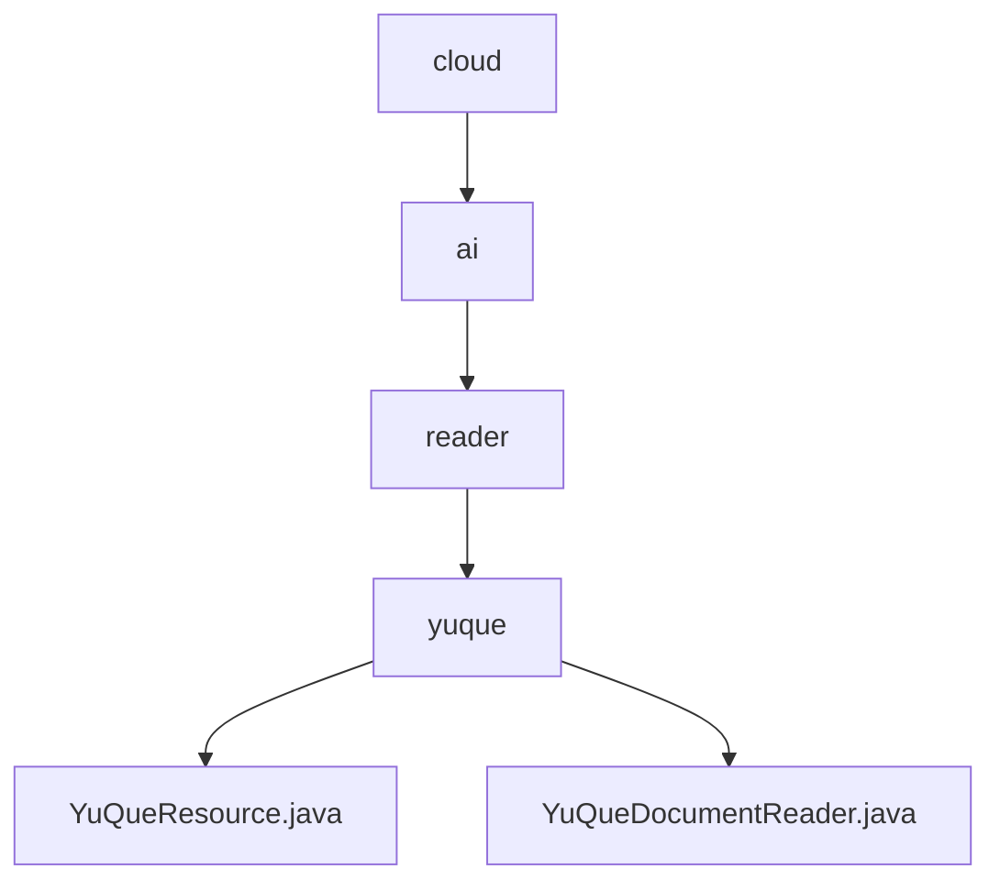

# 基础信息

|      |      |
|------|------|
| 名称 | cloud |
| 编码语言 | .java |
| 代码路径 | spring-ai-alibaba/community/document-readers/spring-ai-alibaba-starter-document-reader-yuque/src/main/java/com/alibaba/cloud |
| 包名 | spring-ai-alibaba.community.document-readers.spring-ai-alibaba-starter-document-reader-yuque.src.main.java.com.alibaba.cloud |
| 概述说明 | YuQueResource类处理语雀API资源，验证路径和令牌，获取文档。YuQueDocumentReader类通过YuQueResource和DocumentParser读取并解析文档。 |

# 说明

## 概述
该代码模块主要实现与语雀API的交互，涉及文档资源的获取、验证和解析。核心类包括`YuQueResource`和`YuQueDocumentReader`，它们分别负责处理语雀API的资源操作和文档的读取与解析。通过这些组件的协作，模块能够高效、安全地获取和处理语雀平台上的文档内容，为后续操作提供可靠的数据支持。

## 主要业务场景
1. **资源验证与获取**：`YuQueResource`类负责验证路径和令牌的有效性，确保请求的合法性，并通过语雀API获取文档内容，以输入流的形式返回，便于后续处理。
2. **文档读取与解析**：`YuQueDocumentReader`类利用`YuQueResource`获取文档资源，并通过`DocumentParser`对文档进行解析，确保能够准确获取和处理文档内容。
3. **数据安全与传输**：模块通过验证和结构化处理，确保数据在获取和传输过程中的安全性和准确性，为系统提供可靠的文档数据支持。

### 包内部结构视图

该流程图展示了Spring AI Alibaba项目中文档阅读器模块的层级结构。从`cloud`目录开始，依次进入`ai`、`reader`和`yuque`子目录，最终指向两个具体的Java文件：`YuQueResource.java`和`YuQueDocumentReader.java`。这清晰地反映了项目的模块化设计，每个层级都有明确的职责划分。

# 文件列表 File List

| 名称   | 类型  | 说明 |
|-------|------|-------------|
| [ai](ai/_module.md) | package | YuQueResource类处理语雀API资源，验证路径和令牌，获取文档。YuQueDocumentReader类通过YuQueResource和DocumentParser读取并解析文档。 |

