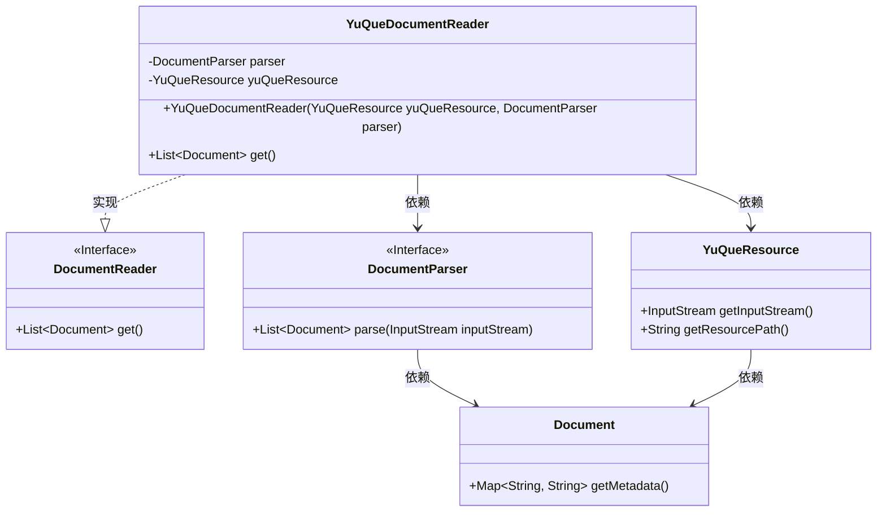
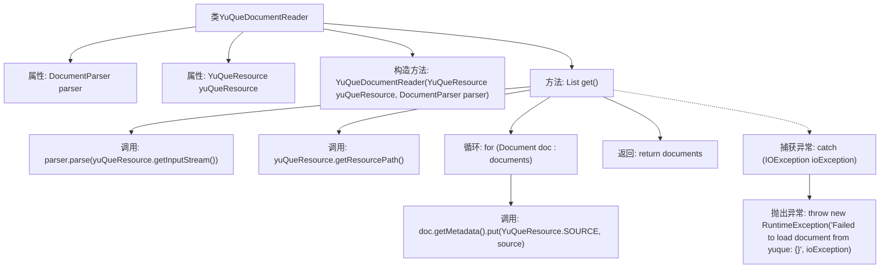

# 基础信息

|      |      |
|------|------|
| 名称 | YuQueDocumentReader |
| 编码语言 | .java |
| 代码路径 | spring-ai-alibaba/community/document-readers/spring-ai-alibaba-starter-document-reader-yuque/src/main/java/com/alibaba/cloud/ai/reader/yuque/YuQueDocumentReader.java |
| 包名 | com.alibaba.cloud.ai.reader.yuque |
| 依赖项 | ['com.alibaba.cloud.ai.document.DocumentParser', 'org.springframework.ai.document.Document', 'org.springframework.ai.document.DocumentReader', 'org.springframework.ai.reader.ExtractedTextFormatter', 'java.io.IOException', 'java.util.ArrayList', 'java.util.List'] |
| 概述说明 | YuQueDocumentReader类利用YuQueResource和DocumentParser读取解析文档。 |

# 说明

YuQueDocumentReader类的主要功能是通过YuQueResource和DocumentParser两个组件来读取并解析文档。YuQueResource负责获取文档资源，而DocumentParser则负责对获取到的文档进行解析。这个类的设计旨在实现文档的高效读取和解析，确保能够准确获取和处理文档内容。通过这种结构化的方式，YuQueDocumentReader类能够有效地处理各种文档资源，为后续的操作提供可靠的数据支持。

# 类列表 Class Summary

| 名称   | 类型  | 说明 |
|-------|------|-------------|
| YuQueDocumentReader | class | YuQueDocumentReader类通过YuQueResource和DocumentParser读取并解析文档。 |

## 类 YuQueDocumentReader

|      |      |
|------|------|
| 访问范围 | public |
| 类型 | class |
| 名称 | YuQueDocumentReader |
| 说明 | YuQueDocumentReader类通过YuQueResource和DocumentParser读取并解析文档。 |

### UML类图

这段代码定义了一个 `YuQueDocumentReader` 类，它实现了 `DocumentReader` 接口。`YuQueDocumentReader` 类通过 `YuQueResource` 和 `DocumentParser` 来获取和解析文档。`YuQueResource` 提供了文档的输入流和资源路径，`DocumentParser` 负责将输入流解析为 `Document` 对象列表。每个 `Document` 对象的元数据中都会添加资源路径信息。如果解析过程中发生 `IOException`，则会抛出运行时异常。

### 内部方法调用关系图

这段代码定义了一个名为 `YuQueDocumentReader` 的类，该类实现了 `DocumentReader` 接口。它通过构造函数接收 `YuQueResource` 和 `DocumentParser` 两个参数，并在 `get` 方法中解析从 `YuQueResource` 获取的输入流，生成文档列表。每个文档的元数据中都会添加资源路径信息。如果解析过程中发生 `IOException`，则会抛出运行时异常。

### 字段列表 Field List

| 名称  | 类型  | 说明 |
|-------|-------|------|
| parser | DocumentParser | 私有且不可变的文档解析器实例。 |
| yuQueResource | YuQueResource | 私有且不可变的YuQueResource实例。 |

### 方法列表 Method List

| 名称  | 类型  | 说明 |
|-------|-------|------|
| get | List<Document> | 方法`get()`解析语雀资源流，添加源路径到文档元数据，返回文档列表。 |

